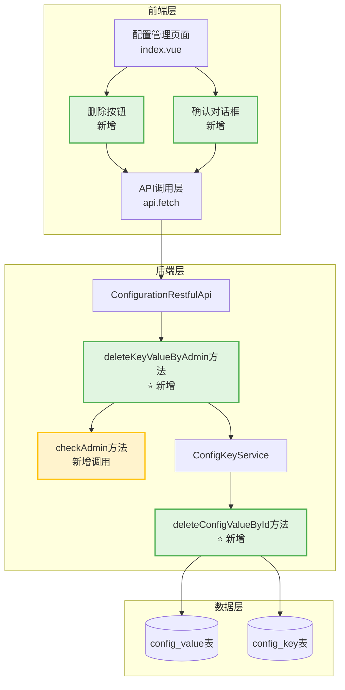
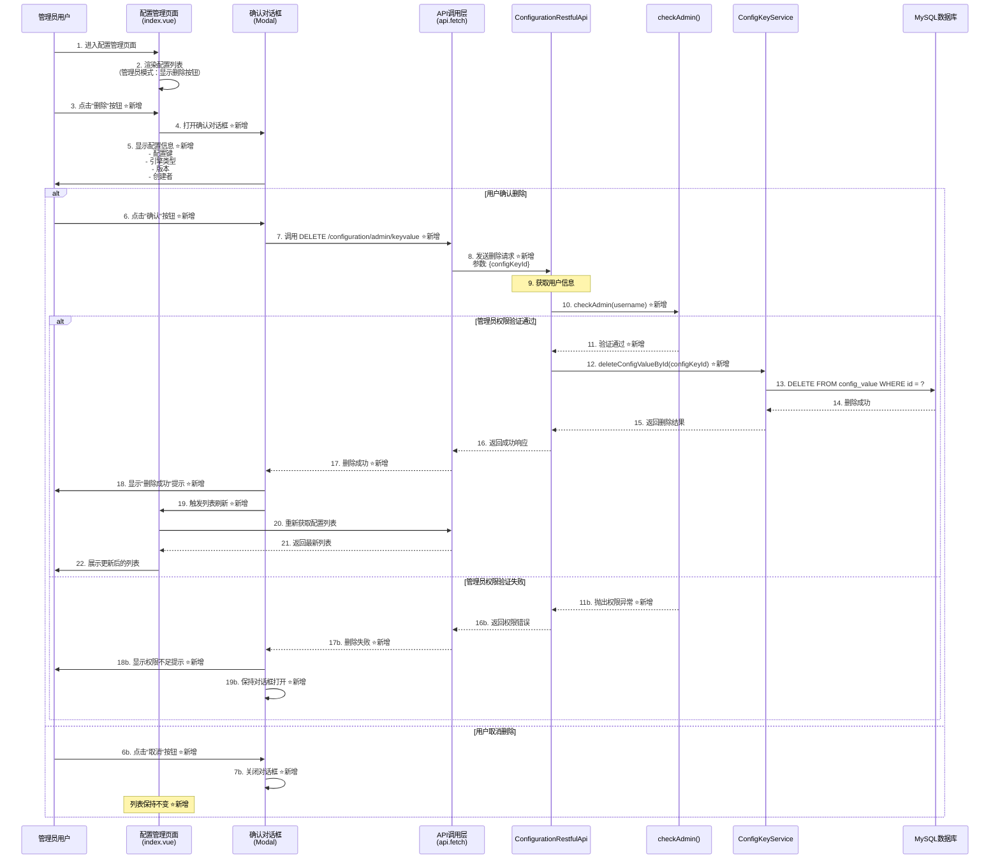
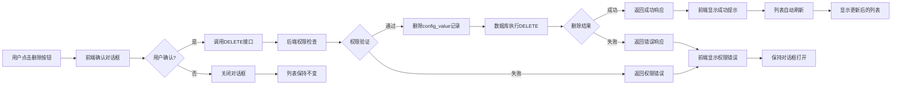

# 运维工具-用户配置删除功能 - 设计文档

## 文档信息
- **文档版本**: v1.1 ⭐
- **最后更新**: 2025-01-04（更新）⭐
- **维护人**: 功能增强架构设计Agent
- **文档状态**: 草稿
- **需求类型**: ENHANCE（功能增强）
- **需求文档**: [运维工具_用户配置删除_需求.md](../requirements/运维工具_用户配置删除_需求.md)
- **更新说明**: ⭐ v1.1：修正后端接口设计，新增管理员专用删除接口 `DELETE /configuration/admin/keyvalue`，不再复用现有用户删除接口

---

## 执行摘要

> 📖 **阅读指引**：本章节为1页概览（约500字），用于快速理解设计方案。详细内容请参考后续章节。

### 设计目标

| 目标 | 描述 | 优先级 |
|-----|------|-------|
| 在用户配置管理页面增加删除功能 | 在配置列表的操作列增加删除按钮，支持管理员删除配置项 | P0 |
| 增强删除接口安全性 | 在后端删除接口中增加管理员权限检查，防止未授权删除 | P0 |
| 提供友好的删除交互 | 删除前弹出确认对话框，显示配置完整信息，防止误删 | P0 |
| 保持向后兼容 | 不影响现有的查看和编辑功能，不修改现有接口定义 | P0 |

### 核心设计决策

| 决策点 | 选择方案 | 决策理由（一句话） | 替代方案 |
|-------|---------|------------------|---------|
| 删除功能实现方式 | 前端增加删除按钮，新增管理员专用删除接口 | 现有接口只能删除用户自己的配置，管理员需要删除其他用户的配置 | 复用现有接口（不适用） |
| 后端接口策略 | 新增 DELETE /configuration/admin/keyvalue 接口 | 管理员需要能够删除任意用户的配置，不能复用现有用户删除接口 | 修改现有接口签名（影响兼容性） |
| 权限控制策略 | 后端增加管理员权限检查（checkAdmin） | 确保接口安全，防止绕过前端直接调用 | 仅依赖前端权限控制 |
| 确认机制 | Modal对话框 + 显示完整配置信息 | 二次确认 + 信息完整展示，降低误删风险 | 简单confirm弹窗 |
| 删除按钮显示策略 | 仅对管理员用户可见和可操作 | 最小化权限暴露，降低普通用户误操作风险 | 对所有用户可见但禁用 |

### 架构概览图

```
┌─────────────────────────────────────────────────────────────┐
│                     前端 - 配置管理页面                       │
│  ┌──────────────┐  ┌──────────────┐  ┌──────────────┐      │
│  │  配置列表     │  │  删除按钮     │  │  确认对话框   │      │
│  │  (现有)       │  │  (新增)       │  │  (新增)       │      │
│  └──────────────┘  └──────────────┘  └──────────────┘      │
└─────────────────────────────────────────────────────────────┘
                              │
                              ▼
┌─────────────────────────────────────────────────────────────┐
│                   后端 - Configuration模块                    │
│  ┌──────────────────────────────────────────────────────┐   │
│  │  DELETE /configuration/admin/keyvalue ⭐ 新增接口     │   │
│  │  - 参数: configKeyId (配置项ID)                       │   │
│  │  - 权限: 管理员权限验证 (checkAdmin)                   │   │
│  │  - 功能: 删除任意用户的配置项                          │   │
│  └──────────────────────────────────────────────────────┘   │
└─────────────────────────────────────────────────────────────┘
                              │
                              ▼
┌─────────────────────────────────────────────────────────────┐
│                   数据层 - ConfigValue表                     │
│  DELETE FROM config_value WHERE id = ?                       │
└─────────────────────────────────────────────────────────────┘
```

### 关键风险与缓解

| 风险 | 等级 | 缓解措施 |
|-----|------|---------|
| 误删重要配置 | 高 | 强制二次确认机制 + 确认对话框显示完整配置信息 |
| 前端权限控制被绕过 | 中 | 后端接口增加管理员权限检查（checkAdmin） |
| 删除正在使用的配置 | 中 | 确认对话框提示风险 + 建议用户确认使用情况 |
| 删除后无法恢复 | 中 | 提示"操作不可恢复" + 建议操作前备份 |

### 核心指标

| 指标 | 目标值 | 说明 |
|-----|-------|------|
| 删除操作响应时间 | < 2秒 | 正常网络环境下 |
| 列表刷新时间 | < 500ms | 删除成功后自动刷新 |
| 权限检查响应时间 | < 50ms | checkAdmin方法调用 |
| 前端按钮渲染时间 | < 100ms | 管理员用户登录后 |

### 章节导航

| 关注点 | 推荐章节 |
|-------|---------|
| 想了解整体架构设计 | [1.1 系统架构设计](#11-系统架构设计) |
| 想了解删除流程 | [1.2 核心流程设计](#12-核心流程设计) |
| 想了解前端详细设计 | [1.3 前端界面设计](#13-前端界面设计) |
| 想了解后端接口变更 | [1.4 后端接口增强设计](#14-后端接口增强设计) |
| 想了解兼容性保证 | [1.5 兼容性设计](#15-兼容性设计) |
| 想查看完整代码变更 | [3.2 完整代码变更](#32-完整代码变更) |

---

# Part 1: 核心设计

> 🎯 **本层目标**：阐述架构决策、核心流程、关键接口，完整详细展开。
>
> **预计阅读时间**：10-15分钟

## 1.1 系统架构设计

### 1.1.1 增强类型识别

**增强类型**：前端界面增强 + 后端新增管理员专用删除接口

**增强范围**：
- 前端：配置管理页面（linkis-web/src/apps/linkis/module/configManagement/index.vue）
- 后端：配置删除接口（ConfigurationRestfulApi.deleteKeyValueByAdmin）⭐ 新增

**非侵入性设计**：
- 前端：仅在现有操作列增加删除按钮，不影响现有查看和编辑功能
- 后端：⭐ 新增管理员专用删除接口，不影响现有用户删除接口

### 1.1.2 整体架构图



### 1.1.3 模块划分与职责

| 模块 | 职责 | 涉及文件 | 变更类型 |
|-----|------|---------|---------|
| **前端 - 配置管理页面** | 提供配置列表展示、编辑、删除功能 | linkis-web/src/apps/linkis/module/configManagement/index.vue | 增加删除按钮和确认对话框 |
| **前端 - API调用层** | 封装后端接口调用 | linkis-web/src/common/service/api.js | 无变更（复用现有fetch方法） |
| **后端 - REST API层** | 提供管理员配置删除接口，执行权限检查 | linkis-public-enhancements/linkis-configuration/src/main/java/org/apache/linkis/configuration/restful/api/ConfigurationRestfulApi.java | ⭐ 新增管理员删除接口方法 |
| **后端 - Service层** | 执行配置删除业务逻辑 | ConfigKeyService | ⭐ 新增按ID删除方法 |
| **数据层 - 持久化层** | 删除配置值记录 | config_value表 | 无变更（标准DELETE操作） |

---

## 1.2 核心流程设计

### 1.2.1 用户配置删除流程时序图



#### 关键节点说明

| 节点 | 处理逻辑 | 输入/输出 | 异常处理 |
|-----|---------|----------|---------|
| 2. 渲染配置列表 | 根据用户角色渲染列表，管理员用户显示删除按钮 | **输入**: 用户角色信息<br>**输出**: 带删除按钮的配置列表 | 普通用户不显示删除按钮 |
| 5. 显示配置信息 | 在确认对话框中显示配置的完整标识信息 | **输入**: 配置键、引擎类型、版本、创建者<br>**输出**: 格式化的配置信息展示 | 配置信息为空时显示"未知" |
| 7-8. 调用删除接口 | 前端调用后端管理员删除接口 | **输入**: `{configKeyId}`<br>**输出**: Promise\<Response> | 网络超时：显示网络错误提示 |
| 10. checkAdmin | 后端验证用户是否为管理员 | **输入**: 用户名<br>**输出**: void（验证通过）或抛出异常 | 非管理员：抛出ConfigurationException |
| 12-13. 删除配置值 | 执行数据库删除操作（按ID删除） | **输入**: configKeyId<br>**输出**: 影响行数 | SQL异常：回滚事务，返回错误 |
| 17-18. 显示删除结果 | 根据接口返回显示相应提示 | **输入**: 接口响应<br>**输出**: 成功/失败提示 | 错误码处理：显示具体错误信息 |
| 19-20. 列表刷新 | 删除成功后自动刷新列表 | **输入**: 无<br>**输出**: 更新后的配置列表 | 刷新失败：显示刷新失败提示，但不影响删除结果 |
| 6b-7b. 取消删除 | 用户取消删除操作 | **输入**: 点击取消按钮<br>**输出**: 关闭对话框 | 无 |

#### 技术难点与解决方案

| 难点 | 问题描述 | 解决方案 | 决策理由 |
|-----|---------|---------|---------|
| **前端权限控制** | 如何确保删除按钮仅对管理员可见？ | 使用v-if指令结合用户角色判断：`v-if="isAdmin"` | v-if完全移除DOM，比v-display更安全，防止通过浏览器开发者工具启用按钮 |
| **后端权限验证** | 如何防止用户绕过前端直接调用删除接口？ | 在deleteKeyValueByAdmin方法中增加checkAdmin调用 | 前端权限控制可被绕过，必须依赖后端验证 |
| **管理员删除其他用户配置** | 现有接口只能删除用户自己的配置，如何实现管理员删除任意配置？ | ⭐ 新增管理员专用接口，传递configKeyId而非用户标识 | 直接通过ID删除，不依赖用户标签，管理员可删除任意配置 |
| **确认对话框信息完整性** | 如何确保用户清楚知道要删除哪个配置？ | 显示配置的完整标识信息：配置键、引擎类型、版本、创建者 | 避免用户误删配置，特别是相似名称的配置 |
| **删除失败的降级处理** | 如果删除失败，如何保证用户体验？ | 删除失败时保持对话框打开，显示具体错误信息，允许用户重试或取消 | 避免对话框关闭后用户不知道发生了什么 |
| **列表刷新的时序控制** | 如何确保列表刷新在删除成功后执行？ | 使用async/await确保删除接口返回成功后再执行刷新 | 避免删除未完成时列表已刷新，导致数据不一致 |

#### 边界与约束说明

**前置条件**：
- 用户已登录系统
- 用户具有管理员权限（linkis.admin.user配置中定义）
- 配置管理页面已加载完成
- 配置列表数据已获取成功

**后置保证**：
- 删除成功：config_value表中对应的记录被删除，列表不再显示已删除的配置
- 删除失败：config_value表数据不变，用户收到明确的错误提示
- 取消删除：配置列表保持不变，对话框关闭

**并发约束**：
- **支持并发**：是，多个管理员可同时删除不同的配置项
- **并发控制**：数据库层乐观锁（通过主键ID定位记录）
- **并发冲突**：如果两个管理员同时删除同一配置，数据库返回影响行数为0，前端提示"配置已被删除"

**性能约束**：
- **响应时间**：删除操作P99 < 2秒（正常网络环境）
- **吞吐量**：支持 10 TPS（配置删除非高频操作）
- **资源限制**：无特殊限制

**幂等性说明**：
- **是否幂等**：否（重复删除会返回"配置不存在"错误）
- **重复请求处理**：第二次删除时接口返回"未找到配置"，前端提示"配置已被删除"
- **幂等建议**：前端应在删除成功后禁用删除按钮，防止重复点击

---

## 1.3 前端界面设计

### 1.3.1 前端组件结构

```
index.vue (配置管理页面主组件)
├── template (模板层)
│   ├── 搜索栏 (现有)
│   ├── 配置表格
│   │   ├── 表头 (现有)
│   │   ├── 表格行 (现有)
│   │   └── 操作列
│   │       ├── 编辑按钮 (现有)
│   │       └── 删除按钮 (新增) ⭐
│   ├── 分页组件 (现有)
│   └── 确认对话框 (新增) ⭐
├── script (逻辑层)
│   ├── data (数据定义)
│   │   ├── isAdmin (新增): 是否为管理员 ⭐
│   │   └── showDeleteModal (新增): 删除对话框显示状态 ⭐
│   └── methods (方法定义)
│       ├── edit (现有)
│       ├── delete (新增): 删除方法 ⭐
│       ├── confirmDelete (新增): 确认删除 ⭐
│       └── checkIsAdmin (新增): 检查是否为管理员 ⭐
└── style (样式层)
    └── 删除按钮样式 (新增) ⭐
```

### 1.3.2 关键前端代码变更

#### 1.3.2.1 删除按钮UI设计

**位置**：操作列（action列），编辑按钮之后

**样式定义**：
```scss
// 删除按钮样式
.delete-button {
  margin-left: 5px;
  background-color: #ed4014; // 红色，表示危险操作
  
  &:hover {
    background-color: #c5341a;
  }
  
  &:disabled {
    background-color: #c5c5c5;
    cursor: not-allowed;
  }
}
```

**权限控制**：
```javascript
// 在data中定义管理员判断
data() {
  return {
    isAdmin: false, // 是否为管理员
    // ... 其他数据
  }
}

// 在created钩子中检查管理员权限
async created() {
  await this.checkIsAdmin();
  this.init();
}

// 管理员检查方法
methods: {
  async checkIsAdmin() {
    try {
      const res = await api.fetch('/configuration/userinfo', 'get');
      this.isAdmin = res.isAdmin || false;
    } catch(err) {
      this.isAdmin = false;
    }
  }
}
```

**按钮渲染逻辑**：
```javascript
// tableColumns中的操作列渲染
{
  title: this.$t('message.linkis.ipListManagement.action'),
  key: 'action',
  width: 200,
  align: 'center',
  render: (h, params) => {
    return h('div', [
      // 编辑按钮（现有）
      h('Button', {
        props: { type: 'primary', size: 'small' },
        style: { marginRight: '5px' },
        on: { click: () => this.edit(params.row) }
      }, this.$t('message.linkis.ipListManagement.edit')),
      
      // 删除按钮（新增）⭐
      this.isAdmin ? h('Button', {  // 仅管理员可见
        props: { type: 'error', size: 'small' },
        on: { click: () => this.delete(params.row) }
      }, this.$t('message.linkis.ipListManagement.delete')) : null
    ]);
  }
}
```

#### 1.3.2.2 删除确认对话框设计

**对话框组件**：使用iView的Modal组件

**显示信息**：
- 标题：`确认删除`
- 内容：`确认删除配置 [配置键] 吗？此操作不可恢复。`
- 配置详情：
  - 配置键：`{configKey}`
  - 引擎类型：`{engineType}`
  - 版本：`{version}`
  - 创建者：`{creator}`

**交互设计**：
```javascript
// 删除方法
methods: {
  delete(data) {
    const { key, engineType, version, creator } = data;
    
    this.$Modal.confirm({
      title: this.$t('message.linkis.ipListManagement.confirmDelete'),
      content: `
        <div>
          <p>${this.$t('message.linkis.ipListManagement.isConfirmDelete', { key })}</p>
          <p style="color: #ed4014; margin-top: 10px;">
            ${this.$t('message.linkis.ipListManagement.deleteWarning')}
          </p>
          <div style="margin-top: 15px; padding: 10px; background-color: #f8f8f9; border-radius: 4px;">
            <p><strong>配置信息：</strong></p>
            <p>配置键：${key}</p>
            <p>引擎类型：${engineType || '-'}</p>
            <p>版本：${version || '-'}</p>
            <p>创建者：${creator || '-'}</p>
          </div>
        </div>
      `,
      okText: this.$t('message.linkis.ipListManagement.confirm'),
      cancelText: this.$t('message.linkis.ipListManagement.cancel'),
      onOk: async () => {
        await this.confirmDelete(data);
        await this.getTableData();
      },
      onCancel: () => {
        // 取消删除，无需额外操作
      }
    });
  }
}
```

**文案国际化**：
```javascript
// 在i18n配置中添加以下文案
{
  'message.linkis.ipListManagement.confirmDelete': '确认删除',
  'message.linkis.ipListManagement.isConfirmDelete': '确认删除配置 {key} 吗？',
  'message.linkis.ipListManagement.deleteWarning': '此操作不可恢复，请谨慎操作。',
  'message.linkis.ipListManagement.confirm': '确认',
  'message.linkis.ipListManagement.cancel': '取消',
  'message.linkis.ipListManagement.deleteSuccess': '删除成功',
  'message.linkis.ipListManagement.deleteFailed': '删除失败：{error}'
}
```

#### 1.3.2.3 删除逻辑实现

**API调用**：
```javascript
methods: {
  async confirmDelete(data) {
    try {
      const { id } = data; // ⭐ 修改：使用configKeyId而非其他参数

      // 调用后端管理员删除接口 ⭐ 修改接口路径和参数
      await api.fetch('/configuration/admin/keyvalue', {
        id: id // ⭐ 仅传递配置项ID
      }, 'delete');

      // 删除成功提示
      this.$Message.success(this.$t('message.linkis.ipListManagement.deleteSuccess'));

    } catch(err) {
      // 删除失败提示
      const errorMsg = err.message || this.$t('message.linkis.ipListManagement.unknownError');
      this.$Message.error(this.$t('message.linkis.ipListManagement.deleteFailed', { error: errorMsg }));

      // 重新抛出异常，阻止列表刷新
      throw err;
    }
  }
}
```

**错误处理**：
- 网络错误：显示"网络错误，请稍后重试"
- 权限不足：显示"您没有删除此配置的权限"
- 配置不存在：显示"配置已被删除"
- 其他错误：显示具体错误信息

---

## 1.4 后端接口增强设计

### 1.4.1 接口变更总览

| 接口 | 变更类型 | 变更说明 | 兼容性影响 |
|-----|---------|---------|-----------|
| DELETE /configuration/keyvalue | **保持不变** | 现有接口，保持原样（用户删除自己的配置） | **向后兼容** ✅ |
| **DELETE /configuration/admin/keyvalue** | **⭐ 新增接口** | 管理员专用删除接口，可删除任意用户的配置 | **不影响现有接口** ✅ |

### 1.4.2 接口详细设计

#### 1.4.2.1 DELETE /configuration/keyvalue（现有接口，保持不变）

**接口路径**：`DELETE /configuration/keyvalue`

**功能说明**：用户删除自己的配置（现有接口，本次不修改）

**请求参数**：
```json
{
  "engineType": "引擎类型（如：hive、spark、*）",
  "version": "版本（如：2.3.0、*）",
  "creator": "创建者（如：IDE、*）",
  "configKey": "配置键（如：wds.linkis.rm.yarnqueue.memory.max）"
}
```

**删除逻辑**：基于当前用户和标签匹配删除（不能删除其他用户的配置）

**变更说明**：本次增强不修改此接口，保持原有功能不变

#### 1.4.2.2 DELETE /configuration/admin/keyvalue（⭐ 新增管理员接口）

**接口路径**：`DELETE /configuration/admin/keyvalue`

**请求方法**：DELETE

**请求头**：
```
Content-Type: application/json
```

**请求参数**：
```json
{
  "id": "配置项ID（必填，对应linkis_ps_configuration_config_value表的id字段）"
}
```

**参数说明**：

| 参数 | 类型 | 必填 | 说明 | 示例 |
|-----|------|------|------|------|
| id | Long | 是 | 配置项ID，对应config_value表的主键 | 123 |

**响应示例**：
```json
{
  "method": "/configuration/admin/keyvalue",
  "status": 0,
  "message": "OK",
  "data": {
    "configValue": {
      "id": 123,
      "key": "wds.linkis.rm.yarnqueue.memory.max",
      "configValue": "100G",
      "configLabelId": 456,
      "createTime": "2025-01-01 10:00:00",
      "updateTime": "2025-01-01 10:00:00"
    }
  }
}
```

**错误响应示例**：
```json
{
  "method": "/configuration/admin/keyvalue",
  "status": 1,
  "message": "Only admin can perform this operation",
  "data": null
}
```

#### 1.4.2.3 接口代码实现（⭐ 新增接口）

**新增管理员删除接口**：
```java
@ApiOperation(value = "deleteKeyValueByAdmin", notes = "Admin can delete any user's config value by ID", response = Message.class)
@ApiImplicitParams({
  @ApiImplicitParam(name = "id", required = true, dataType = "Long", value = "Config value ID")
})
@ApiOperationSupport(ignoreParameters = {"json"})
@RequestMapping(path = "/admin/keyvalue", method = RequestMethod.DELETE)
public Message deleteKeyValueByAdmin(HttpServletRequest req, @RequestBody Map<String, Object> json)
    throws ConfigurationException {
  // 获取用户信息
  String username = ModuleUserUtils.getOperationUser(req, "deleteKeyValueByAdmin");

  // ===== 管理员权限检查 ⭐ =====
  checkAdmin(username);

  // 提取参数
  Object idObj = json.get("id");
  if (idObj == null) {
    return Message.error("id cannot be empty");
  }

  Long configKeyId;
  try {
    configKeyId = Long.parseLong(idObj.toString().trim());
  } catch (NumberFormatException e) {
    return Message.error("id must be a number");
  }

  // 删除配置值（按ID删除，不区分用户） ⭐ 新增Service方法
  ConfigValue configValue = configKeyService.deleteConfigValueById(configKeyId);

  if (configValue == null) {
    return Message.error("Config value not found");
  }

  return Message.ok().data("configValue", configValue);
}

// ===== 管理员权限检查方法 ⭐ =====
/**
 * 检查用户是否为管理员
 *
 * @param userName 用户名
 * @throws ConfigurationException 如果用户不是管理员，抛出异常
 */
private void checkAdmin(String userName) throws ConfigurationException {
  if (!org.apache.linkis.common.conf.Configuration.isAdmin(userName)) {
    throw new ConfigurationException(ONLY_ADMIN_PERFORM.getErrorDesc());
  }
}
```

**Service层新增方法**：
```java
// 在 ConfigKeyService 中新增方法
/**
 * 管理员按ID删除配置值
 *
 * @param configKeyId 配置值ID
 * @return 被删除的配置值对象
 * @throws ConfigurationException 如果配置不存在或删除失败
 */
ConfigValue deleteConfigValueById(Long configKeyId) throws ConfigurationException;
```

**Mapper层实现**：
```java
// 在 ConfigKeyMapper 中新增方法
/**
 * 按ID删除配置值
 *
 * @param id 配置值ID
 * @return 影响行数
 */
int deleteById(@Param("id") Long id);
```

**变更说明**：
- **新增接口**：`DELETE /configuration/admin/keyvalue`，专门用于管理员删除配置
- **参数简化**：只需传递`configKeyId`，无需传递用户信息和标签
- **权限控制**：通过`checkAdmin()`确保只有管理员可调用
- **Service层增强**：新增`deleteConfigValueById()`方法，按ID直接删除
- **不影响现有接口**：`DELETE /configuration/keyvalue`接口保持不变
- **向后兼容**：✅ 完全兼容，现有调用方无需修改

---

## 1.5 兼容性设计

### 1.5.1 接口兼容性

**现有接口影响**：无影响 ✅

**分析**：
- 后端 `DELETE /configuration/keyvalue` 接口已存在且稳定
- 本次增强仅为前端增加调用入口，不修改接口定义
- 接口的请求参数、响应格式、错误处理均保持不变
- **向后兼容**：✅ 完全兼容

**版本控制**：不需要版本控制 ✅

**灰度方案**：不需要 ✅

**分析**：
- 删除功能是通过UI按钮触发，非核心流程
- 可以通过控制按钮的显示/隐藏来控制功能启用
- 建议直接全量发布，风险可控

### 1.5.2 数据兼容性

**新增字段**：无 ✅

**数据迁移**：不需要 ✅

**分析**：
- 删除操作仅删除配置值（ConfigValue表数据）
- 不影响配置定义（ConfigKey表）
- 不需要数据迁移脚本

**回滚方案**：
- 如果删除错误，用户可以重新创建配置
- 建议在删除前备份重要配置（手动操作）

### 1.5.3 行为兼容性

**现有业务流程影响**：无影响 ✅

**分析**：
- 删除功能是独立的操作，不影响查看和编辑
- 普通用户界面完全无变化
- 仅管理员用户可以看到删除按钮

**兼容性保证措施**：

| 措施 | 说明 |
|-----|------|
| 前端权限控制 | 使用v-if完全移除删除按钮DOM，普通用户不可见 |
| 后端权限验证 | 增加checkAdmin调用，防止绕过前端直接调用 |
| 接口签名不变 | 保持现有接口定义，确保向后兼容 |
| 错误处理统一 | 使用现有错误码和错误处理机制 |
| 文档同步更新 | 更新API文档，标注权限要求 |

### 1.5.4 兼容性测试清单

| 测试场景 | 测试步骤 | 预期结果 | 优先级 |
|---------|---------|---------|-------|
| 普通用户访问配置管理页面 | 1. 使用普通用户登录<br/>2. 进入配置管理页面 | 删除按钮不显示，查看和编辑功能正常 | P0 |
| 管理员访问配置管理页面 | 1. 使用管理员登录<br/>2. 进入配置管理页面 | 删除按钮显示，查看和编辑功能正常 | P0 |
| 删除配置成功 | 1. 管理员点击删除按钮<br/>2. 确认删除 | 配置被删除，列表自动刷新，显示成功提示 | P0 |
| 删除配置失败（权限不足） | 1. 普通用户直接调用删除接口<br/>2. 绕过前端验证 | 返回权限错误，配置未被删除 | P0 |
| 删除配置失败（配置不存在） | 1. 管理员删除已删除的配置 | 显示"配置已被删除"，列表保持不变 | P1 |
| 取消删除 | 1. 管理员点击删除按钮<br/>2. 点击取消按钮 | 对话框关闭，列表保持不变 | P0 |
| 编辑功能不受影响 | 1. 管理员点击编辑按钮<br/>2. 修改配置 | 编辑功能正常，与删除功能独立 | P0 |
| 查看功能不受影响 | 1. 管理员查看配置列表 | 查看功能正常，列表显示正常 | P0 |

---

# Part 2: 支撑设计

> 📐 **本层目标**：数据模型、API规范、配置策略的结构化摘要。
>
> **预计阅读时间**：5-10分钟

## 2.1 数据模型设计

### 2.1.1 涉及数据表

**表名**：`config_value`（配置值表）

**表说明**：存储用户配置的实际值，通过标签（Label）关联用户、引擎类型、版本、创建者等信息

**表结构（现有，无需变更）**：

| 字段名 | 类型 | 说明 | 约束 | 索引 |
|-------|------|------|------|------|
| id | BIGINT | 主键ID | NOT NULL, AUTO_INCREMENT | PK |
| key | VARCHAR(200) | 配置键（关联config_key表） | NOT NULL | IDX_key |
| config_value | TEXT | 配置值 | NULL | - |
| config_label_id | BIGINT | 配置标签ID | NOT NULL | FK, IDX_label |
| create_time | DATETIME | 创建时间 | NOT NULL, DEFAULT NOW() | IDX_create |
| update_time | DATETIME | 更新时间 | NOT NULL, DEFAULT NOW() ON UPDATE NOW() | - |

**索引设计说明**：

| 索引名 | 类型 | 字段 | 用途 |
|-------|------|------|------|
| PRIMARY | 主键 | id | 主键查询 |
| idx_key | 普通索引 | key | 按配置键查询 |
| idx_label | 普通索引 | config_label_id | 按标签查询 |
| idx_create | 普通索引 | create_time | 按创建时间排序 |

**删除操作SQL**（由MyBatis自动生成）：
```sql
DELETE FROM config_value 
WHERE key = #{configKey} 
  AND config_label_id IN (
    SELECT id FROM config_label 
    WHERE label_value LIKE '%user:' AND 
          label_value LIKE '%creator:' AND 
          label_value LIKE '%engineType:' AND 
          label_value LIKE '%version:'
  );
```

### 2.1.2 数据流图



---

## 2.2 API规范设计

### 2.2.1 API端点列表

| 方法 | 路径 | 描述 | 权限 | 关键参数 |
|-----|------|------|------|---------|
| GET | /configuration/baseKeyValue | 查询配置列表（现有） | 所有用户 | engineType, key, pageNow, pageSize |
| POST | /configuration/baseKeyValue | 创建/更新配置（现有） | 管理员 | key, name, description, defaultValue, ... |
| PUT | /configuration/baseKeyValue | 修改配置（现有） | 管理员 | id, key, name, description, ... |
| DELETE | /configuration/baseKeyValue | 删除配置定义（现有） | 管理员 | id |
| DELETE | /configuration/keyvalue | 用户删除自己的配置（现有） | 所有用户 | configKey, engineType, version, creator |
| **DELETE** | **/configuration/admin/keyvalue** | **管理员删除任意配置（⭐ 新增）** | **管理员** | **id（configKeyId）** |

### 2.2.2 删除接口详细说明

#### 2.2.2.1 DELETE /configuration/keyvalue（现有接口）

- **请求方法**：DELETE
- **请求路径**：/configuration/keyvalue
- **权限要求**：所有用户（只能删除自己的配置）
- **Content-Type**：application/json

**请求参数**：

| 参数 | 类型 | 必填 | 说明 | 示例 |
|-----|------|------|------|------|
| configKey | String | 是 | 配置键 | wds.linkis.rm.yarnqueue.memory.max |
| engineType | String | 否 | 引擎类型，*表示所有引擎 | hive、spark、* |
| version | String | 否 | 版本，*表示所有版本 | 2.3.0、* |
| creator | String | 否 | 创建者，*表示所有创建者 | IDE、* |

**功能说明**：用户删除自己的配置（基于当前用户和标签匹配）

#### 2.2.2.2 DELETE /configuration/admin/keyvalue（⭐ 新增接口）

- **请求方法**：DELETE
- **请求路径**：/configuration/admin/keyvalue
- **权限要求**：管理员（可删除任意用户的配置）
- **Content-Type**：application/json

**请求参数**：

| 参数 | 类型 | 必填 | 说明 | 示例 |
|-----|------|------|------|------|
| id | Long | 是 | 配置项ID（对应config_value表的主键） | 123 |

**响应摘要**：

| 字段 | 类型 | 说明 |
|-----|------|------|
| method | String | 请求路径 |
| status | Integer | 响应码，0表示成功，1表示失败 |
| message | String | 响应消息 |
| data.configValue | ConfigValue | 被删除的配置对象 |

**功能说明**：管理员按配置项ID删除，不区分用户归属

> 完整JSON示例请参考 [3.3 API请求响应示例](#33-api请求响应示例)

---

## 2.3 安全设计摘要

| 安全关注点 | 措施 | 说明 |
|-----------|------|------|
| **认证** | 会话认证 | 用户必须登录系统，通过Session验证身份 |
| **授权** | 管理员权限检查 | 前端v-if控制 + 后端checkAdmin验证 |
| **防CSRF** | SameSite Cookie | 依赖Linkis统一的CSRF防护机制 |
| **防误删** | 二次确认机制 | 删除前弹出确认对话框，显示完整配置信息 |
| **操作审计** | 日志记录 | 建议记录删除操作日志（如现有系统支持） |
| **权限控制** | 前后端双重验证 | 前端控制按钮显示，后端验证接口权限 |

---

## 2.4 测试策略

### 2.4.1 测试范围

| 测试类型 | 覆盖范围 | 优先级 |
|---------|---------|-------|
| 单元测试 | checkAdmin方法、delete方法 | P0 |
| 集成测试 | 删除接口端到端测试 | P0 |
| UI测试 | 删除按钮显示、确认对话框交互 | P0 |
| 权限测试 | 管理员/普通用户权限验证 | P0 |
| 兼容性测试 | 现有查看/编辑功能不受影响 | P0 |
| 性能测试 | 删除操作响应时间 < 2秒 | P1 |

### 2.4.2 关键测试场景

| 场景 | 输入 | 预期输出 | 优先级 |
|-----|------|---------|-------|
| 管理员删除配置成功 | 管理员用户 + 确认删除 | 配置被删除，列表刷新，显示成功提示 | P0 |
| 普通用户不显示删除按钮 | 普通用户访问 | 删除按钮不显示，查看/编辑功能正常 | P0 |
| 普通用户调用删除接口 | 普通用户直接调用接口 | 返回权限错误，配置未被删除 | P0 |
| 删除不存在的配置 | 管理员删除已删除的配置 | 显示"配置已被删除"，列表保持不变 | P1 |
| 取消删除操作 | 点击取消按钮 | 对话框关闭，列表保持不变 | P0 |
| 网络错误删除失败 | 网络断开时删除 | 显示网络错误提示，对话框保持打开 | P1 |
| 删除后列表刷新 | 删除成功后 | 列表自动刷新，已删除配置不显示 | P0 |
| 编辑功能不受影响 | 点击编辑按钮 | 编辑功能正常，与删除功能独立 | P0 |

### 2.4.3 测试用例设计（Cucumber格式）

```gherkin
Feature: 用户配置删除功能

  Scenario: 管理员成功删除配置
    Given 用户以管理员身份登录
    And 用户进入配置管理页面
    When 用户点击配置行的"删除"按钮
    And 确认对话框显示配置信息
    And 用户点击"确认"按钮
    Then 系统删除配置
    And 列表自动刷新
    And 显示"删除成功"提示

  Scenario: 普通用户不显示删除按钮
    Given 用户以普通用户身份登录
    And 用户进入配置管理页面
    Then 删除按钮不显示
    And 查看和编辑功能正常

  Scenario: 普通用户调用删除接口失败
    Given 普通用户直接调用删除接口
    Then 接口返回权限错误
    And 配置未被删除

  Scenario: 用户取消删除操作
    Given 用户以管理员身份登录
    And 用户点击"删除"按钮
    When 用户点击"取消"按钮
    Then 对话框关闭
    And 列表保持不变
```

---

## 2.5 外部依赖接口设计

**适用性声明**：本增强功能不涉及新的外部系统依赖。

**分析**：
- 删除功能仅涉及配置管理模块内部
- 不影响上下游系统
- 不涉及第三方服务

**结论**：本章节标注为 **N/A**。

---

## 2.6 监控与告警

### 2.6.1 关键指标

| 指标 | 阈值 | 告警级别 | 说明 |
|-----|------|---------|------|
| 删除操作失败率 | > 5% | P2 | 可能存在权限或数据问题 |
| 删除操作响应时间 | > 5秒 | P2 | 可能存在性能问题 |
| 权限验证失败次数 | > 100次/小时 | P1 | 可能存在恶意攻击 |

### 2.6.2 日志记录

**关键日志点**：

| 日志点 | 日志级别 | 日志内容 |
|-------|---------|---------|
| 删除操作开始 | INFO | 用户[username]尝试删除配置[configKey] |
| 权限验证失败 | WARN | 用户[username]删除配置权限验证失败 |
| 删除操作成功 | INFO | 用户[username]成功删除配置[configKey]，影响行数[count] |
| 删除操作失败 | ERROR | 用户[username]删除配置[configKey]失败：[error] |

---

# Part 3: 参考资料

> 📎 **本层目标**：完整代码、脚本、配置，按需查阅。
>
> **使用方式**：点击展开查看详细内容

## 3.1 完整代码变更

<details>
<summary>📄 linkis-web/src/apps/linkis/module/configManagement/index.vue - 前端完整变更</summary>

```vue
<template>
  <div class="tenantManagement">
    <Spin v-if="loading" size="large" fix/>
    <Row class="search-bar">
      <Col span="6" class="search-item">
        <span :title="$t('message.linkis.ipListManagement.engineType')" class="search-label">{{$t('message.linkis.ipListManagement.engineType')}}</span>
        <Select v-model="queryData.engineType" style="width: 290px">
          <Option v-for="(item) in getEngineTypes" :label="item === 'all' ? $t('message.linkis.engineTypes.all'): item" :value="item" :key="item" />
        </Select>
      </Col>
      <Col span="6" class="search-item">
        <span :title="$t('message.linkis.ipListManagement.key')" class="search-label">{{$t('message.linkis.ipListManagement.key')}}</span>
        <Input
          v-model="queryData.key"
          style="width: 290px"
          :placeholder="$t('message.linkis.ipListManagement.inputKey')"
          @on-enter="search"
        ></Input>
      </Col>
      <Col span="9">
        <Button type="primary" class="button" @click="search">{{
          $t('message.linkis.ipListManagement.search')
        }}</Button>
        <Button type="warning" class="button" @click="clearSearch">{{
          $t('message.linkis.ipListManagement.clear')
        }}</Button>
        <Button type="success" class="button" @click="createTenant">{{
          $t('message.linkis.ipListManagement.create')
        }}</Button>
      </Col>
    </Row>
    <Table
      border
      size="small"
      align="center"
      :columns="tableColumns"
      :data="datalist"
      :loading="tableLoading"
      class="table-content data-source-table">
    </Table>
    <Page
      :page-size="page.pageSize"
      :current="page.pageNow"
      :total="page.totalPage"
      show-total
      @on-change="changePage"
      size="small"
      show-elevator
      :prev-text="$t('message.linkis.previousPage')" :next-text="$t('message.linkis.nextPage')"
      class="page"
    ></Page>
    <Modal
      v-model="showCreateModal"
      class="modal"
      :title="modalTitle"
      @on-cancel="cancel">
      <div class="form">
        <Form ref="createTenantForm" :model="modalData" label-position="left" :label-width="100" :rules="modalDataRule">
          <FormItem :label="$t('message.linkis.ipListManagement.key')" prop="key">
            <Input class="input" v-model="modalData.key"></Input>
          </FormItem>
          <FormItem :label="$t('message.linkis.ipListManagement.name')" prop="name">
            <Input class="input" v-model="modalData.name"></Input>
          </FormItem>
          <FormItem :label="$t('message.linkis.ipListManagement.description')" prop="description">
            <Input class="input" v-model="modalData.description"></Input>
          </FormItem>
          <FormItem :label="$t('message.linkis.ipListManagement.treeName')" prop="treeName">
            <Input class="input" v-model="modalData.treeName"></Input>
          </FormItem>
          <FormItem :label="$t('message.linkis.ipListManagement.defaultValue')" prop="defaultValue">
            <Input class="input" v-model="modalData.defaultValue"></Input>
          </FormItem>
          <FormItem :label="$t('message.linkis.ipListManagement.validType')" prop="validateType">
            <Select class="input" v-model="modalData.validateType">
              <Option v-for="(item) in validateTypeList" :label="item.label" :value="item.value" :key="item.value" />
            </Select>
          </FormItem>
          <FormItem :label="$t('message.linkis.ipListManagement.dataType')" prop="boundaryType">
            <Select class="input" v-model="modalData.boundaryType">
              <Option v-for="(item) in boundaryTypeList" :label="item.label" :value="item.value" :key="item.value" />
            </Select>
          </FormItem>
          <FormItem :rules="{required: modalData.validateType !== 'None' , message: $t('message.linkis.ipListManagement.notEmpty'), trigger: 'blur'}" :label="$t('message.linkis.ipListManagement.validRange')" prop="validateRange"> 
            <Input class="input" v-model="modalData.validateRange"></Input>
          </FormItem>
          <FormItem :label="$t('message.linkis.ipListManagement.engineType')" prop="engineType">
            <Select class="input" v-model="modalData.engineType">
              <Option v-for="(item) in getEngineTypes" :label="item === 'all' ? $t('message.linkis.engineTypes.all'): item" :value="item" :key="item" />
            </Select>
          </FormItem>
          <FormItem :label="$t('message.linkis.ipListManagement.templateRequired')" prop="templateRequired">
            <RadioGroup v-model="modalData.templateRequired">
              <Radio label="1">{{$t('message.linkis.ipListManagement.yes')}}</Radio>
              <Radio label="0">{{$t('message.linkis.ipListManagement.no')}}</Radio>
            </RadioGroup>
          </FormItem>
          <FormItem v-if="mode !== 'edit'" :label="$t('message.linkis.ipListManagement.enName')" prop="enName">
            <Input class="input" v-model="modalData.enName"></Input>
          </FormItem>
          <FormItem v-if="mode !== 'edit'" :label="$t('message.linkis.ipListManagement.enDescription')" prop="enDescription">
            <Input class="input" v-model="modalData.enDescription"></Input>
          </FormItem>
          <FormItem v-if="mode !== 'edit'" :label="$t('message.linkis.ipListManagement.enTreeName')" prop="enTreeName">
            <Input class="input" v-model="modalData.enTreeName"></Input>
          </FormItem>
        </Form>
      </div>
      <div slot="footer">
        <Button @click="cancel">{{$t('message.linkis.ipListManagement.Cancel')}}</Button>
        <Button type="primary" @click="addConfig" :loading="isRequesting">{{$t('message.linkis.ok')}}</Button>
      </div>
    </Modal>
  </div>
</template>

<script>
import api from '@/common/service/api'
import { cloneDeep } from 'lodash';

export default {
  name: 'configManagement',
  data() {
    return {
      validateTypeList: [
        { label: this.$t('message.linkis.ipListManagement.none'), value: 'None'},
        { label: this.$t('message.linkis.ipListManagement.regex'), value: 'Regex'},
        { label: this.$t('message.linkis.ipListManagement.numInterval'), value: 'NumInterval'},
        { label: this.$t('message.linkis.ipListManagement.oft'), value: 'OFT'},
      ],
      modalTitle: '',
      getEngineTypes: [],
      loading: false,
      queryData: {
        engineType: '',
        key: ''
      },
      confirmQuery: {
        engineType: '',
        key: '',
      },
      tableColumns: [
        {
          title: "ID",
          key: 'id',
          width: 60,
          tooltip: true,
          align: 'center',
        },
        {
          title: this.$t('message.linkis.ipListManagement.key'),
          key: 'key',
          width: 300,
          tooltip: true,
          align: 'center',
        },
        {
          title: this.$t('message.linkis.ipListManagement.name'),
          key: 'name',
          width: 300,
          tooltip: true,
          align: 'center',
        },
        {
          title: this.$t('message.linkis.ipListManagement.description'),
          key: 'description',
          width: 300,
          tooltip: true,
          align: 'center',
        },
        {
          title: this.$t('message.linkis.ipListManagement.defaultValue'),
          key: 'defaultValue',
          width: 150,
          tooltip: true,
          align: 'center',
        },
        {
          title: this.$t('message.linkis.ipListManagement.validType'),
          key: 'formatValidateType',
          width: 200,
          tooltip: true,
          align: 'center',
        },
        {
          title: this.$t('message.linkis.ipListManagement.validRange'),
          key: 'validateRange',
          width: 280,
          tooltip: true,
          align: 'center',
        },
        {
          title: this.$t('message.linkis.ipListManagement.dataType'),
          key: 'formatBoundaryType',
          width: 150,
          tooltip: true,
          align: 'center',
        },
        {
          title: this.$t('message.linkis.ipListManagement.engineType'),
          key: 'engineType',
          width: 150,
          tooltip: true,
          align: 'center',
        },
        {
          title: this.$t('message.linkis.ipListManagement.treeName'),
          key: 'treeName',
          width: 120,
          tooltip: true,
          align: 'center',
        },
        {
          title: this.$t('message.linkis.ipListManagement.templateRequired'),
          key: 'templateRequired',
          width: 200,
          tooltip: true,
          align: 'center',
          render: (h, params) => {
            return h('div', [
              h('span', params.row.templateRequired === '1' ? this.$t('message.linkis.ipListManagement.yes') : this.$t('message.linkis.ipListManagement.no'))
            ]);
          }
        },
        {
          title: this.$t('message.linkis.ipListManagement.action'),
          key: 'action',
          width: 200,
          align: 'center',
          render: (h, params) => {
            return h('div', [
              h('Button', {
                props: {
                  type: 'primary',
                  size: 'small'
                },
                style: {
                  marginRight: '5px'
                },
                on: {
                  click: () => {
                    this.edit(params.row)
                  }
                }
              }, this.$t('message.linkis.ipListManagement.edit')),
              // ===== 新增：删除按钮（仅管理员可见）⭐ =====
              this.isAdmin ? h('Button', {
                props: {
                  type: 'error',
                  size: 'small'
                },
                on: {
                  click: () => {
                    this.delete(params.row)
                  }
                }
              }, this.$t('message.linkis.ipListManagement.delete')) : null
            ]);
          }
        }
      ],
      datalist: [],
      tableLoading: false,
      showCreateModal: false,
      // ===== 新增：管理员标识 ⭐ =====
      isAdmin: false, // 是否为管理员
      modalData: {
        key: '',
        name: '',
        description: '',
        defaultValue: '',
        validateType: '',
        validateRange: '',
        boundaryType: '',
        treeName: '',
        enName: '',
        enDescription: '',
        enTreeName: '',
        templateRequired: '0',
      },
      modalDataRule: {
        key: [
          {required: true, message: this.$t('message.linkis.ipListManagement.notEmpty'), trigger: 'blur'},
          {pattern: /^[^一-鿿]+$/, message: this.$t('message.linkis.ipListManagement.noZH'), type: 'string'},
          {type: 'string', max: 50, message: this.$t('message.linkis.ipListManagement.customLen', {length: '50'})}
        ],
        name: [
          {required: true, message: this.$t('message.linkis.ipListManagement.notEmpty'), trigger: 'blur'},
          {type: 'string', max: 50, message: this.$t('message.linkis.ipListManagement.customLen', {length: '50'})}
        ],
        description: [
          {required: true, message: this.$t('message.linkis.ipListManagement.notEmpty'), trigger: 'blur'},
          {type: 'string', max: 200, message: this.$t('message.linkis.ipListManagement.customLen', {length: '200'})}
        ],
        validateType: [
          {required: true, message: this.$t('message.linkis.ipListManagement.notEmpty'), trigger: 'change'},
        ],
        validateRange: [
          {type: 'string', max: 150, message: this.$t('message.linkis.ipListManagement.customLen', {length: '150'})},
        ],
        boundaryType: [
          {required: true, message: this.$t('message.linkis.tenantTagManagement.notEmpty'), trigger: 'change', type: 'number'},
        ],
        treeName: [
          {required: true, message: this.$t('message.linkis.tenantTagManagement.notEmpty'), trigger: 'blur'},
          {type: 'string', max: 20, message: this.$t('message.linkis.ipListManagement.customLen', {length: '20'})}
        ],
        engineType: [
          {pattern: /^[^一-鿿]+$/, message: this.$t('message.linkis.ipListManagement.noZH'), type: 'string'},
        ],
        enName: [
          {pattern: /^[^一-鿿]+$/, message: this.$t('message.linkis.ipListManagement.noZH'), type: 'string'},
          {type: 'string', max: 200, message: this.$t('message.linkis.ipListManagement.customLen', {length: '200'})}
        ],
        enDescription: [
          {pattern: /^[^一-鿿]+$/, message: this.$t('message.linkis.ipListManagement.noZH'), type: 'string'},
          {type: 'string', max: 100, message: this.$t('message.linkis.ipListManagement.customLen', {length: '100'})}
        ],
        enTreeName: [
          {pattern: /^[^一-鿿]+$/, message: this.$t('message.linkis.ipListManagement.noZH'), type: 'string'},
          {type: 'string', max: 100, message: this.$t('message.linkis.ipListManagement.customLen', {length: '100'})}
        ],
      },
      mode: 'create',
      page: {
        pageSize: 10,
        pageNow: 1,
        totalPage: 0,
      },
      isRequesting: false,
      boundaryTypeMap: ['none', 'with min', 'with max', 'min and max both'],
      boundaryTypeList: ['none', 'with min', 'with max', 'min and max both'].map((item, index) => {
        return {
          label: item,
          value: index
        }
      })
    }
  },
  methods: {
    async getTableData() {
      try {
        this.tableLoading = true;
        let params = {};
        if(this.confirmQuery?.engineType === 'all') delete this.confirmQuery.engineType;
        const keys = Object.keys(this.confirmQuery);
        for (let i = 0; i< keys.length; i++) {
          if(this.confirmQuery[keys[i]]) {
            params[[keys[i]]] = this.confirmQuery[keys[i]];
          }
        }
        params.pageNow = this.page.pageNow;
        params.pageSize = this.page.pageSize;
        const res = await api.fetch("/configuration/baseKeyValue", params, "get")
          
        this.datalist = res.configKeyList.map((item) => {
          item.formatBoundaryType = this.boundaryTypeMap[item.boundaryType]
          item.formatValidateType = this.validateTypeList.find(p => p.value === item.validateType)?.label || ''
          item.templateRequired = item.templateRequired ? '1' : '0'
          return item
        });
        this.page.totalPage = res.totalPage;
        this.tableLoading = false;
      } catch(err) {
        this.tableLoading = false;
      }

    },
    async init() {
      this.loading = true;
      await this.getTableData();
      this.loading = false;
    },
    async clearSearch() {
      this.queryData = {
        engineType: '',
        key: ''
      };
      this.confirmQuery = {
        engineType: '',
        key: ''
      }
      this.page.pageNow = 1;
      await this.getTableData()
    },
    async createTenant () {
      this.modalTitle = this.$t('message.linkis.ipListManagement.createRules')
      this.showCreateModal = true;
      this.mode = 'create'
      this.$refs.createTenantForm.resetFields()
    },
    cancel() {
      this.showCreateModal = false;
      this.modalData = {
        key: '',
        name: '',
        description: '',
        defaultValue: '',
        engineType: '',
        validateType: '',
        validateRange: '',
        boundaryType: '',
        treeName: '',
        enName: '',
        enDescription: '',
        enTreeName: ''
      }
    },
    addConfig() {
      if(this.isRequesting) return; 
      const target = '/configuration/baseKeyValue'
      this.$refs.createTenantForm.validate(async (valid) => {
        if(valid) {
          
          try {
            if(this.mode !== 'edit') {
              this.page.pageNow = 1;
            }
            this.isRequesting = true
            const body = cloneDeep(this.modalData);
            if(!body.engineType || body.engineType === 'all') delete body.engineType
            body.templateRequired = body.templateRequired === '1'
            await api.fetch(target, body, "post")
            await this.clearSearch();
            this.cancel();
            this.$Message.success(this.$t('message.linkis.udf.success'));
           
            this.isRequesting = false
          } catch(err) {
            this.isRequesting = false
          }
        } else {
          this.$Message.error(this.$t('message.linkis.error.validate'));
        }
      })

    },
    edit(data) {
      const {
        id,
        key,
        name,
        description,
        defaultValue,
        validateType,
        validateRange,
        boundaryType,
        treeName,
        enName,
        enDescription,
        enTreeName,
        engineType,
        templateRequired
      } = data
      this.modalData = {
        id,
        key,
        name,
        description,
        defaultValue,
        validateType,
        validateRange,
        boundaryType,
        treeName,
        enName,
        enDescription,
        enTreeName,
        engineType,
        templateRequired
      };
      this.showCreateModal = true;
      this.modalTitle = this.$t('message.linkis.ipListManagement.editRules')
      this.$refs.createTenantForm.resetFields()
      this.mode = 'edit';
    },
    // ===== 新增：删除方法 ⭐ =====
    delete(data) {
      const { key, engineType, version, creator } = data;
      
      this.$Modal.confirm({
        title: this.$t('message.linkis.ipListManagement.confirmDelete'),
        content: `
          <div>
            <p>${this.$t('message.linkis.ipListManagement.isConfirmDelete', { key })}</p>
            <p style="color: #ed4014; margin-top: 10px;">
              ${this.$t('message.linkis.ipListManagement.deleteWarning')}
            </p>
            <div style="margin-top: 15px; padding: 10px; background-color: #f8f8f9; border-radius: 4px;">
              <p><strong>配置信息：</strong></p>
              <p>配置键：${key}</p>
              <p>引擎类型：${engineType || '-'}</p>
              <p>版本：${version || '-'}</p>
              <p>创建者：${creator || '-'}</p>
            </div>
          </div>
        `,
        okText: this.$t('message.linkis.ipListManagement.confirm'),
        cancelText: this.$t('message.linkis.ipListManagement.cancel'),
        onOk: async () => {
          await this.confirmDelete(data);
          await this.getTableData();
        },
        onCancel: () => {
          // 取消删除，无需额外操作
        }
      });
    },
    // ===== 新增：确认删除方法 ⭐ =====
    async confirmDelete(data) {
      try {
        const { id } = data; // ⭐ 修改：使用configKeyId

        // 调用后端管理员删除接口 ⭐ 修改接口路径和参数
        await api.fetch('/configuration/admin/keyvalue', {
          id: id // ⭐ 仅传递配置项ID
        }, 'delete');

        // 删除成功提示
        this.$Message.success(this.$t('message.linkis.ipListManagement.deleteSuccess'));

      } catch(err) {
        // 删除失败提示
        const errorMsg = err.message || this.$t('message.linkis.ipListManagement.unknownError');
        this.$Message.error(this.$t('message.linkis.ipListManagement.deleteFailed', { error: errorMsg }));

        // 重新抛出异常，阻止列表刷新
        throw err;
      }
    },
    // ===== 新增：检查是否为管理员 ⭐ =====
    async checkIsAdmin() {
      try {
        const res = await api.fetch('/configuration/userinfo', 'get');
        this.isAdmin = res.isAdmin || false;
      } catch(err) {
        this.isAdmin = false;
      }
    },
    async changePage(val) {
      this.page.pageNow = val;
      await this.getTableData();
    },
    async search() {
      const { engineType, key } = this.queryData;
      this.confirmQuery = { engineType, key };
      this.page.pageNow = 1;
      await this.getTableData()
    }
  },
  // ===== 修改：在created钩子中检查管理员权限 ⭐ =====
  async created() {
    await this.checkIsAdmin(); // 新增
    api.fetch('/configuration/engineType', 'get').then(res => {
      this.getEngineTypes = ['all', ...res.engineType]
    })
    this.init();
  }

};
</script>

<style lang="scss" src="./index.scss" scoped></style>
<style lang="scss" scoped>

.modal {
  .form {
    .input {
      width: 319px;
    }
  }
}

.ivu-tooltip-popper {
  .ivu-tooltip-content {
    .ivu-tooltip-inner-with-width {
      word-wrap: break-word;
    }
  }
}

// ===== 新增：删除按钮样式 ⭐ =====
.delete-button {
  margin-left: 5px;
  background-color: #ed4014;
  
  &:hover {
    background-color: #c5341a;
  }
  
  &:disabled {
    background-color: #c5c5c5;
    cursor: not-allowed;
  }
}

</style>
```

</details>

---

<details>
<summary>📄 ConfigurationRestfulApi.java - 后端完整变更</summary>

```java
/*
 * Licensed to the Apache Software Foundation (ASF) under one or more
 * contributor license agreements.  See the NOTICE file distributed with
 * this work for additional information regarding copyright ownership.
 * The ASF licenses this file to You under the Apache License, Version 2.0
 * (the License); you may not use this file except in compliance with
 * the License.  You may obtain a copy of the License at
 *
 *    http://www.apache.org/licenses/LICENSE-2.0
 *
 * Unless required by applicable law or agreed to in writing, software
 * distributed under the License is distributed on an "AS IS" BASIS,
 * WITHOUT WARRANTIES OR CONDITIONS OF ANY KIND, either express or implied.
 * See the License for the specific language governing permissions and
 * limitations under the License.
 */

package org.apache.linkis.configuration.restful.api;

import org.apache.linkis.common.utils.AESUtils;
import org.apache.linkis.configuration.conf.Configuration;
import org.apache.linkis.configuration.entity.*;
import org.apache.linkis.configuration.exception.ConfigurationException;
import org.apache.linkis.configuration.service.CategoryService;
import org.apache.linkis.configuration.service.ConfigKeyService;
import org.apache.linkis.configuration.service.ConfigurationService;
import org.apache.linkis.configuration.util.ConfigurationConfiguration;
import org.apache.linkis.configuration.util.JsonNodeUtil;
import org.apache.linkis.configuration.util.LabelEntityParser;
import org.apache.linkis.configuration.validate.ValidatorManager;
import org.apache.linkis.manager.label.entity.engine.EngineTypeLabel;
import org.apache.linkis.manager.label.entity.engine.UserCreatorLabel;
import org.apache.linkis.manager.label.utils.LabelUtils;
import org.apache.linkis.server.BDPJettyServerHelper;
import org.apache.linkis.server.Message;
import org.apache.linkis.server.utils.ModuleUserUtils;

import org.apache.commons.collections.CollectionUtils;
import org.apache.commons.lang3.StringUtils;

import org.springframework.beans.factory.annotation.Autowired;
import org.springframework.web.bind.annotation.*;

import javax.servlet.http.HttpServletRequest;

import java.io.IOException;
import java.text.MessageFormat;
import java.util.*;
import java.util.stream.Collectors;

import com.fasterxml.jackson.databind.JsonNode;
import com.fasterxml.jackson.databind.ObjectMapper;
import com.github.pagehelper.PageHelper;
import com.github.pagehelper.PageInfo;
import com.github.xiaoymin.knife4j.annotations.ApiOperationSupport;
import io.swagger.annotations.Api;
import io.swagger.annotations.ApiImplicitParam;
import io.swagger.annotations.ApiImplicitParams;
import io.swagger.annotations.ApiOperation;
import org.slf4j.Logger;
import org.slf4j.LoggerFactory;

import static org.apache.linkis.configuration.errorcode.LinkisConfigurationErrorCodeSummary.*;

@Api(tags = "parameter configuration")
@RestController
@RequestMapping(path = "/configuration")
public class ConfigurationRestfulApi {

  private static final Logger logger = LoggerFactory.getLogger(ConfigurationRestfulApi.class);

  @Autowired private ConfigurationService configurationService;

  @Autowired private CategoryService categoryService;

  @Autowired private ConfigKeyService configKeyService;

  @Autowired private ValidatorManager validatorManager;

  ObjectMapper mapper = new ObjectMapper();

  private static final String NULL = "null";

  // ... 其他现有方法 ...

  // ===== 新增：管理员删除接口 ⭐ =====
  @ApiOperation(value = "deleteKeyValueByAdmin", notes = "Admin can delete any user's config value by ID", response = Message.class)
  @ApiImplicitParams({
    @ApiImplicitParam(name = "id", required = true, dataType = "Long", value = "Config value ID")
  })
  @ApiOperationSupport(ignoreParameters = {"json"})
  @RequestMapping(path = "/admin/keyvalue", method = RequestMethod.DELETE)
  public Message deleteKeyValueByAdmin(HttpServletRequest req, @RequestBody Map<String, Object> json)
      throws ConfigurationException {
    // 获取用户信息
    String username = ModuleUserUtils.getOperationUser(req, "deleteKeyValueByAdmin");

    // ===== 管理员权限检查 ⭐ =====
    checkAdmin(username);

    // 提取参数
    Object idObj = json.get("id");
    if (idObj == null) {
      return Message.error("id cannot be empty");
    }

    Long configKeyId;
    try {
      configKeyId = Long.parseLong(idObj.toString().trim());
    } catch (NumberFormatException e) {
      return Message.error("id must be a number");
    }

    // 删除配置值（按ID删除，不区分用户） ⭐ 新增Service方法
    ConfigValue configValue = configKeyService.deleteConfigValueById(configKeyId);

    if (configValue == null) {
      return Message.error("Config value not found");
    }

    return Message.ok().data("configValue", configValue);
  }

  // ===== 管理员权限检查方法 ⭐ =====
  /**
   * 检查用户是否为管理员
   *
   * @param userName 用户名
   * @throws ConfigurationException 如果用户不是管理员，抛出异常
   */
  private void checkAdmin(String userName) throws ConfigurationException {
    if (!org.apache.linkis.common.conf.Configuration.isAdmin(userName)) {
      throw new ConfigurationException(ONLY_ADMIN_PERFORM.getErrorDesc());
    }
  }

  // ... 其他现有方法 ...
}
```

</details>

---

## 3.2 API请求响应示例

<details>
<summary>📄 删除配置值接口完整请求响应示例</summary>

**⭐ 新增：管理员删除接口请求示例**：
```bash
curl -X DELETE 'http://localhost:8080/api/configuration/admin/keyvalue' \
  -H 'Content-Type: application/json' \
  -d '{
    "id": 123
  }'
```

**成功响应示例**：
```json
{
  "method": "/configuration/admin/keyvalue",
  "status": 0,
  "message": "OK",
  "data": {
    "configValue": {
      "id": 123,
      "key": "wds.linkis.rm.yarnqueue.memory.max",
      "configValue": "100G",
      "configLabelId": 456,
      "createTime": "2025-01-01 10:00:00",
      "updateTime": "2025-01-01 10:00:00"
    }
  }
}
```

**权限不足响应示例**：
```json
{
  "method": "/configuration/admin/keyvalue",
  "status": 1,
  "message": "Only admin can perform this operation",
  "data": null
}
```

**配置不存在响应示例**：
```json
{
  "method": "/configuration/admin/keyvalue",
  "status": 1,
  "message": "Config value not found",
  "data": null
}
```

**参数错误响应示例**：
```json
{
  "method": "/configuration/admin/keyvalue",
  "status": 1,
  "message": "id cannot be empty",
  "data": null
}
```

**现有接口：用户删除自己的配置（保持不变）**：
```bash
curl -X DELETE 'http://localhost:8080/api/configuration/keyvalue' \
  -H 'Content-Type: application/json' \
  -d '{
    "engineType": "hive",
    "version": "2.3.0",
    "creator": "IDE",
    "configKey": "wds.linkis.rm.yarnqueue.memory.max"
  }'
```

</details>

---

## 3.3 国际化文案配置

<details>
<summary>📄 国际化文案配置（i18n）</summary>

```javascript
// 中文配置 (zh-CN)
{
  'message.linkis.ipListManagement.confirmDelete': '确认删除',
  'message.linkis.ipListManagement.isConfirmDelete': '确认删除配置 {key} 吗？',
  'message.linkis.ipListManagement.deleteWarning': '此操作不可恢复，请谨慎操作。',
  'message.linkis.ipListManagement.confirm': '确认',
  'message.linkis.ipListManagement.cancel': '取消',
  'message.linkis.ipListManagement.deleteSuccess': '删除成功',
  'message.linkis.ipListManagement.deleteFailed': '删除失败：{error}',
  'message.linkis.ipListManagement.unknownError': '未知错误'
}

// 英文配置 (en-US)
{
  'message.linkis.ipListManagement.confirmDelete': 'Confirm Delete',
  'message.linkis.ipListManagement.isConfirmDelete': 'Confirm to delete configuration {key}?',
  'message.linkis.ipListManagement.deleteWarning': 'This operation cannot be undone, please proceed with caution.',
  'message.linkis.ipListManagement.confirm': 'Confirm',
  'message.linkis.ipListManagement.cancel': 'Cancel',
  'message.linkis.ipListManagement.deleteSuccess': 'Delete successfully',
  'message.linkis.ipListManagement.deleteFailed': 'Delete failed: {error}',
  'message.linkis.ipListManagement.unknownError': 'Unknown error'
}
```

</details>

---

# 附录

## A. 相关文档

- [需求文档](../requirements/运维工具_用户配置删除_需求.md)
- [Apache Linkis官方文档](https://linkis.apache.org/)
- [Linkis错误码定义](../../errorcode/)

## B. 审批记录

| 审批人 | 角色 | 时间 | 状态 |
|--------|------|------|------|
| - | - | - | 待审批 |

## C. 更新日志

| 版本 | 时间 | 作者 | 变更说明 |
|------|------|------|---------|
| v1.1 | 2025-01-04 | 功能增强架构设计Agent | ⭐ 修正后端接口设计：新增管理员专用删除接口 `DELETE /configuration/admin/keyvalue`，前端调用新接口传递`configKeyId`参数 |
| v1.0 | 2025-01-04 | 功能增强架构设计Agent | 初版创建 |

---

**文档结束**

*本文档基于 Apache Linkis 项目的现有代码和需求分析生成，旨在为运维工具-用户配置删除功能提供清晰的技术设计和实现指导。*
