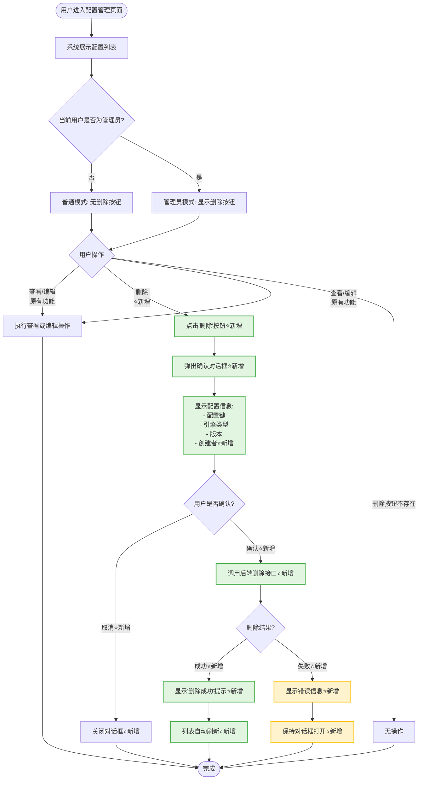

# 运维工具-用户配置删除功能 需求文档

**需求类型**: ENHANCE（功能增强）
**基础模块**: Configuration（用户配置管理模块）
**文档版本**: v1.0
**创建日期**: 2025-01-04

---

## 📋 需求速览

| 维度 | 内容 |
|-----|------|
| **一句话描述** | 在用户配置管理模块新增删除功能，支持管理员删除多余的配置项 |
| **基础模块** | Configuration（用户配置管理模块） |
| **增强目的** | 方便运维人员删除多余或错误的用户配置 |
| **功能范围** | P0: 1个 · P1: 0个 · P2: 0个 |
| **兼容性要求** | 仅删除用户配置值，不影响配置定义和现有功能 |
| **涉及模块** | Configuration、前端配置管理页面 |

> 💡 **阅读指引**：速览全貌看本卡片 → 现有功能看第二章 → 增强详情看第三章 → 技术实现看设计文档

---

## 1. 需求概述

### 1.1 业务背景

【核心】运维工具-用户配置删除功能

Apache Linkis 作为计算中间件，提供了灵活的参数配置管理功能，支持不同用户、不同引擎、不同版本的配置管理。

**现有能力**：
- ✅ 支持管理员和用户创建和修改配置
- ✅ 支持查询用户配置（管理员可查看所有用户，普通用户只能查看自己）
- ✅ 后端已具备删除接口（`DELETE /configuration/keyvalue`），但前端未暴露

**当前痛点**：
- ❌ 前端配置管理页面缺少删除按钮
- ❌ 当配置错误或多余时，只能通过后端接口或数据库手动删除
- ❌ 运维人员无法通过界面快速清理配置

### 1.2 核心目标

**主要目标**：为用户配置管理模块增加删除能力

**期望价值**：
- 提升运维效率：通过界面快速删除多余配置
- 降低操作风险：通过确认机制防止误删
- 保持功能完整性：补齐配置管理的CRUD能力

### 1.3 基础模块分析

**基础模块**: Configuration（用户配置管理模块）

**现有功能**:
- 配置查询（支持用户和管理员不同权限）
- 配置创建和修改
- 配置分类管理
- 全局配置管理

**增强动机**:
现有后端接口已支持删除功能（`DELETE /configuration/keyvalue`），但前端未暴露，导致运维人员无法通过界面操作。本次增强的目标是在前端增加删除按钮和交互逻辑。

---

## 2. 现有功能分析

### 2.1 现有后端接口分析 【核心】

#### 2.1.1 用户配置查询接口

**接口**: `GET /configuration/userKeyValue`

**功能**: 查询用户配置，支持分页

**权限控制**:
```java
// 行836-838
if (!org.apache.linkis.common.conf.Configuration.isAdmin(username) && !username.equals(user)) {
    return Message.error("Only admin can query other user configuration data");
}
```
- 管理员：可以查询所有用户的配置
- 普通用户：只能查询自己的配置

#### 2.1.2 用户配置删除接口（已存在，本次增强的重点）

**接口**: `DELETE /configuration/keyvalue`

**位置**: ConfigurationRestfulApi.java 行610-630

**功能**: 删除指定用户配置值

**请求参数**:
```json
{
  "engineType": "引擎类型",
  "version": "版本",
  "creator": "创建者",
  "configKey": "配置键"
}
```

**权限控制**:
```java
// 行614
String username = ModuleUserUtils.getOperationUser(req, "deleteKeyValue");
```
- 通过 `ModuleUserUtils.getOperationUser()` 获取用户信息
- **注意**：该接口未明确检查管理员权限，但在实际使用中应该增加权限验证

**业务逻辑**:
```java
// 行625-629
List labelList = LabelEntityParser.generateUserCreatorEngineTypeLabelList(
    username, creator, engineType, version);
List<ConfigValue> configValues = configKeyService.deleteConfigValue(configKey, labelList);
return Message.ok().data("configValues", configValues);
```
- 根据用户、创建者、引擎类型、版本生成标签列表
- 调用 `configKeyService.deleteConfigValue()` 删除配置
- 返回被删除的配置列表

#### 2.1.3 管理员权限判断方法（参考）

**方法**: `checkAdmin(String userName)`

**位置**: ConfigurationRestfulApi.java 行486-490

**功能**: 判断用户是否为管理员

**实现**:
```java
private void checkAdmin(String userName) throws ConfigurationException {
    if (!org.apache.linkis.common.conf.Configuration.isAdmin(userName)) {
        throw new ConfigurationException(ONLY_ADMIN_PERFORM.getErrorDesc());
    }
}
```

**使用场景**:
- `deleteCategory()` (行232-239)
- `createFirstCategory()` (行209-224)
- `getBaseKeyValue()` (行655)
- `deleteBaseKeyValue()` (行677-681)

**结论**: 现有代码中已有成熟的管理员权限判断逻辑，可直接复用。

### 2.2 现有前端模块分析

**模块路径**: `linkis-web/src/apps/linkis/module/configManagement/`

**文件结构**:
```
configManagement/
├── index.js          # 模块入口
├── index.scss        # 样式文件
└── index.vue         # 主组件（需要修改）
```

**现有功能**（推测）:
- 配置列表展示
- 配置编辑功能
- 配置创建功能

**缺少功能**:
- ❌ 删除按钮
- ❌ 删除确认对话框

---

## 3. 增强需求

### 3.1 功能总览

| ID | 增强点 | 优先级 | 状态 | 一句话描述 |
|----|-------|:------:|:----:|----------|
| E1 | 用户配置删除功能 | P0 | ✅ 已确认 | 在配置管理页面新增删除按钮和确认机制 |

### 3.2 增强点1：用户配置删除功能 `P0` `已确认`

#### 3.2.1 增强描述

**增强类型**: 前端界面增强（后端接口已存在）

**原有功能**:
- 用户可以通过配置管理页面查看和编辑配置
- 后端已提供删除接口，但前端未暴露

**本次增强**:
- 在配置列表的每一行增加"删除"按钮
- 点击删除按钮时弹出确认对话框
- 确认后调用后端接口删除配置
- 删除成功后刷新列表

#### 3.2.2 输入变化

| 输入项 | 变化类型 | 说明 | 约束 |
|-------|:--------:|------|------|
| 删除操作 | 新增 | 用户点击删除按钮触发删除流程 | 仅管理员可见和可操作 |
| 确认操作 | 新增 | 用户在确认对话框中确认删除 | 必须明确确认才能执行删除 |

#### 3.2.3 输出变化

| 输出项 | 变化类型 | 说明 |
|-------|:--------:|------|
| 删除按钮 | 新增 | 在配置列表的操作列显示删除按钮（仅管理员可见） |
| 确认对话框 | 新增 | 删除前弹出确认对话框，显示配置关键信息 |
| 删除结果提示 | 新增 | 删除成功或失败的提示信息 |

#### 3.2.4 用户交互流程 【核心】

**现有流程**：
1. 用户进入配置管理页面
2. 系统展示配置列表
3. 用户可以查看、编辑配置

**增强后流程**：
1. 用户进入配置管理页面
2. 系统展示配置列表（管理员用户可以看到删除按钮）
3. **⭐新增**：用户点击"删除"按钮
4. **⭐新增**：系统弹出确认对话框，显示配置信息（配置键、引擎类型、版本、创建者）
5. **⭐新增**：用户确认删除
6. **⭐新增**：系统调用后端接口执行删除
7. **⭐新增**：系统显示删除结果提示
8. **⭐新增**：列表自动刷新，已删除的配置项消失

**对现有流程的影响**:
- 原有的查看、编辑功能保持不变
- 删除功能作为独立的操作，不影响现有流程
- 仅管理员用户可以看到删除按钮，普通用户界面无变化

#### 3.2.5 流程图



**流程说明**:
- 绿色节点表示本次增强新增的步骤
- 黄色节点表示异常处理步骤
- 管理员和普通用户的操作流程在"显示删除按钮"处分流
- 删除操作包含完整的确认和结果反馈机制

#### 3.2.6 业务规则

| 规则ID | 规则描述 |
|--------|---------|
| R1.1 | 删除按钮仅对管理员用户可见和可操作 |
| R1.2 | 点击删除按钮时，必须弹出确认对话框，显示配置的完整标识信息 |
| R1.3 | 删除操作仅删除用户配置值，不影响配置定义（ConfigKey） |
| R1.4 | 删除成功后，列表自动刷新，已删除的配置项不再显示 |
| R1.5 | 删除失败时，显示具体错误信息，保持对话框打开 |
| R1.6 | 确认对话框的默认按钮应为"取消"，防止误操作 |

#### 3.2.7 验收标准（三段式）

| 验证阶段 | 验收条件 |
|:--------:|---------|
| **输入验证** | AC1.1: 删除按钮仅对管理员用户可见，普通用户不可见<br/>AC1.2: 点击删除按钮时，正确弹出确认对话框 |
| **处理验证** | AC1.3: 确认删除后，成功调用后端接口 `DELETE /configuration/keyvalue`<br/>AC1.4: 后端接口正确删除指定的配置项<br/>AC1.5: 原有的查看和编辑功能不受影响 |
| **输出验证** | AC1.6: 删除成功后显示"删除成功"提示，列表自动刷新<br/>AC1.7: 删除失败后显示错误信息，列表不刷新<br/>AC1.8: 取消删除后对话框关闭，列表保持不变 |

---

## 4. 兼容性分析

### 4.1 接口兼容性

**现有接口影响**: 无影响 ✅

**分析**:
- 后端 `DELETE /configuration/keyvalue` 接口已存在且稳定
- 本次增强仅为前端增加调用入口，不修改接口定义
- 接口的请求参数、响应格式、错误处理均保持不变

**向后兼容方案**:
- 新增的前端删除功能完全基于现有接口
- 不引入新的接口或修改现有接口
- 完全向后兼容，不影响现有调用方

**版本控制**: 不需要版本控制 ✅

### 4.2 数据兼容性

**新增字段**: 无 ✅

**数据迁移**: 不需要 ✅

**分析**:
- 删除操作仅删除配置值（ConfigValue表数据）
- 不影响配置定义（ConfigKey表）
- 不需要数据迁移脚本

**回滚方案**:
- 如果删除错误，用户可以重新创建配置
- 建议在删除前备份重要配置（手动操作）

### 4.3 行为兼容性

**现有业务流程影响**: 无影响 ✅

**分析**:
- 删除功能是独立的操作，不影响查看和编辑
- 普通用户界面完全无变化
- 仅管理员用户可以看到删除按钮

**灰度方案**: 不需要 ✅

**分析**:
- 删除功能是通过UI按钮触发，非核心流程
- 可以通过控制按钮的显示/隐藏来控制功能启用
- 建议直接全量发布，风险可控

---

## 5. 涉及文件清单

### 5.1 需要修改的文件

**后端文件**:

- [ ] **`linkis-public-enhancements/linkis-configuration/src/main/java/org/apache/linkis/configuration/restful/api/ConfigurationRestfulApi.java`**
  - **修改内容**: 在 `deleteKeyValue()` 方法中增加管理员权限检查
  - **修改原因**: 提升安全性，确保只有管理员才能删除配置
  - **修改建议**: 在行614后增加 `checkAdmin(username);`
  - **影响范围**: 仅影响删除接口的权限验证逻辑

**前端文件**:

- [ ] **`linkis-web/src/apps/linkis/module/configManagement/index.vue`**
  - **修改内容**:
    1. 在配置列表的操作列增加"删除"按钮
    2. 增加删除确认对话框组件
    3. 实现删除逻辑和结果处理
  - **修改原因**: 暴露删除功能的UI入口
  - **影响范围**: 仅影响配置管理页面的UI和交互

### 5.2 需要新增的文件

**前端文件**（可选，如果需要单独的对话框组件）:

- [ ] `linkis-web/src/apps/linkis/module/configManagement/components/DeleteConfirmDialog.vue`（可选）
  - **文件说明**: 删除确认对话框组件（如果需要复用，可以单独抽取）

---

## 6. 非功能需求

### 6.1 性能需求

- **响应时间**: 删除操作应在2秒内完成（正常网络环境下）
- **并发处理**: 支持多个管理员同时删除不同的配置项
- **列表刷新**: 删除成功后，列表应在500ms内完成刷新

### 6.2 安全需求

- **权限控制**: 删除按钮仅对管理员可见和可操作
- **确认机制**: 必须经过二次确认才能执行删除
- **操作审计**: 建议记录删除操作的日志（如现有系统支持）
- **防误删**: 确认对话框的默认按钮应为"取消"

### 6.3 可用性需求

- **用户提示**: 删除成功和失败时，都有明确的提示信息
- **错误处理**: 网络错误、权限不足等情况有友好的错误提示
- **交互一致性**: 删除操作与系统其他删除功能的交互保持一致

### 6.4 可维护性需求

- **代码复用**: 删除逻辑应封装为可复用的方法
- **注释完整**: 关键逻辑应有清晰的注释
- **错误码统一**: 使用系统统一的错误码和提示信息

---

## 7. 关联影响分析

### 7.1 功能模块影响

**影响模块**: Configuration（用户配置管理模块）

**影响范围**:
- ✅ 前端配置管理页面：新增删除按钮和对话框
- ✅ 后端删除接口：可能需要增加权限验证
- ✅ 配置查询接口：不受影响
- ✅ 配置创建和修改功能：不受影响

**兼容性**: 完全兼容，不影响现有功能

### 7.2 数据模型影响

**影响数据**: ConfigValue（用户配置值表）

**影响说明**:
- 删除操作会删除 ConfigValue 表中的记录
- 不影响 ConfigKey（配置定义表）
- 不影响其他表

**数据一致性**: 删除操作是原子性的，不会造成数据不一致

### 7.3 安全与权限影响

**新增权限点**: 无（复用现有管理员权限）

**权限控制**:
- 删除按钮仅对管理员可见
- 删除操作需要管理员权限（建议在后端接口增加检查）

**安全风险**:
- 🟡 **中等风险**: 误删可能导致配置丢失
- **应对措施**: 强制确认机制 + 建议操作前备份

### 7.4 用户体验与文案影响

**影响页面**: 配置管理页面

**UI变化**:
- 在操作列增加"删除"按钮
- 新增删除确认对话框

**文案建议**:
- 删除按钮文案："删除"
- 确认对话框标题："确认删除"
- 确认对话框内容："确认删除配置 [配置键] 吗？此操作不可恢复。"
- 确认按钮文案："确认"
- 取消按钮文案："取消"
- 删除成功提示："删除成功"
- 删除失败提示："删除失败：[错误信息]"

### 7.5 上下游与三方依赖影响

**影响范围**: 无外部依赖

**分析**:
- 删除功能仅涉及配置管理模块内部
- 不影响上下游系统
- 不涉及第三方服务

---

## 8. 风险识别

### 8.1 兼容性风险

**风险1**: 删除操作可能影响正在运行的作业

**可能性**: 低
**影响程度**: 中
**应对措施**:
- 在确认对话框中提示用户"此操作可能影响正在运行的作业"
- 建议用户在删除前确认配置是否正在使用
- 后续可以考虑增加"配置使用情况查询"功能

### 8.2 技术风险

**风险2**: 前端删除功能可能被绕过，直接调用后端接口

**可能性**: 中
**影响程度**: 中
**应对措施**:
- **强烈建议**在后端接口中增加管理员权限检查
- 确保接口权限控制严密

**风险3**: 删除后配置无法恢复

**可能性**: 高
**影响程度**: 中
**应对措施**:
- 在确认对话框中明确提示"此操作不可恢复"
- 建议用户在删除前手动备份重要配置
- 后续可以考虑增加"配置回收站"功能

### 8.3 业务风险

**风险4**: 管理员误删重要配置

**可能性**: 中
**影响程度**: 高
**应对措施**:
- 强制二次确认机制
- 确认对话框显示完整配置信息
- 建议增加操作审计日志
- 提供配置重新创建的能力（现有功能已支持）

---

## 9. 后续优化建议

### 9.1 功能增强

1. **批量删除**: 支持批量选择配置项进行删除
2. **配置回收站**: 删除的配置进入回收站，支持恢复
3. **删除前置检查**: 删除前检查配置是否正在使用，给出警告
4. **删除历史**: 记录删除操作历史，支持审计

### 9.2 体验优化

1. **删除原因记录**: 记录删除原因，便于后续分析
2. **智能提示**: 当删除的配置是关键配置时，给出更强力的警告
3. **快捷键支持**: 支持通过快捷键快速删除

---

## 附录

### 附录A：现有接口完整信息

#### A.1 删除接口详细信息

**接口路径**: `DELETE /configuration/keyvalue`

**请求方法**: DELETE

**请求头**:
```
Content-Type: application/json
```

**请求参数**:
```json
{
  "engineType": "引擎类型（如：hive、spark）",
  "version": "版本（如：2.3.0）",
  "creator": "创建者（如：IDE）",
  "configKey": "配置键（如：wds.linkis.rm.yarnqueue.memory.max）"
}
```

**响应示例**:
```json
{
  "method": "/configuration/keyvalue",
  "status": 0,
  "message": "OK",
  "data": {
    "configValues": [
      {
        "id": 123,
        "key": "wds.linkis.rm.yarnqueue.memory.max",
        "configValue": "100G",
        "configLabelId": 456,
        "createTime": "2025-01-01 10:00:00",
        "updateTime": "2025-01-01 10:00:00"
      }
    ]
  }
}
```

**错误示例**:
```json
{
  "method": "/configuration/keyvalue",
  "status": 1,
  "message": "key cannot be empty",
  "data": null
}
```

### 附录B：管理员权限配置

Linkis 的管理员配置通常在配置文件中定义，具体配置项如下：

**配置项**: `linkis.admin.user`

**默认值**: 通常为 `hadoop` 或部署时指定的用户

**判断方法**:
```java
org.apache.linkis.common.conf.Configuration.isAdmin(userName)
```

**配置示例**:
```properties
linkis.admin.user=hadoop,user1,user2
```

---

**文档结束**

*本文档基于 Apache Linkis 项目的现有代码分析生成，旨在为运维工具-用户配置删除功能提供清晰的需求定义和实现指导。*
