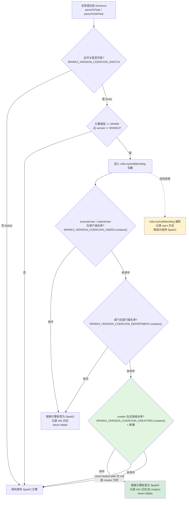
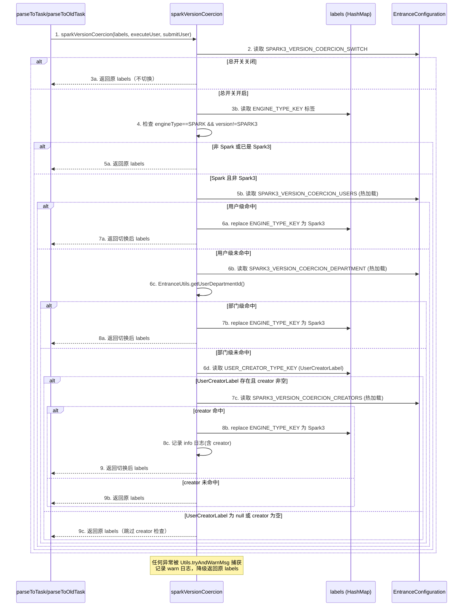

# Spark3 强制切换增强（Creator 维度） 设计文档

## 文档信息
- **文档版本**: v1.0
- **最后更新**: 2026-07-14
- **维护人**: v-kkhuang
- **文档状态**: 草稿
- **需求类型**: ENHANCE
- **功能属性**: 后端
- **前端开发类型**: N/A
- **设计文档类型**: 单一设计文档
- **需求文档**: [spark3-coercion-creator_需求.md](../requirements/spark3-coercion-creator_需求.md)

> 🔔 **方案演进（2026-07-20）**：本文档已整合「配置项管理迁移」方案 —— Part 1-3 为 creator 维度判定设计（已实现），Part 4 为配置机制迁移设计（3 名单从 properties 迁移到配置项管理、switch 保留 properties、entrance RPC 读取，已实现并验证）。

---

## 执行摘要

> 阅读指引：本章节为1页概览（约500字），用于快速理解设计方案。详细内容请参考后续章节。

### 设计目标

| 目标 | 描述 | 优先级 |
|-----|------|-------|
| 新增 creator 维度判定 | 在 sparkVersionCoercion 方法中新增应用级(creator)强制切换判定分支，作为第三优先级 | P0 |
| 向后兼容 | 开关关闭或 creator 名单为空时，行为与增强前完全一致 | P0 |
| 降级安全 | creator 分支复用现有 Utils.tryAndWarnMsg 异常保护，异常时降级为保持 Spark2 | P0 |
| 配置热加载 | creator 名单使用 getHotValue()，运维可不重启调整名单 | P1 |

### 核心设计决策

| 决策点 | 选择方案 | 决策理由 | 替代方案 |
|-------|---------|---------|---------|
| creator 分支位置 | 部门级检查之后、tryAndWarnMsg 闭合之前 | 优先级 个人 > 部门 > creator，仅在更高优先级未命中时检查 | 放在用户级之后（跳过部门级不合理） |
| creator 取值方式 | 从 labels 中 UserCreatorLabel.getCreator 获取 | 调用时 UserCreatorLabel 已生成（generateAndVerifyUserCreatorLabel 之后），无需改方法签名 | 新增方法参数（破坏签名兼容） |
| 配置加载方式 | getHotValue()（热加载） | 与现有 USERS/DEPARTMENT 一致，运维可不重启调整名单 | getValue()（需重启，灵活性差） |
| 是否新增子开关 | 复用现有总开关 spark.version.coercion.switch | Stage 0 确认不新增独立子开关，总开关统一控制所有维度 | 新增 spark.version.coercion.creators.switch（过度设计） |
| 总开关加载方式 | 保持 getValue 不改 | Stage 0 确认保持现状，避免引入未预期的热加载行为 | 改为 getHotValue（超出本次范围） |

### 架构概览图

```
                    ┌─────────────────────────────┐
                    │   CommonEntranceParser       │
                    │   sparkVersionCoercion()     │
                    └──────────┬──────────────────┘
                               │
              ┌────────────────┼────────────────────────┐
              │                │                        │
     ┌────────┴───┐   ┌───────┴──────┐   ┌─────────────┴────────┐
     │ 用户级检查  │   │ 部门级检查    │   │ creator 级检查 (新增) │
     │ (现有)     │   │ (现有)       │   │ 从 UserCreatorLabel   │
     │ executeUser│   │ DepartmentId │   │ .getCreator() 取值     │
     │ /submitUser│   │ .contains()  │   │ .contains() 匹配      │
     └────────────┘   └──────────────┘   └──────────────────────┘
         优先级: 高 ──────────────────────────────► 低
```

### 关键风险与缓解

| 风险 | 等级 | 缓解措施 |
|-----|------|---------|
| creator 分支引入新异常影响任务执行 | 中 | 复用现有 Utils.tryAndWarnMsg 包裹，异常时降级为保持 Spark2 |
| String.contains 子串匹配局限性 | 低 | 与现有用户级/部门级一致；风险章节已说明；后续可升级为精确匹配 |
| 主流程 Parser 改动回归风险 (section 10.1 步骤[5]) | 中 | 需开关 on/off 双态冒烟；并发场景验证 (>=3 任务) |

### 章节导航

| 关注点 | 推荐章节 |
|-------|---------|
| 想了解整体方案 | [1.1 增强范围与架构](#11-增强范围与架构) |
| 想了解核心流程 | [1.2 增强后判定流程](#12-增强后判定流程) |
| 想了解接口变更 | [1.3 关键接口变更](#13-关键接口变更) |
| 想了解兼容性设计 | [2.1 兼容性保证](#21-兼容性保证) |
| 想了解配置策略 | [2.2 配置策略](#22-配置策略) |
| 想了解测试方案 | [2.3 测试策略](#23-测试策略) |
| 想了解回滚方案 | [2.4 回滚方案](#24-回滚方案) |
| 想查看完整代码 | [3.1 完整增强后方法代码](#31-完整增强后方法代码) |

---

# Part 1: 核心设计

> 本层目标：阐述增强方案、核心流程、关键接口变更，完整详细展开。
>
> 预计阅读时间：10-15分钟

## 1.1 增强范围与架构

### 1.1.1 增强定位

本次增强属于 **逻辑增强**，在现有 `CommonEntranceParser.sparkVersionCoercion` 方法中新增 creator 维度判定分支，不修改现有用户级/部门级判定逻辑，不改变方法签名，不新增独立开关。

**改动范围**：

| 文件 | 变更类型 | 变更内容 |
|-----|---------|---------|
| `EntranceConfiguration.scala` | 新增配置声明 | 新增 `SPARK3_VERSION_COERCION_CREATORS`（getHotValue，默认空） |
| `CommonEntranceParser.scala` | 新增 import + 新增判定分支 | import 块新增 `SPARK3_VERSION_COERCION_CREATORS`；sparkVersionCoercion 方法在部门级检查之后新增 creator 分支 |
| `linkis-cg-entrance.properties` | 新增配置注释行 | 补充四项 spark.version.coercion.* 配置注释行 |
| `docs/configuration/` | 文档更新 | 补充 creator 维度说明 |

**不改动范围**：

| 不改动项 | 理由 |
|---------|------|
| `sparkVersionCoercion` 方法签名 | 保持调用方兼容（parseToTask 行142、parseToOldTask 行323） |
| 现有用户级/部门级判定逻辑 | 零改动，仅在未命中后追加新分支 |
| `SPARK3_VERSION_COERCION_SWITCH` 加载方式 | Stage 0 确认保持 getValue 不改 |
| 拦截器链顺序 (EntranceSpringConfiguration) | 本次非 section 10.2 #2 拦截器链改动 |
| Protocol case class / Bean 名称 | 地雷区不动 |

### 1.1.2 技术约束

| 约束 | 要求 |
|-----|------|
| JDK | 1.8（禁 Java 9+ 语法） |
| Scala | 2.11.12（禁 2.12+ 语法如 trait 参数） |
| 单行最大 | 200 字符 |
| 缩进 | 2 空格（禁 Tab） |
| 文件末尾 | 空一行 |
| 异常保护 | 新分支沿用现有 Utils.tryAndWarnMsg 包裹 |
| 日志 | extends Logging 的 logger，中英双语格式 |
| 主流程风险 | section 10.1 步骤[5] Parser，按 section 10.3 需 on/off 双态冒烟 |

---

## 1.2 增强后判定流程

### 1.2.1 Spark3 强制切换判定流程图（增强后）



**增强点说明**：
- 绿色节点为本次新增的 creator 维度判定分支
- creator 检查仅在用户级和部门级均未命中后执行（最低优先级）
- UserCreatorLabel 为 null 或 creator 值为空时跳过 creator 维度，不影响任务
- 整个 creator 分支复用现有 Utils.tryAndWarnMsg 异常保护

### 1.2.2 判定时序图



#### 关键节点说明

| 节点 | 处理逻辑 | 输入/输出 | 异常处理 |
|-----|---------|----------|---------|
| 1. 调用 sparkVersionCoercion | 任务解析阶段调用，UserCreatorLabel 已生成 | 输入: labels(HashMap), executeUser, submitUser<br>输出: labels(HashMap) | 方法整体被 Utils.tryAndWarnMsg 包裹 |
| 2. 读取总开关 | SPARK3_VERSION_COERCION_SWITCH (getValue, 非热加载) | 输入: 无<br>输出: Boolean | 开关为 false 时直接返回原 labels |
| 3b. 读取引擎标签 | 从 labels 获取 ENGINE_TYPE_KEY | 输入: labels<br>输出: engineType, version | 标签为 null 时不进入强制切换逻辑 |
| 5b. 用户级检查 | executeUser/submitUser 是否在 USERS 名单中 | 输入: executeUser, submitUser, USERS<br>输出: Boolean | 命中则替换标签并 return |
| 6b-6c. 部门级检查 | EntranceUtils.getUserDepartmentId 获取部门 ID，检查是否在 DEPARTMENT 名单 | 输入: executeUser, submitUser<br>输出: departmentId | 部门 ID 为空时跳过；命中则替换标签并 return |
| 6d-7c. creator 级检查 (新增) | 从 labels 获取 UserCreatorLabel，取 creator 值，检查是否在 CREATORS 名单 | 输入: labels<br>输出: creator(String) | UserCreatorLabel 为 null 或 creator 为空时跳过；命中则替换标签并 return |
| 8c. 记录日志 (新增) | creator 命中时记录 info 级别日志，含 creator 值和 executeUser | 输入: creator, executeUser<br>输出: 日志 | 无 |
| 异常降级 | Utils.tryAndWarnMsg 捕获任何异常 | 输入: 异常对象<br>输出: warn 日志 + 返回原 labels | 降级为保持 Spark2，不抛出异常 |

#### 技术难点与解决方案

| 难点 | 问题描述 | 解决方案 | 决策理由 |
|-----|---------|---------|---------|
| creator 值获取时机 | UserCreatorLabel 是否在 sparkVersionCoercion 调用时已存在 | 调用点 parseToTask 行142 在 generateAndVerifyUserCreatorLabel 行139 之后；parseToOldTask 行323 在 UserCreatorLabel 构建 行304-310 之后 | 已确认调用时机安全；额外增加 null 检查兜底 |
| 异常安全 | creator 分支可能引入新异常（如 ClassCastException、NPE） | creator 分支放在现有 Utils.tryAndWarnMsg 块内部，任何异常自动被捕获降级 | 复用现有异常保护，零额外代码 |
| 热加载一致性 | creator 名单需要热加载，与 USERS/DEPARTMENT 一致 | 使用 getHotValue()，与现有两维度完全一致 | 运维可不重启调整名单，降低变更窗口压力 |
| 匹配方式选择 | String.contains 子串匹配可能误命中（如 "app" 匹配到 "appA"） | 沿用现有用户级/部门级的 contains 方式，保持一致性 | 与现有维度行为一致；风险已在风险章节说明；后续可统一升级为精确匹配 |

#### 边界与约束

- **前置条件**：UserCreatorLabel 在调用 sparkVersionCoercion 前已生成（generateAndVerifyUserCreatorLabel 之后）
- **后置保证**：creator 命中时引擎标签改写为 Spark3 (version 3.4.4)；未命中时保持原有标签不变
- **兼容性保证**：开关关闭或 creator 名单为空时，行为与增强前完全一致
- **回滚约束**：回滚时关闭总开关或清空 creators 名单即可，无需代码回退

---

## 1.3 关键接口变更

> 本节使用 Before/After 对比形式展示变更点，符合 ENHANCE 类型 codeDepth 要求。

### 1.3.1 EntranceConfiguration 配置声明变更

**BEFORE（现有代码，行 346-353）**：

```scala
  val SPARK3_VERSION_COERCION_USERS: String =
    CommonVars[String]("spark.version.coercion.users", "").getHotValue()

  val SPARK3_VERSION_COERCION_DEPARTMENT: String =
    CommonVars[String]("spark.version.coercion.department.id", "").getHotValue()

  val SPARK3_VERSION_COERCION_SWITCH: Boolean =
    CommonVars[Boolean]("spark.version.coercion.switch", false).getValue
```

**AFTER（增强后）**：

```scala
  val SPARK3_VERSION_COERCION_USERS: String =
    CommonVars[String]("spark.version.coercion.users", "").getHotValue()

  val SPARK3_VERSION_COERCION_DEPARTMENT: String =
    CommonVars[String]("spark.version.coercion.department.id", "").getHotValue()

  // ===== 新增：creator 维度配置（应用级强制切换名单，热加载） =====
  val SPARK3_VERSION_COERCION_CREATORS: String =
    CommonVars[String]("spark.version.coercion.creators", "").getHotValue()

  val SPARK3_VERSION_COERCION_SWITCH: Boolean =
    CommonVars[Boolean]("spark.version.coercion.switch", false).getValue
```

**变更说明**：
- 新增 `SPARK3_VERSION_COERCION_CREATORS`，放在 `DEPARTMENT` 之后、`SWITCH` 之前
- 使用 `getHotValue()`（热加载），与 `USERS`/`DEPARTMENT` 写法完全一致
- 默认空字符串，不触发任何切换

### 1.3.2 CommonEntranceParser import 变更

**BEFORE（现有代码，行 22-27）**：

```scala
import org.apache.linkis.entrance.conf.EntranceConfiguration
import org.apache.linkis.entrance.conf.EntranceConfiguration.{
  SPARK3_VERSION_COERCION_DEPARTMENT,
  SPARK3_VERSION_COERCION_SWITCH,
  SPARK3_VERSION_COERCION_USERS
}
```

**AFTER（增强后）**：

```scala
import org.apache.linkis.entrance.conf.EntranceConfiguration
import org.apache.linkis.entrance.conf.EntranceConfiguration.{
  SPARK3_VERSION_COERCION_CREATORS,
  SPARK3_VERSION_COERCION_DEPARTMENT,
  SPARK3_VERSION_COERCION_SWITCH,
  SPARK3_VERSION_COERCION_USERS
}
```

**变更说明**：
- 在 import 块中新增 `SPARK3_VERSION_COERCION_CREATORS`（按字母序排在 DEPARTMENT 之前）
- 其余 import 不变（`LabelKeyConstant`、`UserCreatorLabel`、`EngineTypeLabelCreator`、`LabelUtil`、`LabelCommonConfig` 均已导入）

### 1.3.3 sparkVersionCoercion 方法变更（Before/After 对比）

**BEFORE（现有代码，行 355-411）核心结构**：

```scala
  private def sparkVersionCoercion(
      labels: util.HashMap[String, Label[_]],
      executeUser: String,
      submitUser: String
  ): util.HashMap[String, Label[_]] = {
    if (SPARK3_VERSION_COERCION_SWITCH && (null != labels && !labels.isEmpty)) {
      // ... 引擎类型检查 ...
      if (engineType.equals(EngineType.SPARK.toString) && (!version.equals(...))) {
        Utils.tryAndWarnMsg {
          // 1. 用户级检查 (行 373-388)
          if (SPARK3_VERSION_COERCION_USERS.contains(executeUser) || ...) {
            // replace label -> return labels
          }
          // 2. 部门级检查 (行 389-406)
          if (...SPARK3_VERSION_COERCION_DEPARTMENT.contains(...)) {
            // replace label -> return labels
          }
          // ← creator 分支插入位置（此处之后是 tryAndWarnMsg 闭合）
        }(s"error to Spark 3 version coercion: ${executeUser}")
      }
    }
    labels;
  }
```

**AFTER（增强后）核心结构**：

```scala
  private def sparkVersionCoercion(
      labels: util.HashMap[String, Label[_]],
      executeUser: String,
      submitUser: String
  ): util.HashMap[String, Label[_]] = {
    if (SPARK3_VERSION_COERCION_SWITCH && (null != labels && !labels.isEmpty)) {
      // ... 引擎类型检查（不变） ...
      if (engineType.equals(EngineType.SPARK.toString) && (!version.equals(...))) {
        Utils.tryAndWarnMsg {
          // 1. 用户级检查（不变，行 373-388）
          if (SPARK3_VERSION_COERCION_USERS.contains(executeUser) || ...) {
            // replace label -> return labels
          }
          // 2. 部门级检查（不变，行 389-406）
          if (...SPARK3_VERSION_COERCION_DEPARTMENT.contains(...)) {
            // replace label -> return labels
          }
          // 3. creator 级检查（新增，插入在部门级 if 闭合之后、tryAndWarnMsg 闭合之前）
          val userCreatorLabel = labels
            .get(LabelKeyConstant.USER_CREATOR_TYPE_KEY)
            .asInstanceOf[UserCreatorLabel]
          if (null != userCreatorLabel) {
            val creator = userCreatorLabel.getCreator
            if (
                StringUtils.isNotBlank(creator) && SPARK3_VERSION_COERCION_CREATORS
                  .contains(creator)
            ) {
              logger.info(
                s"Spark version will be change 3.4.4 by creator:${creator},executeUser:${executeUser} "
              )
              labels.replace(
                LabelKeyConstant.ENGINE_TYPE_KEY,
                EngineTypeLabelCreator.createEngineTypeLabel(
                  EngineType.SPARK.toString,
                  LabelCommonConfig.SPARK3_ENGINE_VERSION.getValue
                )
              )
              return labels
            }
          }
        }(s"error to Spark 3 version coercion: ${executeUser}")
      }
    }
    labels;
  }
```

**变更说明**：

| 变更项 | 说明 |
|-------|------|
| 方法签名 | **不变**（labels, executeUser, submitUser） |
| 用户级检查 | **不变**（行 373-388 原样保留） |
| 部门级检查 | **不变**（行 389-406 原样保留） |
| creator 分支 | **新增**（插入在部门级 if 闭合 `}` 之后、tryAndWarnMsg 闭合 `}` 之前） |
| tryAndWarnMsg 包裹 | **不变**（creator 分支在现有包裹内部，自动获得异常保护） |
| 返回值 | **不变**（命中时 return labels；未命中时方法末尾返回原 labels） |

### 1.3.4 核心业务规则

| 规则编号 | 规则描述 | 触发条件 | 处理逻辑 |
|---------|---------|---------|---------|
| BR-001 | creator 检查仅在用户级和部门级均未命中后执行 | 总开关开启 + Spark 且非 Spark3 + 用户级未命中 + 部门级未命中 | 进入 creator 分支 |
| BR-002 | UserCreatorLabel 为 null 时跳过 creator 检查 | labels 中无 USER_CREATOR_TYPE_KEY 或类型转换失败 | 不进入 creator 匹配，保持原标签 |
| BR-003 | creator 值为空时跳过 creator 检查 | getCreator 返回 null 或空字符串 | 不进入 creator 匹配，保持原标签 |
| BR-004 | creator 名单为空时跳过 creator 检查 | SPARK3_VERSION_COERCION_CREATORS 为空字符串 | String.contains 对空字符串返回 false，等效跳过 |
| BR-005 | creator 命中后改写引擎标签 | creator 在名单中 | replace ENGINE_TYPE_KEY 为 Spark3 (3.4.4)，记录 info 日志，return labels |
| BR-006 | creator 分支异常时降级 | creator 分支内任何异常 | Utils.tryAndWarnMsg 捕获，记录 warn 日志，返回原 labels |

---

## 1.4 设计决策记录 (ADR)

### ADR-001: creator 分支插入位置选择

- **状态**：已采纳
- **背景**：需要在 sparkVersionCoercion 方法中新增 creator 维度判定分支，需确定插入位置
- **决策**：插入在部门级 if 闭合之后、Utils.tryAndWarnMsg 闭合之前
- **选项对比**：

| 选项 | 优点 | 缺点 | 适用场景 |
|-----|------|------|---------|
| 选项A（采用）：部门级之后、tryAndWarnMsg 之前 | 符合优先级 个人 > 部门 > creator；在 tryAndWarnMsg 内部获得异常保护 | 无 | 三维度递进判定 |
| 选项B：用户级之后、部门级之前 | 无 | 违反 Stage 0 确认的优先级（creator 应最低） | 不适用 |
| 选项C：tryAndWarnMsg 之外 | 无 | 失去异常保护，需额外包裹 tryCatch | 不适用 |

- **结论**：选项A 既满足优先级要求，又复用现有异常保护，零额外代码
- **影响**：creator 分支自动获得 Utils.tryAndWarnMsg 保护，无需新增独立异常处理

### ADR-002: creator 配置使用 getHotValue 而非 getValue

- **状态**：已采纳
- **背景**：creator 名单需要支持运维不重启调整
- **决策**：使用 `getHotValue()`，与现有 `SPARK3_VERSION_COERCION_USERS` 和 `SPARK3_VERSION_COERCION_DEPARTMENT` 完全一致
- **选项对比**：

| 选项 | 优点 | 缺点 | 适用场景 |
|-----|------|------|---------|
| 选项A（采用）：getHotValue | 热加载，运维可不重启调整名单；与现有两维度一致 | 每次读取有微小开销（可忽略） | 需要动态调整的名单 |
| 选项B：getValue | 性能略优 | 需重启才生效，灵活性差 | 固定不变的配置 |

- **结论**：选项A 与现有维度保持一致，运维体验统一
- **影响**：creator 名单调整无需重启 linkis-entrance 服务

### ADR-003: 不新增独立子开关

- **状态**：已采纳
- **背景**：是否为 creator 维度新增独立子开关（如 spark.version.coercion.creators.switch）
- **决策**：复用现有总开关 `spark.version.coercion.switch`，不新增子开关
- **选项对比**：

| 选项 | 优点 | 缺点 | 适用场景 |
|-----|------|------|---------|
| 选项A（采用）：复用总开关 | 简单；creator 名单为空等效于关闭；与现有维度一致 | 无法单独关闭 creator 维度 | 灰度迁移场景 |
| 选项B：新增子开关 | 可单独控制 creator 维度 | 过度设计；增加配置复杂度；与现有维度不一致 | 需要细粒度控制时 |

- **结论**：Stage 0 确认不新增子开关；creator 名单为空即为等效关闭
- **影响**：配置项更少，运维更简单

---

# Part 2: 支撑设计

> 本层目标：兼容性保证、配置策略、测试策略、回滚方案的结构化摘要。
>
> 预计阅读时间：5-10分钟

## 2.1 兼容性保证

### 现有接口影响

| 接口/方法 | 影响 | 兼容措施 |
|----------|------|---------|
| `sparkVersionCoercion(labels, executeUser, submitUser)` | 新增内部判定分支，签名不变 | 方法签名、参数、返回类型均不变 |
| `parseToTask` 行142 调用 | 无影响 | 调用方式不变 |
| `parseToOldTask` 行323 调用 | 无影响 | 调用方式不变 |
| 现有用户级检查逻辑 | 无影响 | 行 373-388 原样保留 |
| 现有部门级检查逻辑 | 无影响 | 行 389-406 原样保留 |

### 数据库变更

| 表 | 变更类型 | 变更内容 | 兼容措施 |
|---|---------|---------|---------|
| 无 | 无 | 无 | 本次增强不涉及任何数据库表结构变更 |

### 行为兼容性矩阵

| 场景 | 增强前行为 | 增强后行为 | 兼容性 |
|-----|----------|----------|--------|
| 总开关关闭 | 保持 Spark2 | 保持 Spark2（creator 分支不执行） | 完全一致 |
| 总开关开启 + creator 名单为空 | 保持 Spark2（用户级/部门级未命中时） | 保持 Spark2（creator 名空跳过） | 完全一致 |
| 总开关开启 + creator 名单非空 + creator 命中 | 保持 Spark2（无 creator 维度） | 强制切换 Spark3 | **预期变更**（新功能生效） |
| 总开关开启 + creator 名单非空 + creator 未命中 | 保持 Spark2 | 保持 Spark2（creator 未命中） | 完全一致 |
| 总开关开启 + 用户级命中 | 强制切换 Spark3 | 强制切换 Spark3（creator 不检查） | 完全一致 |
| 总开关开启 + 部门级命中 | 强制切换 Spark3 | 强制切换 Spark3（creator 不检查） | 完全一致 |
| 非 Spark 引擎 | 不受影响 | 不受影响（引擎类型检查在前） | 完全一致 |
| 已是 Spark3 | 不重复切换 | 不重复切换（版本检查在前） | 完全一致 |
| creator 分支异常 | N/A | 降级为保持 Spark2（Utils.tryAndWarnMsg） | 降级安全 |

---

## 2.2 配置策略

### 关键配置项

| 配置项 | 默认值 | 加载方式 | 说明 | 调整建议 |
|-------|-------|---------|------|---------|
| `spark.version.coercion.switch` | `false` | getValue（非热加载） | 总开关，控制所有维度 | 灰度验证后开启；修改需重启 |
| `spark.version.coercion.users` | `""` | getHotValue（热加载） | 用户级名单，逗号分隔 | 不重启可调整 |
| `spark.version.coercion.department.id` | `""` | getHotValue（热加载） | 部门级名单，逗号分隔 | 不重启可调整 |
| `spark.version.coercion.creators` | `""` | getHotValue（热加载） | **新增** 应用级名单，逗号分隔 | 不重启可调整 |

### 配置项关系

```
spark.version.coercion.switch (总开关，默认 false)
  ├── spark.version.coercion.users (用户级，热加载)
  ├── spark.version.coercion.department.id (部门级，热加载)
  └── spark.version.coercion.creators (应用级，热加载，新增)
```

**优先级**：个人(users) > 部门(department) > 应用(creators)

### 环境差异配置

| 配置项 | 开发环境 | 测试环境 | 生产环境 |
|-------|---------|---------|---------|
| spark.version.coercion.switch | true（测试用） | true（验证用） | false（默认关闭，灰度时开启） |
| spark.version.coercion.creators | ""（空） | "test_app"（测试应用） | ""（空，灰度时按需配置） |

---

## 2.3 测试策略

### 测试范围

| 测试类型 | 覆盖范围 | 优先级 |
|---------|---------|-------|
| 单元测试 | sparkVersionCoercion 方法 creator 分支逻辑 | P0 |
| 回归测试 | 现有用户级/部门级判定不受影响 | P0 |
| 冒烟测试 | 开关 on/off 双态 + 任务全链路 | P0 |
| 并发测试 | 同一 creator 同时提交 >=3 任务 | P1 |
| 热加载测试 | 不重启调整 creator 名单 | P1 |

### 关键测试场景

| 场景 | 输入 | 预期输出 | 优先级 |
|-----|------|---------|-------|
| creator 命中名单 | switch=true, creators="appC", creator="appC", Spark2 任务 | 切换 Spark3 (3.4.4)，日志含 creator 值 | P0 |
| creator 未命中名单 | switch=true, creators="appC", creator="appD" | 保持 Spark2 | P0 |
| creator 名单为空 | switch=true, creators="", creator="appE" | 保持 Spark2（与增强前一致） | P0 |
| UserCreatorLabel 不存在 | switch=true, creators="appA", labels 无 UserCreatorLabel | 保持 Spark2，不抛异常 | P0 |
| creator 值为空 | switch=true, creators="appA", UserCreatorLabel.getCreator()=null | 保持 Spark2，不抛异常 | P0 |
| creator 分支异常降级 | switch=true, creators 配置读取异常 | 保持 Spark2，记录 warn 日志 | P1 |
| 用户级命中时不检查 creator | switch=true, users="userA", creators="appB", user="userA", creator="appA" | 切换 Spark3，日志记录用户级命中 | P0 |
| 部门级命中时不检查 creator | switch=true, department="dept02", creators="appB", dept="dept02", creator="appA" | 切换 Spark3，日志记录部门级命中 | P0 |
| 三维度均未命中 | switch=true, users/department/creators 均不匹配 | 保持 Spark2 | P0 |
| 总开关关闭 | switch=false, creators="appA" | 保持 Spark2（与增强前一致） | P0 |
| 非 Spark 引擎 | switch=true, creators="appA", engineType=HIVE | 保持 Hive（不受影响） | P1 |
| 已是 Spark3 | switch=true, creators="appA", version=3.4.4 | 保持 Spark3（不重复切换） | P1 |
| 开关 on 冒烟 | switch=true, creators="smokeApp", 提交 Spark2 任务 | 切换 Spark3，任务正常执行，日志/结果回写正常 | P0 |
| 开关 off 冒烟 | switch=false, 提交相同任务 | 保持 Spark2，任务正常执行 | P0 |
| 并发场景 | switch=true, creators="concurrentApp", 3 个任务同时提交 | 全部正确切换 Spark3，无串扰 | P1 |
| 热加载添加 creator | 运维不重启将 "appK" 加入 creators | 后续任务 creator="appK" 命中切换 | P1 |
| 热加载移除 creator | 运维不重启将 "appL" 从 creators 移除 | 后续任务 creator="appL" 保持 Spark2 | P1 |

---

## 2.4 回滚方案

### 回滚步骤

| 步骤 | 操作 | 验证点 |
|-----|------|-------|
| 1. 紧急回滚（不重启） | 将 `spark.version.coercion.creators` 设为空字符串 `""` | 热加载生效后，creator 维度不再触发切换 |
| 2. 紧急回滚（总开关） | 将 `spark.version.coercion.switch` 设为 `false`（需重启） | 所有维度均不生效 |
| 3. 代码回滚 | `git revert <commit>` | 编译通过，现有功能正常 |

### 回滚验证

- [ ] creator 名单清空后，提交 Spark2 任务验证保持 Spark2
- [ ] 现有用户级/部门级强制切换不受影响（如仍需保留）
- [ ] 任务全链路正常（提交 -> EC 拉起 -> 日志/结果回写 -> jobhistory 落库）

### 回滚约束

- **热加载回滚**：清空 creators 名单即可，无需重启服务，最快
- **总开关回滚**：需重启服务生效（getValue 非热加载）
- **代码回滚**：git revert 后需重新编译部署

---

## 2.5 外部依赖接口设计

N/A - 本增强功能无新增外部系统依赖。纯内部逻辑增强，不涉及外部服务调用、第三方 API 对接或跨系统集成。

---

## 2.6 安全设计摘要

| 安全关注点 | 措施 | 说明 |
|-----------|------|------|
| 日志安全 | 仅记录 creator 值和 executeUser，不打印 SQL/代码/凭证 | 遵循 CLAUDE.md section 8 日志规范 |
| 配置安全 | creator 名单为运维配置项，不涉及敏感信息 | 默认空值，不触发切换 |
| 权限控制 | 无新增权限点，复用现有总开关 | 运维通过配置管理平台调整 |

---

# Part 3: 参考资料

> 本层目标：完整代码、配置变更，按需查阅。
>
> 使用方式：点击展开查看详细内容

## 3.1 完整增强后方法代码

<details>
<summary>CommonEntranceParser.sparkVersionCoercion - 增强后完整方法（含 creator 分支）</summary>

```scala
  private def sparkVersionCoercion(
      labels: util.HashMap[String, Label[_]],
      executeUser: String,
      submitUser: String
  ): util.HashMap[String, Label[_]] = {
    // 个人>部门>应用(creator)
    // 是否强制转换
    if (SPARK3_VERSION_COERCION_SWITCH && (null != labels && !labels.isEmpty)) {
      val engineTypeLabel = labels.get(LabelKeyConstant.ENGINE_TYPE_KEY)
      val engineType = LabelUtil.getFromLabelStr(engineTypeLabel.getStringValue, "engine")
      val version = LabelUtil.getFromLabelStr(engineTypeLabel.getStringValue, "version")
      if (
          engineType.equals(EngineType.SPARK.toString) && (!version.equals(
            LabelCommonConfig.SPARK3_ENGINE_VERSION.getValue
          ))
      ) {
        Utils.tryAndWarnMsg {
          // 判断用户是否是个人配置中的一员
          if (
              SPARK3_VERSION_COERCION_USERS.contains(executeUser) || SPARK3_VERSION_COERCION_USERS
                .contains(submitUser)
          ) {
            logger.info(
              s"Spark version will be change 3.4.4,submitUser:${submitUser},executeUser:${executeUser} "
            )
            labels.replace(
              LabelKeyConstant.ENGINE_TYPE_KEY,
              EngineTypeLabelCreator.createEngineTypeLabel(
                EngineType.SPARK.toString,
                LabelCommonConfig.SPARK3_ENGINE_VERSION.getValue
              )
            )
            return labels
          }
          val executeUserDepartmentId = EntranceUtils.getUserDepartmentId(executeUser)
          val submitUserDepartmentId = EntranceUtils.getUserDepartmentId(submitUser)
          if (
              (StringUtils.isNotBlank(executeUserDepartmentId) && SPARK3_VERSION_COERCION_DEPARTMENT
                .contains(executeUserDepartmentId)) ||
              (StringUtils.isNotBlank(submitUserDepartmentId) && SPARK3_VERSION_COERCION_DEPARTMENT
                .contains(submitUserDepartmentId))
          ) {
            logger.info(s"Spark version will be change 3.4.4 by department:${executeUser} ")
            labels.replace(
              LabelKeyConstant.ENGINE_TYPE_KEY,
              EngineTypeLabelCreator.createEngineTypeLabel(
                EngineType.SPARK.toString,
                LabelCommonConfig.SPARK3_ENGINE_VERSION.getValue
              )
            )
            return labels
          }
          // ===== 新增：creator 维度检查（应用级，优先级最低） =====
          val userCreatorLabel = labels
            .get(LabelKeyConstant.USER_CREATOR_TYPE_KEY)
            .asInstanceOf[UserCreatorLabel]
          if (null != userCreatorLabel) {
            val creator = userCreatorLabel.getCreator
            if (
                StringUtils.isNotBlank(creator) && SPARK3_VERSION_COERCION_CREATORS
                  .contains(creator)
            ) {
              logger.info(
                s"Spark version will be change 3.4.4 by creator:${creator},executeUser:${executeUser} "
              )
              labels.replace(
                LabelKeyConstant.ENGINE_TYPE_KEY,
                EngineTypeLabelCreator.createEngineTypeLabel(
                  EngineType.SPARK.toString,
                  LabelCommonConfig.SPARK3_ENGINE_VERSION.getValue
                )
              )
              return labels
            }
          }
          // ===== 新增结束 =====
        }(s"error to Spark 3 version coercion: ${executeUser}")
      }
    }
    labels;
  }
```

</details>

---

## 3.2 完整配置声明代码

<details>
<summary>EntranceConfiguration.scala - SPARK3_VERSION_COERCION_* 配置块（增强后）</summary>

```scala
  val SPARK3_VERSION_COERCION_USERS: String =
    CommonVars[String]("spark.version.coercion.users", "").getHotValue()

  val SPARK3_VERSION_COERCION_DEPARTMENT: String =
    CommonVars[String]("spark.version.coercion.department.id", "").getHotValue()

  val SPARK3_VERSION_COERCION_CREATORS: String =
    CommonVars[String]("spark.version.coercion.creators", "").getHotValue()

  val SPARK3_VERSION_COERCION_SWITCH: Boolean =
    CommonVars[Boolean]("spark.version.coercion.switch", false).getValue
```

</details>

---

## 3.3 完整 import 变更

<details>
<summary>CommonEntranceParser.scala - import 变更（增强后）</summary>

```scala
import org.apache.linkis.entrance.conf.EntranceConfiguration
import org.apache.linkis.entrance.conf.EntranceConfiguration.{
  SPARK3_VERSION_COERCION_CREATORS,
  SPARK3_VERSION_COERCION_DEPARTMENT,
  SPARK3_VERSION_COERCION_SWITCH,
  SPARK3_VERSION_COERCION_USERS
}
```

**已存在无需新增的 import**（确认行号）：

| import 项 | 行号 | 用途 |
|-----------|------|------|
| `LabelKeyConstant` | 行 41 | 获取 USER_CREATOR_TYPE_KEY / ENGINE_TYPE_KEY |
| `UserCreatorLabel` | 行 44-48 | asInstanceOf 转换 + getCreator() 调用 |
| `EngineTypeLabelCreator` | 行 49 | createEngineTypeLabel 改写标签 |
| `LabelUtil` | 行 49 | getFromLabelStr 解析引擎类型/版本 |
| `LabelCommonConfig` | 行 40 | SPARK3_ENGINE_VERSION 常量 |
| `EngineType` | 行 44-48 | EngineType.SPARK.toString 比较 |
| `StringUtils` | 行 56 | isNotBlank 空值检查 |
| `Utils` | 行 21 | tryAndWarnMsg 异常保护 |

</details>

---

## 3.4 配置文件变更

<details>
<summary>linkis-cg-entrance.properties - 新增四项 spark.version.coercion 配置注释行</summary>

```properties
# ... 现有配置 ...

## Spark3 version coercion settings (Spark3 强制切换配置)
## 总开关，默认关闭。开启后按 用户 > 部门 > 应用(creator) 优先级检查
# spark.version.coercion.switch=false
## 用户级强制切换名单，逗号分隔，热加载（不重启可调整）
# spark.version.coercion.users=
## 部门级强制切换名单，逗号分隔，热加载（不重启可调整）
# spark.version.coercion.department.id=
## 应用级(creator)强制切换名单，逗号分隔，热加载（不重启可调整）
# spark.version.coercion.creators=
```

**说明**：
- 四项配置均以注释行形式写出（`#` 前缀），即使为空也列出，便于运维感知
- 现有三项（switch/users/department.id）此前未在 properties 文件中声明，本次一并补充
- 新增一项 `spark.version.coercion.creators`

</details>

---

## 3.5 风险分析补充

<details>
<summary>String.contains 子串匹配局限性分析</summary>

**问题描述**：

当前三个维度（用户级、部门级、creator 级）均使用 `String.contains()` 进行名单匹配。这种方式是子串匹配，存在以下局限性：

| 场景 | 配置名单 | 输入值 | contains 结果 | 预期 | 是否误命中 |
|-----|---------|-------|-------------|------|----------|
| 正常匹配 | "appC" | "appC" | true | true | 否 |
| 子串误匹配 | "appC" | "app" | true | false | **是** |
| 多值匹配 | "app1,app2,app3" | "app2" | true | true | 否 |
| 多值子串误匹配 | "app1,app2" | "app" | true | false | **是** |

**当前决策**：

沿用现有用户级/部门级的 `String.contains()` 方式，保持三维度行为一致性。理由：

1. 现有两维度已在生产环境运行，未报告子串误匹配问题
2. creator 名称通常为完整应用标识（如 "IDE"、"nodeexecution"、"Schedulis"），子串碰撞概率低
3. 若升级为精确匹配，应三维度统一升级，不应仅升级 creator 维度

**后续优化建议**（不在本次范围）：

可考虑将三维度统一升级为逗号分隔后精确匹配：
```scala
SPARK3_VERSION_COERCION_CREATORS.split(",").contains(creator)
```
但此变更需同时修改现有用户级和部门级逻辑，属于独立优化需求。

</details>

---

# 附录

## A. 相关文档

- [需求文档](../requirements/spark3-coercion-creator_需求.md)
- [Feature 文件](../features/spark3-coercion-creator.feature)
- [CLAUDE.md - Linkis 项目 AI 协作指引](../../../CLAUDE.md)
- [section 10.1 任务执行主线流程](../../../CLAUDE.md#10-任务执行主线流程与高危区域)

## B. 受影响文件清单

| 文件路径 | 变更类型 | 变更摘要 |
|---------|---------|---------|
| `linkis-computation-governance/linkis-entrance/src/main/scala/org/apache/linkis/entrance/conf/EntranceConfiguration.scala` | 新增配置声明 | 行 350 后新增 `SPARK3_VERSION_COERCION_CREATORS`（getHotValue，默认空） |
| `linkis-computation-governance/linkis-entrance/src/main/scala/org/apache/linkis/entrance/parser/CommonEntranceParser.scala` | 新增 import + 新增判定分支 | 行 23-26 import 块新增 `SPARK3_VERSION_COERCION_CREATORS`；行 406 后新增 creator 判定分支 |
| `linkis-dist/package/conf/linkis-cg-entrance.properties` | 新增配置注释行 | 补充四项 spark.version.coercion.* 配置注释行 |
| `docs/configuration/` | 文档更新 | 补充 creator 维度配置说明 |

## C. 更新日志

| 版本 | 时间 | 作者 | 变更说明 |
|------|------|------|---------|
| v1.0 | 2026-07-14 | v-kkhuang | 初版创建 |
| v2.0 | 2026-07-20 | v-kkhuang | 整合 Part 4 配置项管理迁移方案 |

---

# Part 4: 配置项管理迁移设计（2026-07-20 演进）

> 本 Part 描述配置机制迁移（3 名单从 properties 迁移到配置项管理）。Part 1-3 的 creator 维度判定设计仍为核心，本 Part 仅改数据源。

## 4.1 迁移范围与分治

3 名单迁移配置项管理，switch 保留 properties。代码统一 `getValue(keyAndValue)` 读：生产 map 无 switch → 走 properties 默认；单测 configMap 含 switch → 走 configMap。无需代码分叉。

## 4.2 读取流程

```
sparkVersionCoercion → fetchSpark3CoercionConfig (RPC, tryAndWarnMsg)
  → keyAndValue Map (失败→null)
  → getValue(keyAndValue) 读 4 个 key
  → 判定 个人>部门>creator（不变）
```

**两条独立链路（重要）**：entrance（判定后丢弃）/ EC（AM 独立拉配置注入）。entrance 丢不影响 EC（详见 4.4 ADR-006）。

## 4.3 关键代码变更

- `EntranceConfiguration`：5 声明从 `String/Boolean`（getValue/getHotValue）→ 保留 `CommonVars` 对象（含 ⭐新增 `SPARK3_VERSION_COERCION_USER_CREATORS`）
- `CommonEntranceParser.sparkVersionCoercion`：开头调 `fetchSpark3CoercionConfig`；5 个 key 改 `getValue(keyAndValue)`；⭐在个人级判定后、部门级前插入 user+creator 组合判定（split 精确匹配 `user:creator` 对）
- 新增 2 个 `protected[parser]` seam：
  - `fetchSpark3CoercionConfig`：RPC 拉配置（`Utils.tryAndWarnMsg` 包裹）
  - `fetchUserDepartmentId`：包 `EntranceUtils.getUserDepartmentId`（便于单测 + 绕过 JDK21 反射设单例限制）
- 优先级链（含组合）：**个人(users) > user+creator组合 > 部门 > creator**

## 4.4 ADR（迁移相关）

| ADR | 决策 | 理由 |
|-----|------|------|
| ADR-001 | 3 名单迁移、switch 保留 | 分治：名单热改、开关谨慎；getValue(map) 对缺失 switch 自动走 properties |
| ADR-002 | 复用 RequestQueryEngineConfigWithGlobalConfig RPC | entrance 已有两处现成调用，零新协议 |
| ADR-003 | 降级照搬 EntranceGroupFactory 范式 | 项目现行惯例，无灰度开关 |
| ADR-004 | 双 protected seam | 单测可 override；JDK21 禁反射设单例 static final |
| ADR-005 | 绑 spark2+spark3 label | spark2 读取生效 + 满足"2和3都会有"展示 |
| ADR-006 | 接受名单注入 EC | AM 独立注入；改 §10.2 #10 高危区不划算；实际无害（EC 不读、非敏感） |
| ADR-007 | 三张表（含 config_value） | 缺 config_value 则 queryConfig 查不到 |
| ADR-008 | ⭐新增 user+creator 组合维度 | 灰度更精细（特定用户+特定应用）；优先级 个人>组合>部门>creator；split 精确匹配避免 contains 子串误命中 |

## 4.5 SQL 三张表

详见 `upgrade/2.1.0_schema/mysql/linkis_configuration.sql`：
1. `config_key`：3 个 key 模板（treeName='Spark3强制切换'）
2. `key_engine_relation`：绑 spark2+spark3 label（CROSS JOIN 子查询）
3. `config_value`：从 relation 衍生空值记录（queryConfig 靠它返回）

## 4.6 缓存坑

`RequestQueryEngineConfigWithGlobalConfig` 实现 `CacheableProtocol`，entrance 侧 `CacheableRPCInterceptor` 缓存（`wds.linkis.rpc.cache.expire.time` 默认 120000ms，**expireAfterAccess** 有访问就不过期）。直接执行 SQL 不清缓存；前端 `saveFullTree` 广播只清 AM 侧不清 entrance 侧 → **执行 SQL 后需重启 `linkis-cg-entrance`**。

## 4.7 回滚

1. 前端清空 3 名单值（无需重启）
2. 删 `key_engine_relation`（key 不被 label 命中 → fallback properties）
3. `git revert`

## 4.8 测试

单测（`CommonEntranceParserSpark3CoercionTest`，11 用例全过）：匿名子类 override `fetchSpark3CoercionConfig` 返回 configMap + `fetchUserDepartmentId` 返回 mockDeptId，覆盖 creator 命中/未命中/空名单、用户级/部门级优先级、switch off、非 Spark、RPC null fallback、异常降级。
