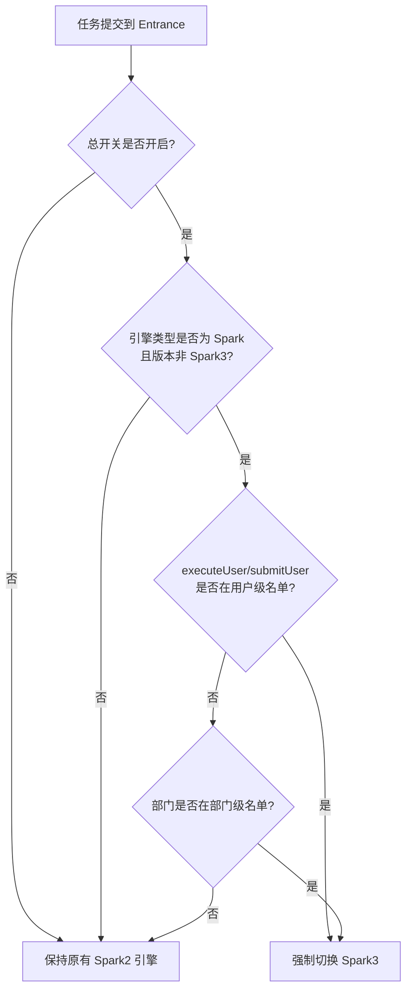
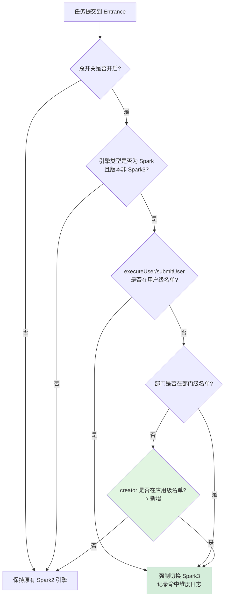

# Spark3 强制切换增强（Creator 维度） 需求文档

**需求类型**: ENHANCE（功能增强）
**基础模块**: linkis-entrance（CommonEntranceParser）
**文档版本**: v1.0
**创建日期**: 2026-07-14
**需求标签**: 【WDSL-UJES】【高风险】【运维需求】【BDP】【linkis】【后端】【非跨组件】

> 🔔 **方案演进（2026-07-20）**：本文档已整合「配置项管理迁移」方案 —— 第 1-9 章为 creator 维度判定（已实现），第 10 章为配置机制迁移（3 名单从 properties 迁移到配置项管理、switch 保留 properties、entrance RPC 读取，已实现并验证）。

---

## 📋 需求速览

| 维度 | 内容 |
|-----|------|
| **一句话描述** | 在现有 Spark3 强制切换机制中新增"应用(creator)"维度，支持按应用灰度迁移 Spark2→Spark3 |
| **基础模块** | linkis-entrance（CommonEntranceParser.sparkVersionCoercion） |
| **增强目的** | 补充应用级灰度能力，弥补现有仅"用户级+部门级"两维度不足 |
| **功能范围** | P0: **1** 个 |
| **兼容性要求** | 向后兼容，开关关闭/名单为空时行为完全不变 |
| **涉及模块** | linkis-entrance |
| **高危区域** | §10.1 主线步骤[5] Parser（主流程改动，按 §10.3 需 on/off 双态冒烟；非 §10.2 #2 拦截器链，不改 EntranceSpringConfiguration） |

> 💡 **阅读指引**：速览全貌看本卡片 → 现有功能看第 2 章 → 增强详情看第 3 章 → 兼容性分析看第 4 章

---

## 1. 需求概述 【核心】

### 1.1 业务背景

Spark2.x 即将停维，Linkis 正在逐步将默认引擎从 Spark2 切换到 Spark3。在灰度迁移期间，需要按不同维度强制将特定任务路由到 Spark3 引擎，而不影响全局默认的 Spark2 行为。

现有强制切换机制已支持**2 个维度**（优先级：个人 > 部门）：
- **用户级**：按 executeUser/submitUser 粒度强制切换
- **部门级**：按用户所属部门粒度强制切换

但在实际灰度迁移过程中，**按应用(creator)粒度灰度**是更常见的运维需求——例如先让某个具体应用（如"数据质量"应用）整体切换 Spark3 验证，而不是该应用下的所有用户逐个配置。现有两维度无法覆盖此场景，需要新增 creator 维度。

### 1.2 核心目标

在现有 `sparkVersionCoercion` 判定逻辑中新增 creator（应用标识）维度检查，作为第三优先级判定分支。当用户级和部门级均未命中时，检查任务提交的 creator 是否在配置名单中，命中则强制切换到 Spark3。

### 1.3 基础模块分析

**基础模块**: linkis-entrance

**现有能力**:
- ✅ Spark3 强制切换（用户级 + 部门级，优先级 个人 > 部门）
- ✅ 总开关控制（spark.version.coercion.switch，默认关闭）
- ✅ 用户级/部门级名单热加载（getHotValue）
- ✅ 异常降级保护（Utils.tryAndWarnMsg 包裹）
- ❌ 应用级(creator)维度强制切换（本次增强目标）

**增强动机**: 现有两维度（用户级、部门级）粒度不足以覆盖"按应用灰度"的运维场景，需要更精细的 creator 维度。

---

## 2. 现有功能分析 【核心】

### 2.1 现有判定逻辑

现有 Spark3 强制切换由 `CommonEntranceParser.sparkVersionCoercion` 方法实现，位于 linkis-entrance 模块。

**调用时机**：任务解析阶段（`parseToTask` / `parseToOldTask`），在 `generateAndVerifyUserCreatorLabel` 之后调用，即 `UserCreatorLabel` 在执行时已生成。

**判定流程**（增强前）：

**命中后行为**：将任务标签中的引擎类型标签替换为 Spark3（版本 3.4.4），使后续引擎创建流程使用 Spark3 引擎。

### 2.2 现有配置项

| 配置项 | 加载方式 | 默认值 | 用途 |
|--------|----------|--------|------|
| `spark.version.coercion.switch` | 非热加载（getValue） | `false` | 总开关，关闭时所有维度均不生效 |
| `spark.version.coercion.users` | 热加载（getHotValue） | 空 | 用户级强制切换名单，逗号分隔 |
| `spark.version.coercion.department.id` | 热加载（getHotValue） | 空 | 部门级强制切换名单，逗号分隔 |

**配置声明位置**：`EntranceConfiguration.scala` 第 346-353 行。

**热加载说明**：
- 用户级和部门级名单使用 `getHotValue`，运维可不重启服务动态调整名单
- 总开关使用 `getValue`，修改需重启服务生效（Stage 0 确认保持不变）

### 2.3 现有异常保护

整个判定逻辑已包裹在 `Utils.tryAndWarnMsg { ... }` 中，任何异常（如配置读取失败、标签解析异常等）均会：
- 记录 warn 级别日志（含 executeUser 信息）
- 不抛出异常，不影响任务执行
- 降级为保持原有 Spark2 引擎

---

## 3. 增强需求 【核心】

### 3.1 功能总览

| ID | 增强点 | 优先级 | 状态 | 一句话描述 |
|----|-------|:------:|:----:|----------|
| E1 | Creator 维度判定 | P0 | ✅ 已确认 | 新增应用级 creator 名单检查，作为第三优先级强制切换维度 |

### 3.2 增强点 E1: Creator 维度判定 `P0` `已确认`

#### 3.2.1 增强描述

**增强类型**: 逻辑增强（在现有方法中新增判定分支）

**原有功能**: `sparkVersionCoercion` 支持用户级 + 部门级两维度强制切换 Spark3，优先级为 个人 > 部门。

**本次增强**: 在用户级和部门级均未命中后，新增 creator 维度检查。命中则强制切换 Spark3，与现有维度行为一致。

#### 3.2.2 Stage 0 澄清结论（约束）

以下结论已在 Stage 0 澄清中确认，作为本需求的硬约束：

| 约束项 | 结论 | 说明 |
|--------|------|------|
| **三维度命中优先级** | 个人 > 部门 > 应用(creator) | creator 检查放在用户级、部门级均未命中之后（最低优先级） |
| **总开关热加载** | 保持 `spark.version.coercion.switch` 现有 getValue（不改） | 仅新增的 creator 名单用 getHotValue |
| **creator 独立开关** | 复用总开关 `spark.version.coercion.switch`（不新增子开关） | 总开关关闭时所有维度均不生效 |
| **creator 取值方式** | 从任务标签中的 UserCreatorLabel 获取 creator 值 | 调用时 UserCreatorLabel 已生成，无需改方法签名 |

#### 3.2.3 判定流程图（增强后）

**增强点说明**：
- 绿色节点 `⭐ 新增` 为本次新增的 creator 维度判定分支
- 原有用户级、部门级判定流程保持不变
- creator 维度仅在用户级和部门级均未命中时执行

#### 3.2.4 输入变化

| 输入项 | 变化类型 | 说明 | 约束 |
|-------|:--------:|------|------|
| creator 名单 | **新增** | 应用级强制切换名单，逗号分隔字符串 | 配置项 `spark.version.coercion.creators`，热加载（getHotValue），默认空 |
| creator 值 | **新增** | 从任务标签中的 UserCreatorLabel 获取 creator（应用标识） | 调用时 UserCreatorLabel 已存在；若获取失败则跳过 creator 维度检查 |

#### 3.2.5 输出变化

| 输出项 | 变化类型 | 说明 |
|-------|:--------:|------|
| 引擎标签 | **无变化** | 命中后行为与现有维度完全一致：改写为 Spark3 版本 3.4.4 |
| 日志输出 | **新增** | creator 命中时记录 info 级别日志，含 creator 值 |

#### 3.2.6 业务规则

| 规则ID | 规则描述 |
|--------|---------|
| R1.1 | creator 检查仅在总开关开启、引擎为 Spark 且非 Spark3、用户级和部门级均未命中时执行 |
| R1.2 | creator 值从 UserCreatorLabel 获取；若 UserCreatorLabel 不存在或获取失败，跳过 creator 维度检查，不影响任务 |
| R1.3 | creator 名单为空时，跳过 creator 维度检查，行为与增强前完全一致 |
| R1.4 | creator 名单匹配方式为包含匹配（与现有用户级、部门级一致） |
| R1.5 | creator 命中后，引擎标签改写为 Spark3 版本 3.4.4，并记录 info 级别日志（含 creator 值） |
| R1.6 | creator 维度检查复用现有 Utils.tryAndWarnMsg 异常保护，异常时降级为保持 Spark2，不抛出异常 |
| R1.7 | creator 名单支持热加载（getHotValue），运维可不重启服务调整名单 |
| R1.8 | 不新增独立子开关，复用现有总开关 `spark.version.coercion.switch` |

#### 3.2.7 验收标准（三段式）

> ⚠️ 使用备用模板生成（acceptance-criteria-generator 调用降级）

**功能验收标准**：

| 验证阶段 | 验收条件 |
|:--------:|---------|
| 【输入验证】 | AC1.1: creator 值从 UserCreatorLabel 正确提取，配置名单格式正确（逗号分隔字符串） |
| 【处理验证】 | AC1.2: creator 命中名单时强制切换 Spark3（版本 3.4.4），优先级正确（个人 > 部门 > creator），用户级或部门级命中时不检查 creator |
| 【输出验证】 | AC1.3: 命中后引擎标签改写为 Spark3 版本 3.4.4，未命中时保持原有 Spark2 标签不变 |

**兼容性验收标准**：

| 验收条件 | 说明 |
|---------|------|
| AC1.4: 总开关关闭时，creator 维度检查不执行 | 行为与增强前完全一致 |
| AC1.5: creator 判定异常时降级 | 不影响任务执行，保持原有 Spark2 引擎，记录 warn 日志 |
| AC1.6: creator 名单为空时 | 行为与增强前完全一致 |
| AC1.7: 非 Spark 引擎任务 | 不受 creator 维度影响，保持原有引擎类型 |
| AC1.8: 已是 Spark3 的任务 | 不重复切换，引擎版本不被重复改写 |

**主流程冒烟验收标准**（§10.1 步骤[5] Parser，按 §10.3 要求）：

| 验收条件 | 说明 |
|---------|------|
| AC1.9: 开关 on 状态冒烟 | 总开关开启 + creator 名单配置后，提交 Spark2 任务验证强制切换生效 |
| AC1.10: 开关 off 状态冒烟 | 总开关关闭后，提交相同任务验证保持 Spark2 行为不变 |
| AC1.11: 并发场景验证 | 同一 creator 同时提交 ≥3 个 Spark2 任务，验证全部正确切换 |

---

## 4. 兼容性分析 【核心】

### 4.1 接口兼容性

- **方法签名兼容**: `sparkVersionCoercion(labels, executeUser, submitUser)` 签名不变，不新增参数
- **调用方兼容**: `parseToTask`（行 142）和 `parseToOldTask`（行 323）调用方式不变
- **导入兼容**: `UserCreatorLabel` 和 `LabelKeyConstant` 已在 `CommonEntranceParser.scala` 中导入，无需为这两个类新增导入（但需新增 `SPARK3_VERSION_COERCION_CREATORS` 配置导入，见 §5.1）
- **向后兼容**: 开关关闭或 creator 名单为空时，行为与增强前完全一致

### 4.2 数据兼容性

- **无数据库表结构变更**: 本增强不涉及任何表结构修改
- **无数据迁移**: 仅新增配置项，默认空值，无需迁移现有数据
- **无回滚风险**: 配置项默认空值，删除配置项即可回退

### 4.3 行为兼容性

- **现有业务流程影响**: 无影响。新增分支仅在用户级和部门级均未命中时执行，不影响现有判定路径
- **灰度方案**: 复用现有总开关 `spark.version.coercion.switch`（默认 false）。开关关闭时所有维度均不生效；开关开启但 creator 名单为空时，creator 维度不生效
- **配置开关**: 不新增独立子开关，creator 维度受总开关统一控制（Stage 0 确认）

---

## 5. 涉及文件清单 【重要】

### 5.1 需要修改的文件

- [ ] `linkis-computation-governance/linkis-entrance/src/main/scala/org/apache/linkis/entrance/conf/EntranceConfiguration.scala` — 新增 `SPARK3_VERSION_COERCION_CREATORS` 配置声明（getHotValue，默认空）
- [ ] `linkis-computation-governance/linkis-entrance/src/main/scala/org/apache/linkis/entrance/parser/CommonEntranceParser.scala` — `sparkVersionCoercion` 方法新增 creator 判定分支（在部门级检查之后、Utils.tryAndWarnMsg 闭合之前）；新增 `SPARK3_VERSION_COERCION_CREATORS` 导入
- [ ] `linkis-dist/package/conf/linkis-cg-entrance.properties` — 新增 `spark.version.coercion.creators` 配置注释行（即使为空也写出，便于运维感知）
- [ ] `docs/configuration/` — 更新配置文档，补充 creator 维度说明

### 5.2 需要新增的文件

无。本次增强仅修改现有文件，不新建文件。

---

## 6. 非功能需求 【重要】

### 6.1 性能需求

- creator 维度检查为字符串包含匹配，与现有用户级、部门级检查方式一致，性能影响可忽略
- creator 值从已有任务标签获取（UserCreatorLabel 在调用前已生成），无额外 IO 开销
- 热加载配置不增加显著内存开销

### 6.2 安全需求

- creator 名单为运维配置项，不涉及敏感信息
- 日志仅记录 creator 值和切换结果，不打印用户凭证、SQL 代码等敏感信息
- 复用现有总开关控制，无新增权限点
- 日志使用项目统一 logger（`extends Logging`），禁止 `println`

### 6.3 代码规范约束

- JDK 1.8 + Scala 2.11.12：禁用 Java 9+ 语法和 Scala 2.12+ 语法
- 新功能主路径必须用 `Utils.tryAndWarnMsg` 包裹降级（现有已包裹，新增分支沿用）
- 开关默认 false（复用现有总开关，已满足）
- 不改 protocol case class、不改拦截器链顺序、不改 Bean 名
- 新建文件必须带 ASF License 头（本次仅改现有文件，不新建）

---

## 7. 关联影响分析 【参考】

### 7.1 功能模块影响

| 维度 | 评估 |
|------|------|
| 影响模块 | linkis-entrance |
| 影响范围 | `CommonEntranceParser.sparkVersionCoercion` 方法（新增判定分支） |
| 影响等级 | 🟢 轻微影响（仅新增分支，不修改现有逻辑路径） |
| 回归风险 | 低。新增分支独立于现有用户级/部门级判定，不影响现有路径 |

### 7.2 数据模型影响

| 维度 | 评估 |
|------|------|
| 表结构变更 | 无 |
| 数据迁移 | 无 |
| 影响等级 | 🟢 无影响 |

### 7.3 安全与权限影响

| 维度 | 评估 |
|------|------|
| 新增权限点 | 无 |
| 数据访问控制 | 无变更 |
| 安全风险 | 无新增风险 |
| 影响等级 | 🟢 无影响 |

### 7.4 用户体验与文案影响

| 维度 | 评估 |
|------|------|
| 前端变更 | 无（纯后端逻辑增强） |
| 用户交互流程 | 无变更 |
| 影响等级 | 🟢 无影响 |

### 7.5 上下游与三方依赖影响

| 维度 | 评估 |
|------|------|
| 上游系统 | 无影响（任务提交流程不变） |
| 下游系统 | 无影响（引擎创建流程不变，仅引擎版本可能从 Spark2 变为 Spark3） |
| 三方依赖 | 无新增 |
| 影响等级 | 🟢 无影响 |

### 7.6 外部依赖识别

本增强功能为纯内部逻辑增强，**无新增外部系统依赖**。不涉及外部服务调用、第三方 API 对接或跨系统集成。

---

## 8. 风险识别 【参考】

### 8.1 兼容性风险

| 风险 | 等级 | 应对措施 |
|------|:----:|---------|
| creator 判定分支引入新异常，影响任务执行 | 🟡 | 复用现有 `Utils.tryAndWarnMsg` 包裹，异常时降级为保持 Spark2 |
| 总开关热加载不生效（getValue 非热加载）导致运维误判 | 🟢 | Stage 0 已确认保持现状；creator 名单用 getHotValue 热加载，可快速调整 |

### 8.2 技术风险

| 风险 | 等级 | 应对措施 |
|------|:----:|---------|
| UserCreatorLabel 在 sparkVersionCoercion 调用时不存在 | 🟢 | 已确认调用时机在 `generateAndVerifyUserCreatorLabel` 之后；额外增加 null 检查兜底 |
| 涉及 §10.1 主线步骤[5] Parser（主流程改动，§10.3 适用） | 🟡 | 需开关 on/off 双态冒烟；并发场景验证（同一 creator 同时提交 ≥3 个任务）；非 §10.2 #2，不改拦截器链顺序 |

### 8.3 业务风险

| 风险 | 等级 | 应对措施 |
|------|:----:|---------|
| creator 名单配置错误导致非预期切换 | 🟡 | 热加载支持快速调整；默认空值不触发切换；info 日志记录命中详情便于排查 |
| creator 值为空或异常导致误判 | 🟢 | null 检查 + 空值跳过；异常降级为保持 Spark2 |

---

## 9. 价值收益

### 【增效】

支持按应用(creator)维度灰度强制切换 Spark3，弥补现有仅"用户级+部门级"两维度的不足，使 Spark2→Spark3 迁移粒度更精细（可按单个应用灰度），降低灰度验证复杂度与风险。

### 【降本】

- 避免 Spark2 停维后的二线维护成本
- 应用级灰度可减少全量切换的大范围回归测试成本
- creator 名单热加载（getHotValue）支持不重启调整，降低运维操作成本与变更窗口压力

---

## 10. 配置项管理迁移 【核心】（2026-07-20 演进）

### 10.1 迁移背景

第 1-9 章的 creator 维度判定已实现，但配置（3 名单 + 总开关）原写在 `linkis-cg-entrance.properties`，运维改名单需登机器改配置文件。本章节把 3 个名单迁移到 Linkis 配置项管理前端可视化配置。

> 业务方原话（v_kkhuang 7/17）：「加到配置项管理里面去，spark 引擎里面，2 和 3 虽然都会有，但可以在代码里面去判断下」；「把之前的强制也迁移到配置项管理」。

### 10.2 迁移范围（分治原则）

| 配置项 | 处置 | 理由 |
|--------|------|------|
| `spark.version.coercion.users` | **迁移**配置项管理 | 名单需前端热改 |
| `spark.version.coercion.department.id` | **迁移**配置项管理 | 名单需前端热改 |
| `spark.version.coercion.creators` | **迁移**配置项管理 | 名单需前端热改 |
| `spark.version.coercion.user.creators` | **迁移**配置项管理（⭐新增）| user+creator 组合细粒度（格式 `user:creator`，逗号分隔）|
| `spark.version.coercion.switch` | **保留** properties | 总开关谨慎（重启生效） |

### 10.3 技术方案

- entrance 通过 RPC（`RequestQueryEngineConfigWithGlobalConfig`）读配置项管理的值，替代本地 properties
- 降级：RPC 失败 `CommonVars.getValue(null)` 自动 fallback 到本地 properties 默认值（照搬 EntranceGroupFactory 范式）
- 抽 2 个 `protected[parser]` seam（`fetchSpark3CoercionConfig` / `fetchUserDepartmentId`）便于单测
- 三张表（缺一不可）：`config_key` + `key_engine_relation` + `config_value`
- 绑 `*-*,spark-2.4.3` + `*-*,spark-3.4.4` 两个 label
- 前端零开发（复用 setting 页面）
- ⭐ user+creator 组合细粒度维度（新增）：优先级 **个人 > user+creator组合 > 部门 > creator**；名单格式 `"user:creator"`（如 `userA:IDE,userB:Schedulis`）；用 split 精确匹配（避免 contains 子串误命中）

### 10.4 兼容性

- SQL 未执行 / RPC 失败 → `getValue` 走 properties 默认，行为与迁移前完全一致
- 判定逻辑/优先级/命中行为完全不变（仅数据源 properties→RPC）
- 仅新增配置项管理数据，无表结构变更（DDL）

### 10.5 涉及文件

- `EntranceConfiguration.scala`：4 声明改 CommonVars 对象
- `CommonEntranceParser.scala`：sparkVersionCoercion 改 RPC 读 + 2 个 protected seam
- `upgrade/2.1.0_schema/mysql/linkis_configuration.sql`：三张表初始化
- `linkis-cg-entrance.properties`：英文 ASCII 注释，4 key 保留 fallback
- `CommonEntranceParserSpark3CoercionTest.scala`：override seam + configMap

### 10.6 风险

- 三张表漏 `config_value` → SQL 含第③步初始化（缺则 queryConfig 查不到）
- RPC 缓存（120s expireAfterAccess）→ 执行 SQL 后重启 `linkis-cg-entrance`
- 名单被 AM 注入 EC（冗余）→ 接受：EC 不读、非敏感

### 10.7 验收

- 前端配名单值 + switch 开启 → Spark2 任务切换 Spark3
- RPC 失败 → fallback properties，不阻断任务
- 并发 ≥3 任务正确切换，无串扰

> 详细设计见 [spark3-coercion-creator_设计.md](../design/spark3-coercion-creator_设计.md) Part 4。
