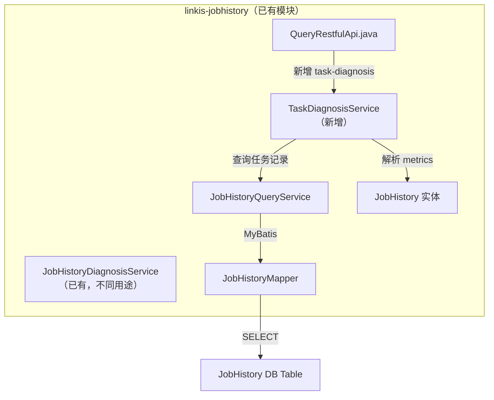
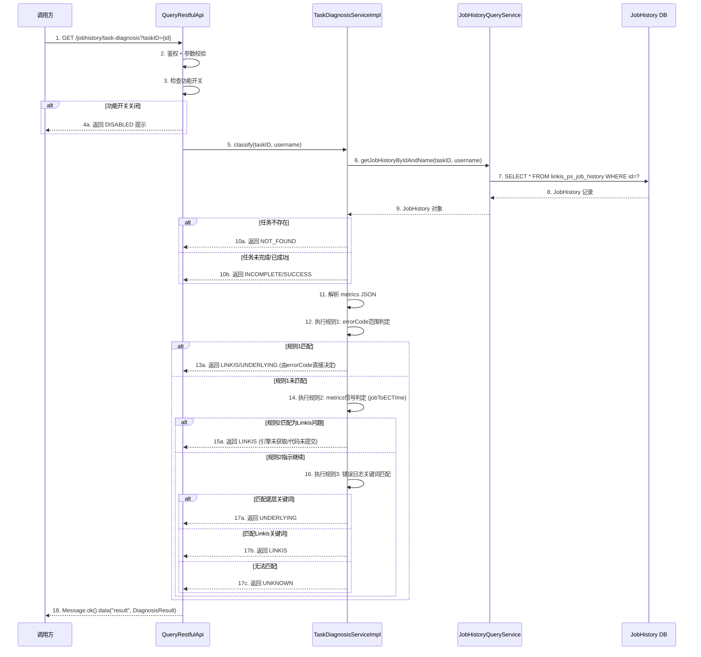
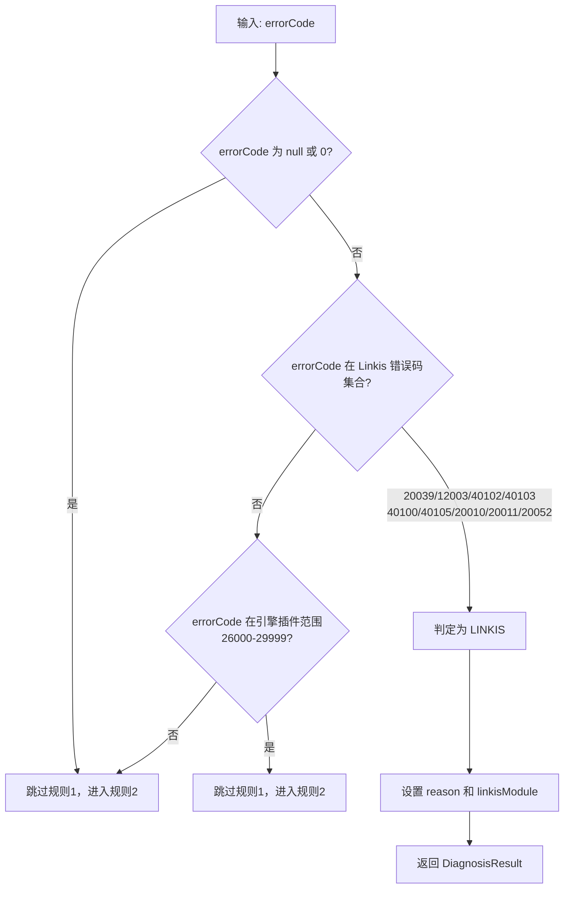
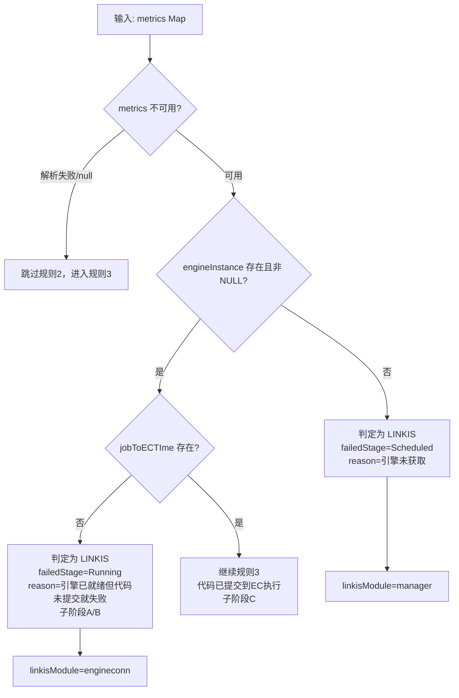
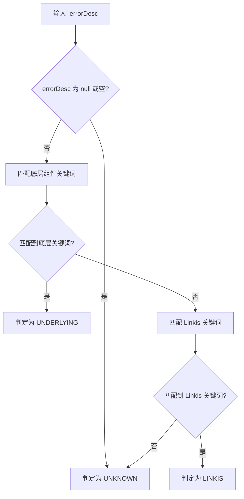

# 任务失败分类诊断 - 设计文档

## 文档信息
- **文档版本**: v1.0
- **最后更新**: 2026-08-13
- **维护人**: kinghao
- **文档状态**: 草稿
- **需求类型**: NEW
- **功能属性**: 后端
- **设计文档类型**: 单一设计文档
- **需求文档**: [任务失败分类诊断_需求.md](../requirements/REQ-04_任务失败分类诊断_需求.md)

---

## 执行摘要

> 阅读指引：本章节为1页概览，用于快速理解设计方案。详细内容请参考后续章节。

### 设计目标

| 目标 | 描述 | 优先级 |
|-----|------|-------|
| 新增分类诊断REST API | 在QueryRestfulApi中新增 `GET /jobhistory/task-diagnosis` 接口，返回分类诊断结果 | P0 |
| 三级规则分类判定引擎 | errorCode范围判定 → metrics信号判定 → 错误日志关键词匹配，区分Linkis问题/底层组件问题/未知 | P0 |
| 分类规则可配置化 | errorCode范围、关键词模式通过CommonVars配置项暴露，支持热更新 | P1 |
| 完全向后兼容 | 不修改现有diagnosis-query接口和任何现有逻辑，功能开关默认关闭 | P0 |

### 核心设计决策

| 决策点 | 选择方案 | 决策理由 | 替代方案 |
|-------|---------|---------|---------|
| 服务层实现语言 | Java 8（Service接口+Impl） | 符合项目规范：REST API / Service / Entity 用 Java；linkis-jobhistory 模块现有 Service 均为 Java 接口 + Scala Impl | 纯 Scala 实现 |
| metrics解析方式 | Jackson ObjectMapper（项目已有依赖） | 项目已依赖 Jackson 2.15.0，无需引入新依赖；JSON 解析性能和容错性优于手动字符串匹配 | Gson / 手动正则提取 |
| 关键词匹配方式 | 预编译正则 Pattern 缓存 | 正则匹配比 String.contains 更灵活（支持多模式组合）；预编译避免每次请求重新编译 | String.contains 循环 / 有限状态机 |
| 判定流程组织 | 责任链模式（三规则顺序执行） | 三个规则优先级明确、高优先级匹配后短路返回，职责链天然支持；后续扩展新规则只需加一个 Chain | if-else 平铺 / 策略模式 |
| 功能开关 | CommonVars + getHotValue | 支持运行时热加载，运维发现问题可立即关闭，无需重启服务 | CommonVars + getValue（需重启） |

### 架构概览图

```
┌─────────────────────────────────────────────────────────────────┐
│  QueryRestfulApi.java（已有，新增方法）                           │
│  ┌───────────────────────────────────────────────────────────┐  │
│  │  GET /jobhistory/task-diagnosis?taskID={id}               │  │
│  │       │                                                    │  │
│  │       ▼                                                    │  │
│  │  TaskDiagnosisService.classify(taskID)                     │  │
│  │       │                                                    │  │
│  │       ├── 1. 查询 JobHistory 记录                          │  │
│  │       ├── 2. 校验任务状态                                    │  │
│  │       ├── 3. 解析 metrics JSON                             │  │
│  │       ├── 4. 执行三级规则判定                                │  │
│  │       │    ├─ Rule1: errorCode 范围判定                     │  │
│  │       │    ├─ Rule2: metrics 信号判定 (jobToECTIme)        │  │
│  │       │    └─ Rule3: 错误日志关键词匹配                      │  │
│  │       └── 5. 组装 DiagnosisResult 返回                      │  │
│  └───────────────────────────────────────────────────────────┘  │
└─────────────────────────────────────────────────────────────────┘
```

### 关键风险与缓解

| 风险 | 等级 | 缓解措施 |
|-----|------|---------|
| metrics JSON格式在不同引擎间不一致 | 中 | Jackson 解析失败时 try-catch 容错，跳过规则2，降级到规则3 |
| 关键词匹配误判（Linkis日志含底层异常类名） | 低 | 规则2的metrics信号判定优先于规则3，减少误判；底层关键词优先于Linkis关键词 |
| jobToECTIme字段在旧版本任务中不存在 | 中 | 不存在时视为"代码未提交"，归为Linkis问题，符合语义 |

### 核心指标

| 指标 | 目标值 | 说明 |
|-----|-------|------|
| 单次API响应时间 | <= 200ms | 仅JobHistory主键查询 + 内存中规则判定，无外部RPC/HTTP调用 |
| 降级率 | 100% | 任何异常都不返回错误，降级返回原始errorCode/errorDesc |
| 向后兼容性 | 100% | 纯新增功能 + 功能开关默认关闭 |
| 新增代码量 | <= 500行 | Service接口 + Impl + Result实体 + REST方法 + 配置项 |

### 章节导航

| 关注点 | 推荐章节 |
|-------|---------|
| 想了解整体架构 | [1.1 系统架构设计](#11-系统架构设计) |
| 想了解核心判定流程 | [1.2 核心流程设计](#12-核心流程设计) |
| 想了解接口和类定义 | [1.3 关键接口定义](#13-关键接口定义) |
| 想了解API规范 | [2.2 API规范设计](#22-api规范设计) |
| 想了解配置策略 | [2.3 配置策略](#23-配置策略) |
| 想查看完整代码 | [3.2 完整代码示例](#32-完整代码示例) |

---

# Part 1: 核心设计

> 本层目标：阐述架构决策、核心流程、关键接口，完整详细展开。
>
> 预计阅读时间：10-15分钟

## 1.1 系统架构设计

### 1.1.1 架构模式选择

**采用模式**：服务层增强（在现有 linkis-jobhistory 服务内新增诊断 Service）

**选择理由**：
- linkis-jobhistory 已有 JobHistory 实体、JobHistoryQueryService 查询能力、QueryRestfulApi REST 入口，无需引入新微服务
- 分类诊断服务仅读取 JobHistory 已有字段（errorCode/errorDesc/metrics），无写操作，无跨服务RPC调用
- 在现有服务内新增，部署和运维零额外成本

**模块关系图**：



### 1.1.2 模块划分

| 模块 | 职责 | 对外接口 | 依赖 |
|-----|------|---------|------|
| QueryRestfulApi.java（修改） | 新增 `task-diagnosis` REST 端点，参数校验，鉴权，调用 TaskDiagnosisService | `GET /jobhistory/task-diagnosis` | TaskDiagnosisService, JobHistoryQueryService |
| TaskDiagnosisService.java（新增接口） | 分类诊断服务接口 | `DiagnosisResult classify(Long taskID, String username)` | - |
| TaskDiagnosisServiceImpl.java（新增实现） | 三级规则判定逻辑、metrics解析、关键词匹配、降级处理 | 实现 TaskDiagnosisService | JobHistoryQueryService, TaskDiagnosisConfiguration |
| DiagnosisResult.java（新增实体） | 诊断结果数据结构，包含分类类型、失败阶段、原因、引擎信息等 | getter/setter | - |
| TaskDiagnosisConfiguration.scala（新增配置） | 功能开关、errorCode范围、关键词模式等 CommonVars 声明 | 静态配置项 | CommonVars |

### 1.1.3 技术选型

| 层级 | 技术 | 版本 | 选型理由 |
|-----|------|------|---------|
| REST框架 | Spring MVC | 2.7.12 | 项目现有技术栈 |
| JSON解析 | Jackson ObjectMapper | 2.15.0 | 项目已有依赖，无需引入新依赖 |
| 配置管理 | CommonVars (Scala) | 项目自带 | Linkis 统一配置管理方式，支持热加载 |
| 正则匹配 | java.util.regex.Pattern | JDK 8 | 原生支持，预编译缓存提升性能 |
| 鉴权 | ModuleUserUtils | 项目自带 | 项目统一鉴权工具，复用现有逻辑 |

---

## 1.2 核心流程设计

### 1.2.1 分类诊断主流程



#### 关键节点说明

| 节点 | 处理逻辑 | 输入/输出 | 异常处理 |
|-----|---------|----------|---------|
| 1. 接收请求 | 接收 taskID 参数 | 输入: taskID (String)<br>输出: 转为 Long | taskID 非数字时抛 LinkisCommonErrorException |
| 2. 鉴权+校验 | ModuleUserUtils.getOperationUser + 权限检查 | 输入: HttpServletRequest<br>输出: username | 无权限时框架自动拦截 |
| 3. 检查开关 | TaskDiagnosisConfiguration.ENABLE.getHotValue | 输入: 无<br>输出: Boolean | - |
| 6-9. 查询任务 | 走现有 JobHistoryQueryService | 输入: taskID, username<br>输出: JobHistory | 返回 null 时任务不存在 |
| 11. 解析metrics | Jackson ObjectMapper.readValue | 输入: metrics String<br>输出: Map<String, Object> | 解析失败时 catch，metrics 视为不可用 |
| 12. 规则1 | errorCode 在 Linkis 错误码集合中? | 输入: errorCode<br>输出: LINKIS / 继续规则2 | errorCode 为 null/0 时跳过规则1 |
| 14. 规则2 | engineInstance 有值? jobToECTIme 有值? | 输入: metrics Map<br>输出: LINKIS / 继续规则3 | metrics 不可用时跳过规则2 |
| 16. 规则3 | 预编译正则匹配 errorDesc | 输入: errorDesc<br>输出: UNDERLYING / LINKIS / UNKNOWN | errorDesc 为 null 时返回 UNKNOWN |

#### 技术难点与解决方案

| 难点 | 问题描述 | 解决方案 | 决策理由 |
|-----|---------|---------|---------|
| jobToECTIme 字段存在性 | 旧版本任务的 metrics 中可能没有 jobToECTIme 字段 | 使用 Map.containsKey() 检查，不存在视为"代码未提交" | 不存在 = 代码未到达 EC，归为 Linkis 问题，语义正确 |
| metrics JSON 结构不一致 | 不同引擎、不同版本的 metrics JSON 结构可能有差异 | 使用 Jackson 解析为通用 Map<String, Object>，不绑定具体 POJO | 通用 Map 方式兼容所有格式变化，不需要为每种引擎维护 POJO |
| 正则关键词性能 | 每次 API 调用都需要对 errorDesc 做多组正则匹配 | 预编译 Pattern 并缓存为 static final，运行时只做 matcher.find() | 正则预编译一次，匹配 O(n) 遍历 errorDesc，性能可控 |
| 引擎插件错误码 (26000-29999) 归属判定 | 引擎插件的错误码既可能是 Linkis 调度问题也可能是引擎执行问题 | 规则1对引擎错误码范围不直接判定，交给规则2/3进一步区分 | 引擎错误码需要结合 metrics 信号和关键词才能准确判定 |

### 1.2.2 规则1：errorCode 范围判定



**linkisModule 映射**：

| errorCode | linkisModule | reason |
|-----------|-------------|--------|
| 20039 | interceptor | 拦截器拒绝，语法检查/权限拦截/变量替换失败 |
| 12003 | ecm | 引擎创建/启动失败，ECM无法拉起EngineConn进程 |
| 40102, 40103 | engineconn | EC侧任务提交失败，锁无效或参数错误 |
| 40100 | engineconn | Executor类型不匹配 |
| 40105 | engineconn | EC向Entrance发送RPC失败 |
| 20010, 20011 | entrance | Entrance请求无效或任务提交失败 |
| 20052 | jobhistory | JobHistory持久化失败 |

### 1.2.3 规则2：metrics 信号判定



**核心信号说明**：

| 信号字段 | 含义 | 判定逻辑 |
|---------|------|---------|
| engineInstance | 处理任务的 EC 实例地址（IP:Port） | 值为 "NULL" 或不存在 → 引擎未获取（子阶段A之前失败） |
| jobToECTIme | 任务代码提交到 EC 的时间戳 | 不存在 → 代码未提交到 EC（子阶段A/B失败）；有值 → 代码已到达 EC（子阶段C） |

> **为什么不使用 progress/applicationId？**
> - **progress 不可靠**：EC daemon 线程在代码提交前就推送 0.1，失败后统一重置为 1.0
> - **applicationId 不可靠**：Spark 引擎启动即有 applicationId，但代码可能尚未执行

### 1.2.4 规则3：错误日志关键词匹配



**底层关键词优先原则**：当 errorDesc 同时包含底层和 Linkis 关键词时，优先判定为底层问题（底层问题更常见且影响面更大）。

---

## 1.3 关键接口定义

### 1.3.1 TaskDiagnosisService 接口

```java
package org.apache.linkis.jobhistory.service;

import org.apache.linkis.jobhistory.entity.DiagnosisResult;

/**
 * 任务分类诊断服务
 *
 * 对失败任务自动判定问题归属：
 * - LINKIS: Linkis框架自身原因导致的失败
 * - UNDERLYING: 底层引擎或外部组件原因导致的失败
 * - UNKNOWN: 无法自动判定
 */
public interface TaskDiagnosisService {

    /**
     * 对指定任务执行分类诊断
     *
     * @param taskID  任务ID
     * @param username  当前用户（用于权限校验）
     * @return DiagnosisResult 诊断结果
     */
    DiagnosisResult classify(Long taskID, String username);
}
```

### 1.3.2 DiagnosisResult 实体

```java
package org.apache.linkis.jobhistory.entity;

/**
 * 分类诊断结果
 *
 * 公共字段：taskID, taskStatus, diagnosisType, failedStage, errorCode, errorDesc
 * LINKIS 独有：reason, linkisModule
 * UNDERLYING 独有：applicationId, engineType, engineConnInstance, yarnResource
 * UNKNOWN 独有：reason + 已知信息（applicationId, engineType, engineConnInstance）
 */
public class DiagnosisResult {

    // ===== 公共字段 =====
    private Long taskID;
    private String taskStatus;
    private String diagnosisType;  // LINKIS / UNDERLYING / UNKNOWN / INCOMPLETE / SUCCESS / DISABLED / ERROR
    private String failedStage;    // Inited / Scheduled / Running
    private Integer errorCode;
    private String errorDesc;

    // ===== LINKIS 独有 =====
    private String reason;         // 分类原因说明
    private String linkisModule;   // 问题模块 (interceptor/ecm/engineconn/entrance/jobhistory/manager)

    // ===== UNDERLYING 独有 =====
    private String applicationId;
    private String engineType;
    private String engineConnInstance;
    private Object yarnResource;   // Map<String, ResourceWithStatus>，原样从 metrics 提取

    // ===== 构建方法 =====
    public static DiagnosisResult linkis(Long taskID, String taskStatus,
                                         String failedStage, Integer errorCode, String errorDesc,
                                         String reason, String linkisModule) { /* ... */ }

    public static DiagnosisResult underlying(Long taskID, String taskStatus,
                                             String failedStage, Integer errorCode, String errorDesc,
                                             String applicationId, String engineType,
                                             String engineConnInstance, Object yarnResource) { /* ... */ }

    public static DiagnosisResult unknown(Long taskID, String taskStatus,
                                          String failedStage, Integer errorCode, String errorDesc,
                                          String reason, String applicationId, String engineType,
                                          String engineConnInstance) { /* ... */ }
}
```

### 1.3.3 QueryRestfulApi 变更点

```java
// ===== 新增方法（在 QueryRestfulApi 类中） =====

@ApiOperation(
    value = "task-diagnosis",
    notes = "classify failed task diagnosis type and return detailed info",
    response = Message.class)
@ApiImplicitParams({
    @ApiImplicitParam(name = "taskID", dataType = "Long", required = true),
})
@RequestMapping(path = "/task-diagnosis", method = RequestMethod.GET)
public Message classifyTaskDiagnosis(
    HttpServletRequest req,
    @RequestParam(value = "taskID") Long taskID) {

    // 1. 鉴权
    String username = ModuleUserUtils.getOperationUser(req, "task-diagnosis");

    // 2. 检查功能开关
    if (!TaskDiagnosisConfiguration.TASK_CLASSIFIED_DIAGNOSIS_ENABLE.getHotValue()) {
        return Message.ok()
            .data("diagnosisType", "DISABLED")
            .data("message", "分类诊断功能未开启");
    }

    // 3. 执行分类诊断
    DiagnosisResult result = Utils.tryCatch(
        () -> taskDiagnosisService.classify(taskID, username),
        t -> {
            logger.warn("Failed to classify task diagnosis for taskID: " + taskID, t);
            DiagnosisResult errorResult = new DiagnosisResult();
            errorResult.setTaskID(taskID);
            errorResult.setDiagnosisType("ERROR");
            errorResult.setReason("诊断过程发生异常: " + t.getMessage());
            return errorResult;
        }
    );

    return Message.ok().data("result", result);
}
```

### 1.3.4 核心业务规则

| 规则编号 | 规则描述 | 触发条件 | 处理逻辑 |
|---------|---------|---------|---------|
| BR-001 | 功能开关默认关闭 | 服务启动 | TaskDiagnosisConfiguration.ENABLE 默认 false |
| BR-002 | 三级规则按优先级顺序执行 | 进入分类判定 | errorCode → metrics信号 → 关键词，高优先级匹配后短路返回 |
| BR-003 | 引擎插件 errorCode 不直接判定 | errorCode 在 26000-29999 | 交给规则2/3进一步判定 |
| BR-004 | 底层关键词优先于 Linkis 关键词 | 规则3匹配 | 先匹配底层关键词，匹配到则不再匹配 Linkis 关键词 |
| BR-005 | 诊断异常时降级返回 | 任何未预期异常 | diagnosisType="ERROR"，包含原始 errorCode/errorDesc |
| BR-006 | 任务不存在时明确提示 | JobHistory 查询为 null | 返回 Message.error |
| BR-007 | 任务未完成/已成功时提示 | status 不为 Failed/Cancelled/Timeout | 返回 INCOMPLETE/SUCCESS 提示 |
| BR-008 | UNKNOWN 类型返回已知信息 | 三规则均无法判定 | 尽可能填充 applicationId、engineInstance 等 |

---

## 1.4 设计决策记录 (ADR)

### ADR-001: 服务实现语言 -- Java 接口 + Java Impl

- **状态**：已采纳
- **背景**：需要决定 TaskDiagnosisService 的实现语言。项目规范要求 REST API / Service / Entity 用 Java，计算逻辑用 Scala。linkis-jobhistory 模块现有 Service 有 Java 接口 + Scala Impl 的模式（如 JobHistoryQueryService），也有纯 Java 实现（如 JobHistoryDiagnosisService）。
- **决策**：Java 接口 + Java Impl
- **选项对比**：

| 选项 | 优点 | 缺点 | 适用场景 |
|-----|------|------|---------|
| Java 接口 + Java Impl（采用） | 1. 判定逻辑无复杂计算，Java 完全胜任 2. 与 DiagnosisResult 实体在同一语言，无需转换 3. Jackson/正则等 Java API 直接使用 | 1. 偏离模块既有模式（Scala Impl） | 逻辑简单，无 Scala 特有需求 |
| Java 接口 + Scala Impl | 1. 符合模块既有模式 2. 可用 Scala match/case 等语法糖 | 1. 判定结果 DiagnosisResult 需 Java/Scala 互操作 2. 增加 .scala 文件编译配置 | 有复杂模式匹配或隐式转换需求 |

- **结论**：选择纯 Java 实现。分类判定逻辑是简单的条件判断和正则匹配，无 Scala 特有需求；与 DiagnosisResult 实体同语言更简洁
- **影响**：新增 2 个 Java 文件（TaskDiagnosisService.java + TaskDiagnosisServiceImpl.java），1 个 Java 实体（DiagnosisResult.java），1 个 Scala 配置（TaskDiagnosisConfiguration.scala）

### ADR-002: metrics 解析方式 -- Jackson ObjectMapper vs 手动字符串提取

- **状态**：已采纳
- **背景**：需要从 metrics JSON 字符串中提取 engineInstance、jobToECTIme、yarnResource 字段
- **决策**：使用 Jackson ObjectMapper 解析为 Map<String, Object>
- **选项对比**：

| 选项 | 优点 | 缺点 | 适用场景 |
|-----|------|------|---------|
| Jackson → Map（采用） | 1. 项目已有依赖，零成本 2. 完整解析，可提取任意嵌套字段 3. 解析失败有明确异常 | 1. 解析整个 JSON，字段多时有轻微性能开销 | 需要提取多个字段，字段有嵌套结构 |
| 手动字符串匹配 | 1. 按需提取，不解析无用部分 | 1. 无法处理嵌套结构 2. 正则匹配脆弱，格式变化易崩 3. yarnResource 结构复杂无法提取 | 仅需提取简单顶层字段 |

- **结论**：选择 Jackson 解析。metrics 中 yarnResource 是嵌套对象（applicationId → ResourceWithStatus），字符串匹配无法可靠提取
- **影响**：引入 `com.fasterxml.jackson.databind.ObjectMapper`（已有依赖）

### ADR-003: 判定流程组织 -- 责任链 vs if-else 平铺

- **状态**：已采纳
- **背景**：三级规则判定流程的组织方式
- **决策**：if-else 短路平铺（非严格责任链模式）
- **选项对比**：

| 选项 | 优点 | 缺点 | 适用场景 |
|-----|------|------|---------|
| if-else 短路（采用） | 1. 三级规则固定，逻辑清晰直观 2. 代码量少，易读 3. 调试方便 | 1. 新增规则需修改主流程 | 规则数量少（3个）且固定 |
| 责任链模式 | 1. 开闭原则，新增规则不改主流程 2. 规则可动态排序 | 1. 三级规则不需要动态扩展 2. 增加接口和类的数量 | 规则数量多、需动态调整顺序 |

- **结论**：选择 if-else 短路平铺。三个规则固定且优先级明确，配置化仅调整规则参数（errorCode范围、关键词），不新增规则类型
- **影响**：TaskDiagnosisServiceImpl.classify() 方法约 150 行

---

# Part 2: 支撑设计

> 本层目标：数据模型、API规范、配置策略的结构化摘要。
>
> 预计阅读时间：5-10分钟

## 2.1 数据模型设计

### 2.1.1 数据来源说明

本次新增**不涉及数据库表结构变更**。分类诊断服务完全基于现有 JobHistory 表中已有字段进行判定。

| 字段路径 | Java类型 | 用途 | 取值方式 |
|---------|---------|------|---------|
| id | Long | 任务ID | jobHistory.getId() |
| status | String | 任务状态判定 | jobHistory.getStatus() |
| errorCode | Integer | 规则1判定输入 | jobHistory.getErrorCode() |
| errorDesc | String | 规则3关键词匹配输入 | jobHistory.getErrorDesc() |
| metrics | String | 规则2信号判定输入（JSON解析后提取 engineInstance/jobToECTIme/yarnResource） | jobHistory.getMetrics() |
| engineType | String | UNDERLYING 类型返回值 | jobHistory.getEngineType() |

### 2.1.2 metrics JSON 关键字段提取

```
metrics JSON
├── engineInstance          → String  (如 "bdpdws110002:15055"，"NULL" 表示未获取)
├── jobToECTIme             → Long    (代码提交到EC的时间戳)
├── yarnResource            → Map     (键为 applicationId)
│   └── {applicationId}
│       ├── queueMemory     → Long    (队列内存，单位 bytes)
│       ├── queueCores      → Int     (队列核数)
│       ├── queueInstances  → Int     (实例数)
│       ├── jobStatus       → String  (Yarn 作业状态)
│       └── queue           → String  (Yarn 队列名)
├── engineconnMap           → Map     (执行链路，诊断不使用)
└── ... 其他字段
```

**提取逻辑**：

| 字段 | 提取方式 | 异常处理 |
|------|---------|---------|
| engineInstance | map.get("engineInstance")，转为 String | 不存在或 "NULL" 视为引擎未获取 |
| jobToECTIme | map.containsKey("jobToECTIme") | 不存在视为代码未提交到 EC |
| yarnResource | map.get("yarnResource")，转为 Map | 不存在或解析异常时 yarnResource 返回 null |

## 2.2 API规范设计

### 2.2.1 新增接口

| 项 | 值 |
|----|-----|
| URL | `GET /api/rest_j/v1/jobhistory/task-diagnosis` |
| 参数 | `taskID`（Long，必填） |
| 鉴权 | ModuleUserUtils.getOperationUser，走现有 JobHistory 鉴权逻辑 |
| 权限 | 管理员可查所有任务，部门管理员可查本部门，普通用户仅查自己 |
| 返回 | Message 对象，data 中包含 result（DiagnosisResult 对象） |

### 2.2.2 响应示例

**diagnosisType = LINKIS**：

```json
{
  "method": "/api/rest_j/v1/jobhistory/task-diagnosis",
  "status": 0,
  "data": {
    "result": {
      "taskID": 12345,
      "taskStatus": "Failed",
      "diagnosisType": "LINKIS",
      "failedStage": "Scheduled",
      "errorCode": 12003,
      "errorDesc": "Engine creation failed...",
      "reason": "引擎创建/启动失败，ECM无法拉起EngineConn进程",
      "linkisModule": "ecm"
    }
  }
}
```

**diagnosisType = UNDERLYING**：

```json
{
  "method": "/api/rest_j/v1/jobhistory/task-diagnosis",
  "status": 0,
  "data": {
    "result": {
      "taskID": 12345,
      "taskStatus": "Failed",
      "diagnosisType": "UNDERLYING",
      "failedStage": "Running",
      "errorCode": 26001,
      "errorDesc": "org.apache.spark.SparkException: Job aborted due to stage failure...",
      "applicationId": "application_1693xxx_0001",
      "engineType": "spark",
      "engineConnInstance": "bdpdws110002:15055",
      "yarnResource": {
        "application_1693xxx_0001": {
          "queueMemory": 8589934592,
          "queueCores": 4,
          "queueInstances": 3,
          "jobStatus": "FAILED",
          "queue": "default"
        }
      }
    }
  }
}
```

**diagnosisType = UNKNOWN**：

```json
{
  "method": "/api/rest_j/v1/jobhistory/task-diagnosis",
  "status": 0,
  "data": {
    "result": {
      "taskID": 12345,
      "taskStatus": "Failed",
      "diagnosisType": "UNKNOWN",
      "failedStage": "Running",
      "errorCode": 27001,
      "errorDesc": "...",
      "reason": "无法自动判定问题归属，需人工排查",
      "applicationId": "application_1693xxx_0001",
      "engineType": "spark",
      "engineConnInstance": "bdpdws110002:15055"
    }
  }
}
```

**异常/特殊场景响应**：

| 场景 | diagnosisType | 响应示例 |
|------|-------------|---------|
| 任务不存在 | - | `Message.error("任务不存在")` |
| 任务未完成 | INCOMPLETE | `{"diagnosisType": "INCOMPLETE", "message": "任务尚未完成，无法诊断"}` |
| 任务已成功 | SUCCESS | `{"diagnosisType": "SUCCESS", "message": "任务执行成功，无需诊断"}` |
| 功能开关关闭 | DISABLED | `{"diagnosisType": "DISABLED", "message": "分类诊断功能未开启"}` |
| 诊断异常 | ERROR | `{"diagnosisType": "ERROR", "reason": "诊断过程发生异常: ..."}` |

## 2.3 配置策略

### 2.3.1 配置项定义

在 `TaskDiagnosisConfiguration.scala` 中声明：

| 配置项 | 类型 | 默认值 | 热加载 | 说明 |
|--------|------|--------|:------:|------|
| `linkis.task.classified.diagnosis.enable` | Boolean | false | 是 | 功能总开关 |
| `linkis.task.classified-diagnosis.linkis.error-codes` | String | "20039,12003,40102,40103,40100,40105,20010,20011,20052" | 是 | Linkis 问题 errorCode 列表 |
| `linkis.task.classified-diagnosis.engine.error-code-range-start` | Int | 26000 | 是 | 引擎插件 errorCode 范围起始 |
| `linkis.task.classified-diagnosis.engine.error-code-range-end` | Int | 29999 | 是 | 引擎插件 errorCode 范围结束 |
| `linkis.task.classified-diagnosis.underlying.keywords` | String | "Container killed by YARN,Container killed by the Yarn,java.lang.OutOfMemoryError,java.io.FileNotFoundException,org.apache.spark.SparkException,org.apache.hadoop.hive.ql.exec,Connection refused,Could not connect,Table not found,Database not found,Permission denied,Application killed by user" | 是 | 底层问题关键词 |
| `linkis.task.classified-diagnosis.linkis.keywords` | String | "EngineConn closed,engineconn is ShuttingDown,requestEngineFailed,ask engine failed,engine not exists,EngineConn not found,Failed to launch EngineConn,SendToEntrance error" | 是 | Linkis 问题关键词 |

### 2.3.2 热加载策略

- 所有配置项使用 `CommonVars` + `getHotValue`，运维修改配置后无需重启服务
- errorCode 列表和关键词列表变更后，下次 API 调用自动使用新配置
- 正则 Pattern 缓存：每次 API 调用时检查配置是否变更（比对配置字符串 hash），变更时重新编译 Pattern

## 2.4 测试策略

### 2.4.1 测试范围

| 测试类型 | 覆盖范围 | 优先级 |
|---------|---------|-------|
| 单元测试 | TaskDiagnosisServiceImpl 三级规则判定逻辑、metrics 解析、关键词匹配 | P0 |
| 集成测试 | REST API 端到端调用、权限校验、功能开关 | P0 |
| 兼容性测试 | 现有 diagnosis-query 接口不变、JobHistory 查询接口不变 | P0 |
| 多引擎测试 | spark/hive/python/jdbc 各引擎类型下分类诊断准确性 | P1 |

### 2.4.2 关键测试场景

| 场景 | 输入 | 预期输出 | 优先级 |
|-----|------|---------|-------|
| 规则1: errorCode=12003 | errorCode=12003，metrics有值 | LINKIS，reason含"引擎创建/启动失败"，linkisModule="ecm" | P0 |
| 规则1: errorCode=20039 | errorCode=20039 | LINKIS，linkisModule="interceptor" | P0 |
| 规则1: errorCode=26001（引擎码） | errorCode=26001，engineInstance有值，jobToECTIme有值，errorDesc含"OutOfMemoryError" | UNDERLYING | P0 |
| 规则2: engineInstance为NULL | errorCode不在Linkis集合，engineInstance="NULL" | LINKIS，failedStage="Scheduled" | P0 |
| 规则2: jobToECTIme不存在 | engineInstance有值，jobToECTIme不存在 | LINKIS，failedStage="Running"，reason含"代码未提交" | P0 |
| 规则2: jobToECTIme有值 | engineInstance有值，jobToECTIme有值，errorDesc无匹配关键词 | UNKNOWN | P0 |
| 规则3: 底层关键词匹配 | errorDesc含"Container killed by YARN" | UNDERLYING | P0 |
| 规则3: Linkis关键词匹配 | errorDesc含"EngineConn closed" | LINKIS | P0 |
| 任务不存在 | taskID=9999999 | Message.error | P0 |
| 任务未完成 | status=Running | INCOMPLETE 提示 | P0 |
| 功能开关关闭 | enable=false | DISABLED 提示 | P0 |
| metrics解析失败 | metrics="invalid json" | 跳过规则2，降级到规则3 | P0 |
| errorCode为null | errorCode=null | 跳过规则1，进入规则2 | P1 |
| errorDesc为null | errorDesc=null | 规则3返回不匹配 | P1 |
| 诊断过程异常 | 任意运行时异常 | ERROR 降级返回 | P1 |

---

## 2.5 外部依赖接口设计

本次新增无外部系统依赖。所有数据来源于现有 JobHistory 表查询（通过 JobHistoryQueryService）。

| 依赖 | 用途 | 是否新增 |
|-----|------|:--------:|
| JobHistoryQueryService.getJobHistoryByIdAndName() | 查询任务记录 | 否（已有） |
| JobHistoryQueryService.search() | 部门管理员查询 | 否（已有） |
| Configuration.isJobHistoryAdmin() | 管理员权限判断 | 否（已有） |
| Configuration.isDepartmentAdmin() | 部门管理员权限判断 | 否（已有） |

---

## 2.6 安全设计摘要

| 安全关注点 | 措施 | 说明 |
|-----------|------|------|
| 鉴权 | ModuleUserUtils.getOperationUser | 复用现有 JobHistory 鉴权逻辑，与 diagnosis-query 一致 |
| 权限隔离 | 管理员/部门管理员/普通用户分级查询 | 与现有 diagnosis-query 使用相同的权限模型 |
| 敏感信息 | 不额外暴露敏感字段 | 仅返回已有字段（errorCode/errorDesc/metrics中提取的子集），无新增敏感数据 |
| 注入防护 | taskID 参数校验（Long 类型转换） | 非数字 taskID 抛 LinkisCommonErrorException |

---

## 2.7 监控与告警

| 监控项 | 采集方式 | 告警条件 |
|--------|---------|---------|
| API 调用量 | JobHistory 服务访问日志 | - |
| API 响应时间 | 日志中记录耗时 | > 500ms 记录 warn |
| 降级率 | ERROR 类型诊断结果计数 | 降级率 > 10% 记录 warn |
| 分类分布 | LINKIS/UNDERLYING/UNKNOWN 分布统计 | - |

---

## 2.8 前端专属设计

N/A - 本次为纯后端 API 新增，不涉及前端改动。

---

# Part 3: 参考资料

> 本层目标：完整代码、脚本、配置，按需查阅。
>
> 使用方式：点击展开查看详细内容

## 3.1 完整DDL脚本

N/A - 本次新增不涉及数据库变更。

---

## 3.2 完整代码示例

<details>
<summary>TaskDiagnosisConfiguration.scala - 配置项声明</summary>

```scala
/*
 * Licensed to the Apache Software Foundation (ASF) under one or more
 * contributor license agreements.  See the NOTICE file distributed with
 * this work for additional information regarding copyright ownership.
 * The ASF licenses this file to You under the Apache License, Version 2.0
 * (the "License"); you may not use this file except in compliance with
 * the License.  You may obtain a copy of the License at
 *
 *   http://www.apache.org/licenses/LICENSE-2.0
 *
 * Unless required by applicable law or agreed to in writing, software
 * distributed under the License is distributed on an "AS IS" BASIS,
 * WITHOUT WARRANTIES OR CONDITIONS OF ANY KIND, either express or implied.
 * See the License for the specific language governing permissions and
 * limitations under the License.
 */

package org.apache.linkis.jobhistory.conf

import org.apache.linkis.common.conf.CommonVars

object TaskDiagnosisConfiguration {

  // 功能总开关，默认关闭
  val TASK_CLASSIFIED_DIAGNOSIS_ENABLE =
    CommonVars("linkis.task.classified.diagnosis.enable", false)

  // 归为 Linkis 问题的 errorCode 列表
  val LINKIS_ERROR_CODES = CommonVars(
    "linkis.task.classified-diagnosis.linkis.error-codes",
    "20039,12003,40102,40103,40100,40105,20010,20011,20052"
  )

  // 引擎插件 errorCode 范围起始
  val ENGINE_ERROR_CODE_RANGE_START =
    CommonVars("linkis.task.classified-diagnosis.engine.error-code-range-start", 26000)

  // 引擎插件 errorCode 范围结束
  val ENGINE_ERROR_CODE_RANGE_END =
    CommonVars("linkis.task.classified-diagnosis.engine.error-code-range-end", 29999)

  // 底层组件问题关键词
  val UNDERLYING_KEYWORDS = CommonVars(
    "linkis.task.classified-diagnosis.underlying.keywords",
    "Container killed by YARN,Container killed by the Yarn," +
    "java.lang.OutOfMemoryError,java.io.FileNotFoundException," +
    "org.apache.spark.SparkException,org.apache.hadoop.hive.ql.exec," +
    "Connection refused,Could not connect," +
    "Table not found,Database not found,Permission denied,Application killed by user"
  )

  // Linkis 问题关键词
  val LINKIS_KEYWORDS = CommonVars(
    "linkis.task.classified-diagnosis.linkis.keywords",
    "EngineConn closed,engineconn is ShuttingDown," +
    "requestEngineFailed,ask engine failed," +
    "engine not exists,EngineConn not found," +
    "Failed to launch EngineConn,SendToEntrance error"
  )
}
```

</details>

<details>
<summary>DiagnosisResult.java - 诊断结果实体</summary>

```java
/*
 * Licensed to the Apache Software Foundation (ASF) under one or more
 * contributor license agreements.  See the NOTICE file distributed with
 * this work for additional information regarding copyright ownership.
 * The ASF licenses this file to You under the Apache License, Version 2.0
 * (the "License"); you may not use this file except in compliance with
 * the License.  You may obtain a copy of the License at
 *
 *   http://www.apache.org/licenses/LICENSE-2.0
 *
 * Unless required by applicable law or agreed to in writing, software
 * distributed under the License is distributed on an "AS IS" BASIS,
 * WITHOUT WARRANTIES OR CONDITIONS OF ANY KIND, either express or implied.
 * See the License for the specific language governing permissions and
 * limitations under the License.
 */

package org.apache.linkis.jobhistory.entity;

public class DiagnosisResult {

    // ===== 公共字段 =====
    private Long taskID;
    private String taskStatus;
    private String diagnosisType;  // LINKIS / UNDERLYING / UNKNOWN / ERROR
    private String failedStage;    // Inited / Scheduled / Running
    private Integer errorCode;
    private String errorDesc;

    // ===== LINKIS 独有 =====
    private String reason;
    private String linkisModule;

    // ===== UNDERLYING 独有 =====
    private String applicationId;
    private String engineType;
    private String engineConnInstance;
    private Object yarnResource;

    // ===== 静态工厂方法 =====

    public static DiagnosisResult linkis(Long taskID, String taskStatus,
                                         String failedStage, Integer errorCode, String errorDesc,
                                         String reason, String linkisModule) {
        DiagnosisResult r = new DiagnosisResult();
        r.taskID = taskID;
        r.taskStatus = taskStatus;
        r.diagnosisType = "LINKIS";
        r.failedStage = failedStage;
        r.errorCode = errorCode;
        r.errorDesc = errorDesc;
        r.reason = reason;
        r.linkisModule = linkisModule;
        return r;
    }

    public static DiagnosisResult underlying(Long taskID, String taskStatus,
                                             String failedStage, Integer errorCode, String errorDesc,
                                             String applicationId, String engineType,
                                             String engineConnInstance, Object yarnResource) {
        DiagnosisResult r = new DiagnosisResult();
        r.taskID = taskID;
        r.taskStatus = taskStatus;
        r.diagnosisType = "UNDERLYING";
        r.failedStage = failedStage;
        r.errorCode = errorCode;
        r.errorDesc = errorDesc;
        r.applicationId = applicationId;
        r.engineType = engineType;
        r.engineConnInstance = engineConnInstance;
        r.yarnResource = yarnResource;
        return r;
    }

    public static DiagnosisResult unknown(Long taskID, String taskStatus,
                                          String failedStage, Integer errorCode, String errorDesc,
                                          String reason, String applicationId, String engineType,
                                          String engineConnInstance) {
        DiagnosisResult r = new DiagnosisResult();
        r.taskID = taskID;
        r.taskStatus = taskStatus;
        r.diagnosisType = "UNKNOWN";
        r.failedStage = failedStage;
        r.errorCode = errorCode;
        r.errorDesc = errorDesc;
        r.reason = reason;
        r.applicationId = applicationId;
        r.engineType = engineType;
        r.engineConnInstance = engineConnInstance;
        return r;
    }

    // ===== getter/setter =====

    public Long getTaskID() { return taskID; }
    public void setTaskID(Long taskID) { this.taskID = taskID; }

    public String getTaskStatus() { return taskStatus; }
    public void setTaskStatus(String taskStatus) { this.taskStatus = taskStatus; }

    public String getDiagnosisType() { return diagnosisType; }
    public void setDiagnosisType(String diagnosisType) { this.diagnosisType = diagnosisType; }

    public String getFailedStage() { return failedStage; }
    public void setFailedStage(String failedStage) { this.failedStage = failedStage; }

    public Integer getErrorCode() { return errorCode; }
    public void setErrorCode(Integer errorCode) { this.errorCode = errorCode; }

    public String getErrorDesc() { return errorDesc; }
    public void setErrorDesc(String errorDesc) { this.errorDesc = errorDesc; }

    public String getReason() { return reason; }
    public void setReason(String reason) { this.reason = reason; }

    public String getLinkisModule() { return linkisModule; }
    public void setLinkisModule(String linkisModule) { this.linkisModule = linkisModule; }

    public String getApplicationId() { return applicationId; }
    public void setApplicationId(String applicationId) { this.applicationId = applicationId; }

    public String getEngineType() { return engineType; }
    public void setEngineType(String engineType) { this.engineType = engineType; }

    public String getEngineConnInstance() { return engineConnInstance; }
    public void setEngineConnInstance(String engineConnInstance) { this.engineConnInstance = engineConnInstance; }

    public Object getYarnResource() { return yarnResource; }
    public void setYarnResource(Object yarnResource) { this.yarnResource = yarnResource; }
}
```

</details>

<details>
<summary>TaskDiagnosisService.java - 服务接口</summary>

```java
/*
 * Licensed to the Apache Software Foundation (ASF) under one or more
 * contributor license agreements.  See the NOTICE file distributed with
 * this work for additional information regarding copyright ownership.
 * The ASF licenses this file to You under the Apache License, Version 2.0
 * (the "License"); you may not use this file except in compliance with
 * the License.  You may obtain a copy of the License at
 *
 *   http://www.apache.org/licenses/LICENSE-2.0
 *
 * Unless required by applicable law or agreed to in writing, software
 * distributed under the License is distributed on an "AS IS" BASIS,
 * WITHOUT WARRANTIES OR CONDITIONS OF ANY KIND, either express or implied.
 * See the License for the specific language governing permissions and
 * limitations under the License.
 */

package org.apache.linkis.jobhistory.service;

import org.apache.linkis.jobhistory.entity.DiagnosisResult;

/**
 * 任务分类诊断服务
 *
 * 对失败任务自动判定问题归属：LINKIS / UNDERLYING / UNKNOWN
 */
public interface TaskDiagnosisService {

    /**
     * 对指定任务执行分类诊断
     *
     * @param taskID   任务ID
     * @param username 当前用户（用于权限校验）
     * @return DiagnosisResult 诊断结果
     */
    DiagnosisResult classify(Long taskID, String username);
}
```

</details>

<details>
<summary>TaskDiagnosisServiceImpl.java - 服务实现（核心判定逻辑）</summary>

```java
/*
 * Licensed to the Apache Software Foundation (ASF) under one or more
 * contributor license agreements.  See the NOTICE file distributed with
 * this work for additional information regarding copyright ownership.
 * The ASF licenses this file to You under the Apache License, Version 2.0
 * (the "License"); you may not use this file except in compliance with
 * the License.  You may obtain a copy of the License at
 *
 *   http://www.apache.org/licenses/LICENSE-2.0
 *
 * Unless required by applicable law or agreed to in writing, software
 * distributed under the License is distributed on an "AS IS" BASIS,
 * WITHOUT WARRANTIES OR CONDITIONS OF ANY KIND, either express or implied.
 * See the License for the specific language governing permissions and
 * limitations under the License.
 */

package org.apache.linkis.jobhistory.service.impl;

import org.apache.linkis.common.conf.Configuration;
import org.apache.linkis.common.utils.Utils;
import org.apache.linkis.jobhistory.conf.TaskDiagnosisConfiguration;
import org.apache.linkis.jobhistory.entity.DiagnosisResult;
import org.apache.linkis.jobhistory.entity.JobHistory;
import org.apache.linkis.jobhistory.service.JobHistoryQueryService;
import org.apache.linkis.jobhistory.service.TaskDiagnosisService;
import org.apache.linkis.jobhistory.transitional.TaskStatus;
import org.apache.linkis.jobhistory.util.JobhistoryUtils;

import org.apache.commons.lang3.StringUtils;
import com.fasterxml.jackson.databind.ObjectMapper;
import org.slf4j.Logger;
import org.slf4j.LoggerFactory;
import org.springframework.beans.factory.annotation.Autowired;
import org.springframework.stereotype.Service;

import java.util.*;
import java.util.regex.Pattern;
import java.util.stream.Collectors;

@Service
public class TaskDiagnosisServiceImpl implements TaskDiagnosisService {

    private static final Logger logger = LoggerFactory.getLogger(TaskDiagnosisServiceImpl.class);
    private static final ObjectMapper OBJECT_MAPPER = new ObjectMapper();

    @Autowired
    private JobHistoryQueryService jobHistoryQueryService;

    // ===== errorCode → (reason, linkisModule) 映射 =====
    private static final Map<Integer, String[]> LINKIS_ERROR_CODE_MAP = new HashMap<>();
    static {
        LINKIS_ERROR_CODE_MAP.put(20039, new String[]{"拦截器拒绝，语法检查/权限拦截/变量替换失败", "interceptor"});
        LINKIS_ERROR_CODE_MAP.put(12003, new String[]{"引擎创建/启动失败，ECM无法拉起EngineConn进程", "ecm"});
        LINKIS_ERROR_CODE_MAP.put(40102, new String[]{"EC侧任务提交失败，锁无效", "engineconn"});
        LINKIS_ERROR_CODE_MAP.put(40103, new String[]{"EC侧任务提交失败，参数错误", "engineconn"});
        LINKIS_ERROR_CODE_MAP.put(40100, new String[]{"Executor类型不匹配", "engineconn"});
        LINKIS_ERROR_CODE_MAP.put(40105, new String[]{"EC向Entrance发送RPC失败", "engineconn"});
        LINKIS_ERROR_CODE_MAP.put(20010, new String[]{"Entrance请求无效", "entrance"});
        LINKIS_ERROR_CODE_MAP.put(20011, new String[]{"任务提交失败", "entrance"});
        LINKIS_ERROR_CODE_MAP.put(20052, new String[]{"JobHistory持久化失败", "jobhistory"});
    }

    @Override
    public DiagnosisResult classify(Long taskID, String username) {
        // 1. 查询任务记录
        JobHistory jobHistory = getJobHistoryWithPermission(taskID, username);
        if (jobHistory == null) {
            return null; // 任务不存在，由 REST 层返回 Message.error
        }

        // 2. 校验任务状态
        String status = jobHistory.getStatus();
        if (!isFailedStatus(status)) {
            return buildNonFailedResult(taskID, status);
        }

        // 3. 解析 metrics
        Map<String, Object> metricsMap = parseMetrics(jobHistory.getMetrics());

        // 4. 执行三级规则判定
        Integer errorCode = jobHistory.getErrorCode();
        String errorDesc = jobHistory.getErrorDesc();

        // 规则1: errorCode 范围判定
        DiagnosisResult rule1Result = applyErrorCodeRule(taskID, status, errorCode, errorDesc);
        if (rule1Result != null) {
            return rule1Result;
        }

        // 规则2: metrics 信号判定
        DiagnosisResult rule2Result = applyMetricsRule(taskID, status, errorCode, errorDesc, metricsMap, jobHistory);
        if (rule2Result != null) {
            return rule2Result;
        }

        // 规则3: 错误日志关键词匹配
        return applyKeywordRule(taskID, status, errorCode, errorDesc, metricsMap, jobHistory);
    }

    /**
     * 带权限的 JobHistory 查询
     */
    private JobHistory getJobHistoryWithPermission(Long taskID, String username) {
        boolean isAdmin = Configuration.isJobHistoryAdmin(username) || Configuration.isAdmin(username);
        boolean isDepartmentAdmin = Configuration.isDepartmentAdmin(username);

        if (isAdmin) {
            return jobHistoryQueryService.getJobHistoryByIdAndName(taskID, null);
        } else if (isDepartmentAdmin) {
            String departmentId = JobhistoryUtils.getDepartmentByuser(username);
            if (StringUtils.isNotBlank(departmentId)) {
                List<JobHistory> list = jobHistoryQueryService.search(
                    taskID, null, null, null, null, null, null, null, null,
                    departmentId, null, null);
                if (list != null && !list.isEmpty()) {
                    return list.get(0);
                }
            }
            return null;
        } else {
            return jobHistoryQueryService.getJobHistoryByIdAndName(taskID, username);
        }
    }

    /**
     * 判断任务是否为失败状态
     */
    private boolean isFailedStatus(String status) {
        return "Failed".equalsIgnoreCase(status)
            || "Cancelled".equalsIgnoreCase(status)
            || "Timeout".equalsIgnoreCase(status);
    }

    /**
     * 非失败状态的结果构建
     */
    private DiagnosisResult buildNonFailedResult(Long taskID, String status) {
        DiagnosisResult result = new DiagnosisResult();
        result.setTaskID(taskID);
        result.setTaskStatus(status);
        if (TaskStatus.isComplete(TaskStatus.valueOf(status)) && "Succeed".equalsIgnoreCase(status)) {
            result.setDiagnosisType("SUCCESS");
            result.setReason("任务执行成功，无需诊断");
        } else {
            result.setDiagnosisType("INCOMPLETE");
            result.setReason("任务尚未完成，无法诊断");
        }
        return result;
    }

    /**
     * 解析 metrics JSON
     */
    private Map<String, Object> parseMetrics(String metrics) {
        if (StringUtils.isBlank(metrics)) {
            return null;
        }
        return Utils.tryCatch(
            () -> OBJECT_MAPPER.readValue(metrics, Map.class),
            t -> {
                logger.warn("Failed to parse metrics JSON: {}", t.getMessage());
                return null;
            }
        );
    }

    // ===== 规则1: errorCode 范围判定 =====

    private DiagnosisResult applyErrorCodeRule(Long taskID, String status,
                                                Integer errorCode, String errorDesc) {
        if (errorCode == null || errorCode == 0) {
            return null; // 跳过规则1
        }

        // 检查是否在配置的 Linkis errorCode 列表中
        Set<Integer> linkisErrorCodes = parseLinkisErrorCodes();
        if (linkisErrorCodes.contains(errorCode)) {
            String[] reasonModule = LINKIS_ERROR_CODE_MAP.getOrDefault(
                errorCode, new String[]{"Linkis框架错误", "unknown"});
            String failedStage = errorCode == 20039 ? "Inited" : "Scheduled";
            return DiagnosisResult.linkis(taskID, status, failedStage,
                errorCode, errorDesc, reasonModule[0], reasonModule[1]);
        }

        // 检查是否在引擎插件 errorCode 范围
        int rangeStart = TaskDiagnosisConfiguration.ENGINE_ERROR_CODE_RANGE_START.getHotValue();
        int rangeEnd = TaskDiagnosisConfiguration.ENGINE_ERROR_CODE_RANGE_END.getHotValue();
        if (errorCode >= rangeStart && errorCode <= rangeEnd) {
            return null; // 引擎插件错误码，交给规则2/3判定
        }

        return null; // 其他errorCode，交给规则2判定
    }

    private Set<Integer> parseLinkisErrorCodes() {
        String codes = TaskDiagnosisConfiguration.LINKIS_ERROR_CODES.getHotValue();
        if (StringUtils.isBlank(codes)) {
            return Collections.emptySet();
        }
        return Arrays.stream(codes.split(","))
            .map(String::trim)
            .filter(StringUtils::isNumeric)
            .map(Integer::parseInt)
            .collect(Collectors.toSet());
    }

    // ===== 规则2: metrics 信号判定 =====

    private DiagnosisResult applyMetricsRule(Long taskID, String status,
                                              Integer errorCode, String errorDesc,
                                              Map<String, Object> metricsMap,
                                              JobHistory jobHistory) {
        if (metricsMap == null) {
            return null; // metrics 不可用，跳过规则2
        }

        String engineInstance = getEngineInstance(metricsMap);
        boolean hasJobToECTIme = metricsMap.containsKey("jobToECTIme");

        if (engineInstance == null) {
            // 引擎未获取 → 子阶段A之前失败 → Linkis问题
            return DiagnosisResult.linkis(taskID, status, "Scheduled",
                errorCode, errorDesc,
                "引擎未获取，任务在引擎申请阶段失败", "manager");
        }

        if (!hasJobToECTIme) {
            // 引擎已获取但代码未提交 → 子阶段A/B失败 → Linkis问题
            return DiagnosisResult.linkis(taskID, status, "Running",
                errorCode, errorDesc,
                "引擎已就绪但代码未提交就失败（子阶段A/B：引擎启动失败/EC断连/EC崩溃）", "engineconn");
        }

        return null; // 代码已提交到EC，交给规则3判定
    }

    private String getEngineInstance(Map<String, Object> metricsMap) {
        Object value = metricsMap.get("engineInstance");
        if (value == null) {
            return null;
        }
        String str = value.toString();
        if ("NULL".equalsIgnoreCase(str) || StringUtils.isBlank(str)) {
            return null;
        }
        return str;
    }

    // ===== 规则3: 错误日志关键词匹配 =====

    private DiagnosisResult applyKeywordRule(Long taskID, String status,
                                              Integer errorCode, String errorDesc,
                                              Map<String, Object> metricsMap,
                                              JobHistory jobHistory) {
        String engineType = jobHistory.getEngineType();
        String engineInstance = metricsMap != null ? getEngineInstance(metricsMap) : null;
        String applicationId = metricsMap != null ? extractApplicationId(metricsMap) : null;
        Object yarnResource = metricsMap != null ? metricsMap.get("yarnResource") : null;

        if (StringUtils.isBlank(errorDesc)) {
            // 无错误描述，无法匹配关键词
            return DiagnosisResult.unknown(taskID, status, "Running",
                errorCode, errorDesc,
                "无法自动判定问题归属，需人工排查",
                applicationId, engineType, engineInstance);
        }

        // 优先匹配底层关键词
        List<Pattern> underlyingPatterns = compileUnderlyingKeywords();
        for (Pattern pattern : underlyingPatterns) {
            if (pattern.matcher(errorDesc).find()) {
                return DiagnosisResult.underlying(taskID, status, "Running",
                    errorCode, errorDesc,
                    applicationId, engineType, engineInstance, yarnResource);
            }
        }

        // 其次匹配 Linkis 关键词
        List<Pattern> linkisPatterns = compileLinkisKeywords();
        for (Pattern pattern : linkisPatterns) {
            if (pattern.matcher(errorDesc).find()) {
                return DiagnosisResult.linkis(taskID, status, "Running",
                    errorCode, errorDesc,
                    "错误日志匹配到Linkis问题关键词", "unknown");
            }
        }

        // 无法匹配
        return DiagnosisResult.unknown(taskID, status, "Running",
            errorCode, errorDesc,
            "无法自动判定问题归属，需人工排查",
            applicationId, engineType, engineInstance);
    }

    /**
     * 从 metrics 中提取 applicationId
     * yarnResource 的键就是 applicationId
     */
    private String extractApplicationId(Map<String, Object> metricsMap) {
        Object yarnResource = metricsMap.get("yarnResource");
        if (yarnResource instanceof Map) {
            Map<?, ?> yarnMap = (Map<?, ?>) yarnResource;
            if (!yarnMap.isEmpty()) {
                // 取第一个 key 作为 applicationId
                return yarnMap.keySet().iterator().next().toString();
            }
        }
        return null;
    }

    private List<Pattern> compileUnderlyingKeywords() {
        String keywords = TaskDiagnosisConfiguration.UNDERLYING_KEYWORDS.getHotValue();
        return compileKeywordPatterns(keywords);
    }

    private List<Pattern> compileLinkisKeywords() {
        String keywords = TaskDiagnosisConfiguration.LINKIS_KEYWORDS.getHotValue();
        return compileKeywordPatterns(keywords);
    }

    private List<Pattern> compileKeywordPatterns(String keywords) {
        if (StringUtils.isBlank(keywords)) {
            return Collections.emptyList();
        }
        return Arrays.stream(keywords.split(","))
            .map(String::trim)
            .filter(StringUtils::isNotBlank)
            .map(k -> Pattern.compile(Pattern.quote(k), Pattern.CASE_INSENSITIVE))
            .collect(Collectors.toList());
    }
}
```

</details>

<details>
<summary>QueryRestfulApi.java - 新增 task-diagnosis 方法</summary>

```java
// ===== 在 QueryRestfulApi 类中新增以下代码 =====

// 1. 新增 Autowired 注入
@Autowired
private TaskDiagnosisService taskDiagnosisService;

// 2. 新增 REST 端点方法
@ApiOperation(
    value = "task-diagnosis",
    notes = "classify failed task diagnosis type and return detailed info",
    response = Message.class)
@ApiImplicitParams({
    @ApiImplicitParam(name = "taskID", dataType = "Long", required = true),
})
@RequestMapping(path = "/task-diagnosis", method = RequestMethod.GET)
public Message classifyTaskDiagnosis(
    HttpServletRequest req,
    @RequestParam(value = "taskID") Long taskID) {

    String username = ModuleUserUtils.getOperationUser(req, "task-diagnosis");

    // 检查功能开关
    if (!TaskDiagnosisConfiguration.TASK_CLASSIFIED_DIAGNOSIS_ENABLE.getHotValue()) {
        return Message.ok()
            .data("diagnosisType", "DISABLED")
            .data("message", "分类诊断功能未开启");
    }

    // 执行分类诊断（带降级保护）
    DiagnosisResult result = Utils.tryCatch(
        () -> taskDiagnosisService.classify(taskID, username),
        t -> {
            logger.warn("Failed to classify task diagnosis for taskID: {}", taskID, t);
            DiagnosisResult errorResult = new DiagnosisResult();
            errorResult.setTaskID(taskID);
            errorResult.setDiagnosisType("ERROR");
            errorResult.setReason("诊断过程发生异常: " + t.getMessage());
            return errorResult;
        }
    );

    if (result == null) {
        return Message.error("任务不存在");
    }

    return Message.ok().data("result", result);
}
```

</details>

---

## 3.3 API请求响应示例

<details>
<summary>请求示例</summary>

```bash
# 基本调用
curl -X GET 'http://gateway:host/api/rest_j/v1/jobhistory/task-diagnosis?taskID=12345' \
  -H 'Cookie: ...'

# 管理员调用（可查所有任务）
curl -X GET 'http://gateway:host/api/rest_j/v1/jobhistory/task-diagnosis?taskID=67890' \
  -H 'Cookie: ...'
```

</details>

---

## 3.4 配置文件示例

<details>
<summary>linkis-ps-publicservice.properties - 新增配置项</summary>

```properties
# ===== 任务分类诊断配置（REQ-04）=====
# 功能总开关，默认关闭，开启后生效
linkis.task.classified.diagnosis.enable=false

# 归为 Linkis 问题的 errorCode 列表（逗号分隔）
linkis.task.classified-diagnosis.linkis.error-codes=20039,12003,40102,40103,40100,40105,20010,20011,20052

# 引擎插件 errorCode 范围
linkis.task.classified-diagnosis.engine.error-code-range-start=26000
linkis.task.classified-diagnosis.engine.error-code-range-end=29999

# 底层组件问题关键词（逗号分隔）
linkis.task.classified-diagnosis.underlying.keywords=Container killed by YARN,Container killed by the Yarn,java.lang.OutOfMemoryError,java.io.FileNotFoundException,org.apache.spark.SparkException,org.apache.hadoop.hive.ql.exec,Connection refused,Could not connect,Table not found,Database not found,Permission denied,Application killed by user

# Linkis 问题关键词（逗号分隔）
linkis.task.classified-diagnosis.linkis.keywords=EngineConn closed,engineconn is ShuttingDown,requestEngineFailed,ask engine failed,engine not exists,EngineConn not found,Failed to launch EngineConn,SendToEntrance error
```

</details>

---

## 3.5 数据迁移脚本

N/A - 本次新增不涉及数据库变更，无需数据迁移。

---

# 附录

## A. 兼容性保证

### 现有接口影响

| 接口 | 影响 | 兼容措施 |
|-----|------|---------|
| `/jobhistory/diagnosis-query` | 无影响 | 新增 task-diagnosis 独立存在，不修改现有逻辑 |
| `/jobhistory/{jobId}/get` | 无影响 | 不修改 |
| 所有其他 JobHistory API | 无影响 | 不修改 |

### 现有服务影响

| 服务 | 影响 | 兼容措施 |
|-----|------|---------|
| JobHistoryQueryService | 无影响 | 仅新增调用，不修改接口签名 |
| JobHistoryDiagnosisService | 无影响 | 独立新增 TaskDiagnosisService，不修改现有诊断服务 |
| JobHistory DB 表 | 无影响 | 无 DDL/DML 变更 |

### 回滚方案

1. 将 `linkis.task.classified.diagnosis.enable` 设置为 `false`（支持热加载，无需重启）
2. 如需完全回滚代码：
   - 移除 QueryRestfulApi 中 `classifyTaskDiagnosis` 方法和 `taskDiagnosisService` 注入
   - 删除 TaskDiagnosisService.java、TaskDiagnosisServiceImpl.java、DiagnosisResult.java、TaskDiagnosisConfiguration.scala
   - 移除 linkis-ps-publicservice.properties 中分类诊断配置项
3. 重新构建并部署 linkis-jobhistory 服务

> 本次新增不涉及数据变更，无需数据回滚。

---

## B. 相关文档

- [需求文档](../requirements/REQ-04_任务失败分类诊断_需求.md)

## C. 审批记录

| 审批人 | 角色 | 时间 | 状态 |
|--------|------|------|------|
| - | - | - | 待审批 |

## D. 更新日志

| 版本 | 时间 | 作者 | 变更说明 |
|------|------|------|---------|
| v1.0 | 2026-08-13 | kinghao | 初版创建 |
