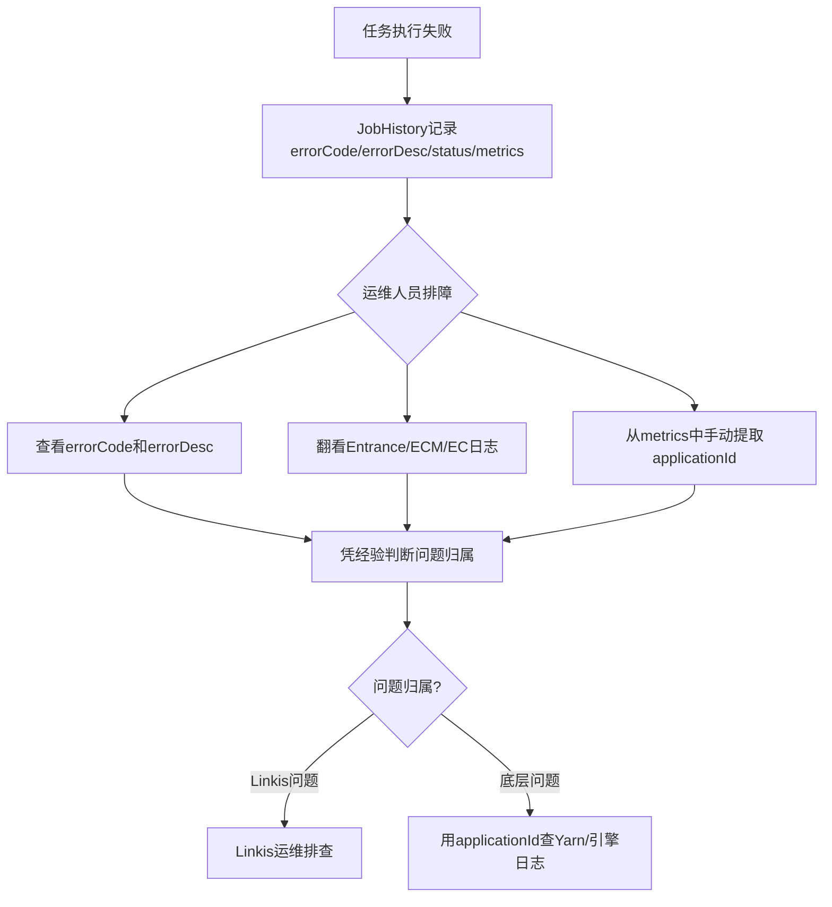
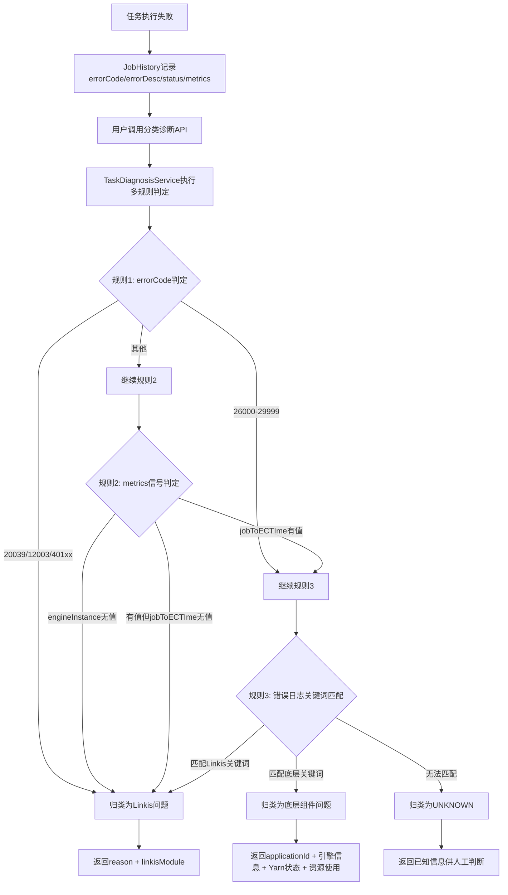

# Linkis 任务失败分类诊断 需求文档

---

## 📋 需求速览

| 维度 | 内容 |
|-----|------|
| **一句话描述** | 新增任务诊断REST API，对失败任务自动分类为"Linkis问题"或"底层组件问题"，Linkis问题返回原因和问题模块，底层问题返回applicationId、引擎信息、Yarn状态等完整诊断信息 |
| **基础模块** | linkis-jobhistory（公共服务） + linkis-entrance（治理层） |
| **增强目的** | 解决任务失败后无法快速区分是Linkis框架问题还是底层引擎/Yarn问题，运维人员需要人工翻日志拼接判断，排障效率低 |
| **功能范围** | P0: 2个 · P1: 1个 · P2: 0个 |
| **兼容性要求** | 完全向后兼容，新增独立API，不影响现有诊断机制（Doctoris、linkis-analyze.sh、ErrorCode日志匹配） |
| **涉及模块** | linkis-jobhistory、linkis-entrance |

### 功能属性标签

| 属性类型 | 检测到的属性 |
|:--------:|-------------|
| **前端属性** | 不涉及（纯后端API，前端可选对接） |
| **后端属性** | `REST API新增` `诊断逻辑` `多规则判定` `功能开关` |
| **数据属性** | 读取现有JobHistory字段（metrics/errorCode/errorDesc/status），无数据库表结构变更 |

---

**需求类型**: NEW（新增功能）
**基础模块**: linkis-jobhistory + linkis-entrance
**文档版本**: v1.0
**创建日期**: 2026-08-13
**作者**: kinghao
**文档状态**: 草稿

---

## 一、需求背景 【核心】

### 1.1 业务背景

**场景**：任务执行失败后，运维人员和开发者需要判断失败是Linkis框架自身的问题（如引擎启动超时、资源调度失败、服务异常），还是底层组件的问题（如Spark SQL执行报错、Yarn Container OOM、HDFS文件不存在）。不同类型的问题对应不同的处理方式：Linkis问题由Linkis运维团队排查，底层问题需要用applicationId去Yarn ResourceManager或引擎日志进一步定位。

**痛点**：
- 任务失败后仅展示errorCode和errorDesc，信息不足以判断问题归属
- 运维人员需要登录多台服务器翻看Entrance日志、ECM日志、EC日志，手动拼接判断链路
- 无法快速区分"引擎没起来"和"引擎起来了但SQL执行报错"，两种情况的排障路径完全不同
- 现有Doctoris诊断依赖外部服务且仅针对Spark引擎，覆盖面有限

**价值**：通过自动化的多规则分类判定，在任务失败时立即给出问题归属和关键诊断信息，将排障定位时间从平均20分钟降低到2分钟以内。

### 1.2 系统背景

当前Linkis已有三套诊断机制，但均无法解决分类判定问题：

| 现有机制 | 位置 | 不足 |
|---------|------|------|
| `GET /jobhistory/diagnosis-query` | JobHistory | 调用linkis-analyze.sh脚本，不做分类判定，仅输出原始诊断文本 |
| Doctoris实时诊断 | Entrance | 依赖外部Doctoris服务，仅覆盖Spark引擎，5分钟超时才触发，无法覆盖快速失败的场景 |
| ErrorCode日志匹配 | Entrance | 用正则匹配引擎日志提取errorCode，但errorCode本身不足以区分Linkis问题还是底层问题（引擎插件的错误码既可能是Linkis调度问题也可能是引擎执行问题） |

JobHistory表已有丰富的失败现场数据：`errorCode`、`errorDesc`、`status`、`metrics`（含yarnResource、engineInstance、jobToECTIme等时序信息），但缺少一个将这些数据综合判定分类的服务。

### 1.3 需求范围

| 属性 | 值 |
|-----|-----|
| 一级模块 | linkis-computation-governance + linkis-public-enhancements |
| 二级模块 | linkis-jobhistory（API入口+诊断服务） |
| 功能属性 | 后端 |
| 涉及模块 | linkis-jobhistory（新增Service+REST API）、linkis-entrance（新增功能开关配置） |
| 涉及其他组件 | 无（不依赖外部服务） |

### 1.4 边界定义

| ✅ 包含（In Scope） | ❌ 不包含（Out of Scope） |
|-------------------|------------------------|
| 新增任务分类诊断REST API | 替代或修改现有Doctoris诊断机制 |
| 基于errorCode/metrics/日志关键词的多规则分类判定 | 修改现有diagnosis-query接口 |
| Linkis问题返回原因+问题模块 | 前端UI对接（后续迭代） |
| 底层问题返回applicationId+引擎信息+Yarn状态+资源使用 | 自动修复或自动重试 |
| 功能开关默认关闭 | 修改JobHistory表结构 |
| UNKNOWN类型返回已知信息供人工判断 | 对运行中的任务做实时诊断（仅处理已完成/失败的任务） |

### 1.5 术语定义

| 术语 | 定义 | 所属领域 |
|-----|------|:--------:|
| 分类诊断 | 对失败任务自动判定问题归属（Linkis问题/底层组件问题/未知）的过程 | 技术 |
| jobToECTIme | metrics中的时间戳字段，记录任务代码提交到EC的时间，有值表示代码已到达EC | 技术 |
| yarnResource | metrics中的子对象，键为Yarn applicationId，值为ResourceWithStatus（内存/Cores/状态/队列） | 技术 |
| engineInstance | metrics中的字段，记录处理任务的EC实例地址（IP:Port） | 技术 |
| 子阶段A/B/C | Running状态内的三个子阶段：A=引擎启动中、B=引擎已就绪代码未提交、C=代码已提交到底层引擎执行 | 技术 |
| Linkis问题 | 任务失败由Linkis框架自身原因导致：资源/调度失败、服务异常、引擎启动失败、引擎连接断开 | 业务 |
| 底层组件问题 | 任务失败由底层引擎或外部组件导致：引擎计算错误、Yarn/容器问题、存储/元数据问题、用户侧SQL错误 | 业务 |

---

## 二、现有功能分析 【核心】

### 2.1 现有功能描述

当前任务失败后的信息获取方式：

1. **JobHistory查询**：通过 `GET /jobhistory/{jobId}/get` 获取任务详情，包含 errorCode、errorDesc、status、metrics 等字段，但无分类判定
2. **诊断日志查询**：通过 `GET /jobhistory/diagnosis-query?taskID={id}` 获取诊断内容，调用shell脚本或返回Doctoris结果，不做分类
3. **人工排障**：运维人员根据errorCode和errorDesc的经验判断问题归属，需要翻看多个服务日志确认

### 2.2 当前痛点

| 痛点ID | 痛点描述 | 影响范围 | 影响程度 |
|--------|---------|---------|:--------:|
| P1 | 失败任务无法自动分类，运维人员需人工判断是Linkis问题还是底层问题，平均耗时20分钟 | 所有需要排障的运维人员 | 高 |
| P2 | 引擎启动失败和引擎执行失败在JobHistory中都显示status=Failed，无法区分失败发生阶段 | 任务排障场景 | 高 |
| P3 | 底层问题排查时需要手动从metrics JSON中提取applicationId和引擎信息，操作繁琐 | 底层问题排查场景 | 中 |
| P4 | 现有Doctoris诊断仅覆盖Spark引擎且需5分钟超时才触发，快速失败的任务无法被诊断 | 所有非Spark引擎和快速失败场景 | 中 |

### 2.3 现有功能依赖

- JobHistory表结构和字段不变，分类诊断服务读取现有字段
- 现有诊断机制（Doctoris、linkis-analyze.sh）继续独立运行，不受影响
- ErrorCode日志匹配机制继续运行，其写入的errorCode/errorDesc是分类判定的重要输入

---

## 三、核心流程 【核心】

### 3.1 增强前流程



### 3.2 增强后流程



### 3.3 用户交互流程

**调用方式**：REST API调用

```
GET /api/rest_j/v1/jobhistory/task-diagnosis?taskID={id}
```

**处理流程**：
1. 接收taskID参数，查询JobHistory获取任务记录
2. 校验任务状态必须为Failed/Cancelled/Timeout，否则返回提示
3. 检查功能开关 `linkis.task.classified-diagnosis.enable` 是否开启
4. 执行多规则分类判定（errorCode → metrics信号 → 日志关键词）
5. 根据分类结果组装响应数据返回

---

## 四、新增需求详情 【核心】

### 4.1 功能总览

| ID | 增强点 | 优先级 | 状态 | 一句话描述 |
|----|-------|:------:|:----:|----------|
| F1 | 任务分类诊断REST API | P0 | ✅ 已确认 | 新增GET /jobhistory/task-diagnosis接口，返回分类判定结果和诊断信息 |
| F2 | 多规则分类判定引擎 | P0 | ✅ 已确认 | 基于errorCode/metrics信号/日志关键词的三级规则判定，区分Linkis问题和底层组件问题 |
| F3 | 分类规则可配置化 | P1 | ✅ 已确认 | Linkis问题errorCode范围、底层问题关键词等通过配置项可扩展，无需改代码 |

---

### 4.2 增强详述

#### F1: 任务分类诊断REST API `P0` `已确认`

**增强描述**

在linkis-jobhistory模块的QueryRestfulApi中新增 `task-diagnosis` 接口，接收taskID参数，返回分类诊断结果。

**接口定义**

| 项 | 值 |
|----|-----|
| URL | `GET /api/rest_j/v1/jobhistory/task-diagnosis` |
| 参数 | `taskID`（Long，必填）- 任务ID |
| 鉴权 | 走现有JobHistory鉴权逻辑 |
| 返回 | Message对象，data中包含分类诊断结果 |

**响应结构**

当 `diagnosisType = "LINKIS"` 时：

```json
{
  "method": "/api/rest_j/v1/jobhistory/task-diagnosis",
  "status": 0,
  "data": {
    "taskID": 12345,
    "taskStatus": "Failed",
    "diagnosisType": "LINKIS",
    "failedStage": "Scheduled",
    "errorCode": 12003,
    "errorDesc": "Engine creation failed...",
    "reason": "引擎创建/启动失败，ECM无法拉起EngineConn进程",
    "linkisModule": "ecm"
  }
}
```

当 `diagnosisType = "UNDERLYING"` 时：

```json
{
  "method": "/api/rest_j/v1/jobhistory/task-diagnosis",
  "status": 0,
  "data": {
    "taskID": 12345,
    "taskStatus": "Failed",
    "diagnosisType": "UNDERLYING",
    "failedStage": "Running",
    "errorCode": 26001,
    "errorDesc": "org.apache.spark.SparkException: Job aborted due to stage failure...",
    "applicationId": "application_1693xxx_0001",
    "engineType": "spark",
    "engineConnInstance": "bdpdws110002:15055",
    "yarnResource": {
      "application_1693xxx_0001": {
        "queueMemory": 8589934592,
        "queueCores": 4,
        "queueInstances": 3,
        "jobStatus": "FAILED",
        "queue": "default"
      }
    }
  }
}
```

当 `diagnosisType = "UNKNOWN"` 时：

```json
{
  "method": "/api/rest_j/v1/jobhistory/task-diagnosis",
  "status": 0,
  "data": {
    "taskID": 12345,
    "taskStatus": "Failed",
    "diagnosisType": "UNKNOWN",
    "failedStage": "Running",
    "errorCode": 27001,
    "errorDesc": "...",
    "reason": "无法自动判定问题归属，需人工排查",
    "applicationId": "application_1693xxx_0001",
    "engineType": "spark",
    "engineConnInstance": "bdpdws110002:15055"
  }
}
```

**业务规则**

| 规则ID | 规则描述 |
|--------|---------|
| R1.1 | taskID对应的任务不存在时，返回错误提示"任务不存在" |
| R1.2 | 任务状态为Inited/Scheduled/Running等未完成状态时，返回提示"任务尚未完成，无法诊断" |
| R1.3 | 任务状态为Succeed时，返回提示"任务执行成功，无需诊断" |
| R1.4 | 功能开关 `linkis.task.classified-diagnosis.enable` 关闭时，返回提示"分类诊断功能未开启" |
| R1.5 | 诊断过程发生异常时，降级返回errorCode和errorDesc原始信息，标记diagnosisType为"ERROR" |

**验收标准（三段式）**

| 验证阶段 | 验收条件 |
|:--------:|---------|
| 【输入验证】 | AC1.1: 传入有效taskID且任务为Failed状态时，接口返回200和分类诊断结果 |
| 【处理验证】 | AC1.2: 传入不存在的taskID时返回明确错误；传入未完成任务时返回提示；功能开关关闭时返回提示 |
| 【输出验证】 | AC1.3: diagnosisType为LINKIS时包含reason和linkisModule；为UNDERLYING时包含applicationId和引擎信息；为UNKNOWN时包含已知信息 |

---

#### F2: 多规则分类判定引擎 `P0` `已确认`

**增强描述**

在linkis-jobhistory模块新增 `TaskDiagnosisService`，实现三级规则分类判定，将失败任务归类为Linkis问题、底层组件问题或未知。

**规则1：errorCode范围判定（最高优先级）**

| errorCode范围 | 分类 | 对应场景 |
|--------------|------|---------|
| 20039 | LINKIS | 拦截器拒绝（语法检查、权限拦截、变量替换失败等） |
| 12003 | LINKIS | 引擎创建/启动失败（ECM拉起EC进程失败） |
| 40102, 40103 | LINKIS | 锁无效/参数错误（EC侧任务提交失败） |
| 40100 | LINKIS | Executor类型不匹配 |
| 40105 | LINKIS | EC向Entrance发送RPC失败 |
| 20010, 20011 | LINKIS | Entrance请求无效/任务提交失败 |
| 20052 | LINKIS | JobHistory持久化失败 |
| 26000-29999 | 继续规则3 | 引擎插件错误码，需进一步区分 |
| 其他 | 继续规则2 | 未匹配的errorCode，用metrics信号判定 |

**规则2：metrics信号判定**

| 条件 | 分类 | 对应子阶段 |
|------|------|-----------|
| engineInstance为"NULL"或不存在 | LINKIS | 引擎未获取（拦截器阶段失败） |
| engineInstance有值 且 jobToECTIme不存在 | LINKIS | 子阶段A/B：EC已获取但代码未提交就失败（引擎启动失败/EC断连/EC崩溃） |
| engineInstance有值 且 jobToECTIme有值 | 继续规则3 | 子阶段C：代码已提交到EC执行 |

> **关键发现**：`jobToECTIme`是区分"代码是否已提交到EC"的精准信号。progress不可靠（EC daemon线程在代码提交前就推送0.1，失败后统一重置为1.0）。applicationId不可靠（Spark引擎启动即有applicationId，但代码可能尚未执行）。

**规则3：错误日志关键词匹配**

对errorDesc进行关键词匹配：

**底层组件问题关键词**：

| 关键词模式 | 匹配场景 |
|-----------|---------|
| `Container killed by YARN` / `Container killed by the Yarn` | Yarn Container被Kill |
| `java.lang.OutOfMemoryError` | OOM |
| `java.io.FileNotFoundException` | HDFS文件不存在 |
| `org.apache.spark.SparkException` | Spark执行异常 |
| `org.apache.hadoop.hive.ql.exec` | Hive执行异常 |
| `Connection refused` / `Could not connect` | 底层组件连接失败 |
| `Table not found` / `Database not found` | 元数据问题 |
| `Permission denied` | 底层权限问题 |
| `Application killed by user` | Yarn Application被Kill |

**Linkis问题关键词**：

| 关键词模式 | 匹配场景 |
|-----------|---------|
| `EngineConn closed` / `engineconn is ShuttingDown` | EC异常关闭 |
| `requestEngineFailed` / `ask engine failed` | 引擎申请失败 |
| `engine not exists` / `EngineConn not found` | 引擎不存在 |
| `Failed to launch EngineConn` | EC启动失败 |
| `SendToEntrance error` | EC-Entrance通信失败 |

**判定优先级**：底层关键词优先于Linkis关键词（当两者同时匹配时，优先判定为底层问题，因为底层问题更常见且影响面更大）。

**业务规则**

| 规则ID | 规则描述 |
|--------|---------|
| R2.1 | 三个规则按优先级顺序执行：errorCode → metrics信号 → 日志关键词，高优先级规则匹配后不再执行后续规则 |
| R2.2 | 规则1中errorCode精确匹配优先于范围匹配 |
| R2.3 | 规则3关键词匹配使用正则表达式，支持多行匹配 |
| R2.4 | 三个规则均无法判定时，diagnosisType为UNKNOWN |
| R2.5 | UNKNOWN类型应尽可能返回已知信息（applicationId、engineInstance等），辅助人工判断 |

**failedStage字段映射**

| 判定结果 | failedStage值 | 含义 |
|---------|--------------|------|
| errorCode=20039 | Inited | 拦截器阶段失败 |
| errorCode=12003或engineInstance无值 | Scheduled | 引擎申请/启动阶段失败 |
| engineInstance有值且jobToECTIme无值 | Running | 引擎已就绪但代码未提交阶段失败 |
| jobToECTIme有值 | Running | 代码已提交到底层引擎执行阶段失败 |

**验收标准（三段式）**

| 验证阶段 | 验收条件 |
|:--------:|---------|
| 【输入验证】 | AC2.1: 给定errorCode=12003的任务，规则1直接判定为LINKIS，不执行规则2和3 |
| 【处理验证】 | AC2.2: 给定errorCode=26001且engineInstance有值且jobToECTIme有值且errorDesc含"OutOfMemoryError"，依次执行规则1→规则2→规则3，最终判定为UNDERLYING |
| 【输出验证】 | AC2.3: LINKIS类型包含reason和linkisModule；UNDERLYING类型包含applicationId和引擎信息；UNKNOWN类型包含已知信息 |

---

#### F3: 分类规则可配置化 `P1` `已确认`

**增强描述**

将分类规则中的errorCode范围、关键词模式等通过配置项暴露，支持运维人员根据生产环境实际情况调整规则，无需修改代码。

**配置项定义**

| 配置项 | 类型 | 默认值 | 说明 |
|--------|------|--------|------|
| `linkis.task.classified-diagnosis.enable` | Boolean | false | 功能总开关 |
| `linkis.task.classified-diagnosis.linkis.error-codes` | String | "20039,12003,40102,40103,40100,40105,20010,20011,20052" | 归为Linkis问题的errorCode列表（逗号分隔） |
| `linkis.task.classified-diagnosis.engine.error-code-range-start` | Int | 26000 | 引擎插件errorCode范围起始值 |
| `linkis.task.classified-diagnosis.engine.error-code-range-end` | Int | 29999 | 引擎插件errorCode范围结束值 |
| `linkis.task.classified-diagnosis.underlying.keywords` | String | "Container killed by YARN,java.lang.OutOfMemoryError,java.io.FileNotFoundException,org.apache.spark.SparkException,Table not found,Permission denied" | 底层问题关键词（逗号分隔） |
| `linkis.task.classified-diagnosis.linkis.keywords` | String | "EngineConn closed,requestEngineFailed,engine not exists,Failed to launch EngineConn,SendToEntrance error" | Linkis问题关键词（逗号分隔） |

**业务规则**

| 规则ID | 规则描述 |
|--------|---------|
| R3.1 | 配置项在EntranceConfiguration中声明，使用CommonVals |
| R3.2 | 关键词配置支持运行时热更新（使用getHotValue），运维调整后无需重启服务 |
| R3.3 | 配置值为空时使用默认值，不影响判定逻辑正常运行 |

**验收标准（三段式）**

| 验证阶段 | 验收条件 |
|:--------:|---------|
| 【输入验证】 | AC3.1: 修改linkis.error-codes配置新增一个errorCode后，该errorCode的任务被判定为LINKIS |
| 【处理验证】 | AC3.2: 修改underlying.keywords配置新增关键词后，errorDesc包含该关键词的任务被判定为UNDERLYING |
| 【输出验证】 | AC3.3: 配置值为空时使用默认值，判定结果与硬编码默认值一致 |

---

### 4.3 异常场景处理

| 场景ID | 异常场景 | 处理方式 |
|--------|---------|---------|
| E1 | taskID对应的任务不存在 | 返回 `Message.error("任务不存在")`，status非0 |
| E2 | 任务状态为未完成（Inited/Scheduled/Running等） | 返回 `Message.ok().data("diagnosisType", "INCOMPLETE").data("message", "任务尚未完成，无法诊断")` |
| E3 | 任务状态为Succeed | 返回 `Message.ok().data("diagnosisType", "SUCCESS").data("message", "任务执行成功，无需诊断")` |
| E4 | 功能开关关闭 | 返回 `Message.ok().data("diagnosisType", "DISABLED").data("message", "分类诊断功能未开启")` |
| E5 | metrics字段为null或空字符串 | 规则2中engineInstance和jobToECTIme视为不存在，按"引擎未获取"处理 |
| E6 | metrics JSON解析失败 | 视为metrics不可用，跳过规则2，直接执行规则3（仅用errorCode和关键词判定） |
| E7 | errorCode为null或0 | 跳过规则1，直接执行规则2 |
| E8 | errorDesc为null或空 | 规则3关键词匹配直接返回不匹配 |
| E9 | 诊断过程发生任何未预期异常 | 降级返回：diagnosisType="ERROR"，包含原始errorCode和errorDesc，日志记录异常堆栈 |
| E10 | yarnResource解析异常 | UNDERLYING类型中yarnResource字段返回null，其他字段正常返回 |

---

## 五、兼容性分析 【核心】

### 5.1 必须保持不变的功能

| 功能 | 说明 | 验证方式 |
|-----|------|---------|
| 现有 diagnosis-query 接口 | 不修改现有诊断查询接口的任何逻辑 | 调用原有接口验证返回结果不变 |
| Doctoris实时诊断 | 不修改Entrance中的Doctoris诊断定时任务 | 确认Doctoris诊断逻辑代码无变更 |
| ErrorCode日志匹配 | 不修改ErrorCodeManager和PersistenceErrorCodeListener | 确认错误码匹配和持久化逻辑无变更 |
| JobHistory查询接口 | 不修改现有/jobhistory/{jobId}/get接口 | 调用原有接口验证返回结果不变 |
| JobHistory表结构 | 不修改linkis_ps_job_history和linkis_ps_job_history_detail表结构 | 无DDL变更 |

### 5.2 现有数据处理

| 数据类型 | 处理方式 | 说明 |
|---------|---------|------|
| JobHistory记录 | 兼容（只读） | 诊断服务读取现有errorCode/errorDesc/metrics字段，不做任何修改 |
| metrics JSON | 兼容（只读） | 解析metrics提取yarnResource/engineInstance/jobToECTIme，不做修改 |

### 5.3 接口兼容性

| 接口 | 兼容性 | 说明 |
|-----|:------:|------|
| /jobhistory/diagnosis-query | ✅ 兼容 | 无变更，新接口独立存在 |
| /jobhistory/{jobId}/get | ✅ 兼容 | 无变更 |
| /jobhistory/task-diagnosis | 🆕 新增 | 独立新增，不影响现有接口 |

---

## 六、非功能需求 【重要】

| 类型 | 需求描述 | 目标值 |
|-----|---------|:------:|
| 性能 | 单次分类诊断API响应时间 | ≤ **200ms**（仅做JobHistory查询+内存中规则判定，无外部RPC/HTTP调用） |
| 可靠性 | 诊断过程异常时降级 | 100%降级（任何异常都不返回错误，而是返回降级结果） |
| 可扩展性 | 新增errorCode/关键词规则 | 仅修改配置项，无需改代码 |
| 兼容性 | 向后兼容 | 100%（纯新增功能+功能开关默认关闭） |
| 可用性 | 功能开关支持热加载 | 修改配置后无需重启服务即可生效 |

---

## 七、数据实体概述 【重要】

### 7.1 数据实体变化

本次新增功能**不涉及任何数据库表结构变更**。分类诊断服务完全基于现有JobHistory表中已有的字段进行判定：

| 使用字段 | 来源表 | 用途 |
|---------|--------|------|
| id | linkis_ps_job_history | 任务ID |
| status | linkis_ps_job_history | 任务状态（判定是否可诊断） |
| error_code | linkis_ps_job_history | 错误码（规则1判定输入） |
| error_desc | linkis_ps_job_history | 错误描述（规则3关键词匹配输入） |
| metrics | linkis_ps_job_history | 执行指标JSON（规则2信号判定输入，提取engineInstance/jobToECTIme/yarnResource） |
| engine_type | linkis_ps_job_history | 引擎类型（UNDERLYING类型返回值） |

### 7.2 数据规模预估

| 指标 | 新增前 | 新增后 |
|-----|:------:|:------:|
| API请求量 | 不变 | 新增task-diagnosis调用量（预估每次失败任务排障调用1-2次） |
| 数据库查询量 | 不变 | 每次API调用增加1次JobHistory SELECT（按主键查询，性能无忧） |
| 内存占用 | 不变 | 略增（关键词正则编译缓存） |

---

## 八、关联影响分析 【参考】

<details>
<summary>📎 点击展开关联影响分析</summary>

| 影响对象 | 影响类型 | 影响描述 | 应对措施 |
|---------|---------|---------|---------|
| QueryRestfulApi.java | 代码修改 | 新增task-diagnosis接口方法 | 新增方法，不修改现有方法 |
| linkis-jobhistory Service层 | 代码新增 | 新增TaskDiagnosisService接口和实现类 | 独立新增，不影响现有Service |
| EntranceConfiguration.scala | 代码修改 | 新增功能开关和规则配置项 | 仅新增CommonVars声明，不修改现有配置 |
| 现有诊断机制 | 无影响 | Doctoris/diagnosis-query/ErrorCode日志匹配独立运行 | 无需处理 |

</details>

---

## 九、风险识别 【参考】

<details>
<summary>⚠️ 点击展开风险分析</summary>

| 风险ID | 风险描述 | 概率 | 影响 | 应对措施 |
|--------|---------|:----:|:----:|---------|
| RISK1 | metrics JSON格式在不同版本/引擎间不一致，解析可能失败 | 中 | 低 | 对metrics解析做try-catch容错，解析失败时跳过规则2，降级到规则3判定 |
| RISK2 | 关键词匹配可能误判（如Linkis日志中包含"OutOfMemoryError"） | 低 | 中 | 规则2的metrics信号判定优先于规则3关键词匹配，减少误判；关键词配置可调整 |
| RISK3 | 新增errorCode未及时加入配置，导致新类型错误被归为UNKNOWN | 低 | 低 | UNKNOWN类型返回已知信息辅助人工判断；配置支持热更新 |
| RISK4 | jobToECTIme字段在某些旧版本任务中不存在（该字段是后来新增的） | 中 | 低 | 不存在时视为"代码未提交"，归为Linkis问题，符合语义 |

</details>

---

## 十、回滚方案 【重要】

### 10.1 回滚触发条件

- 分类诊断API返回错误结果导致误判（如Linkis问题被误判为底层问题）
- 诊断服务异常导致JobHistory服务不稳定
- 诊断逻辑消耗过多资源

### 10.2 回滚步骤

1. 将 `linkis.task.classified-diagnosis.enable` 设置为 `false`（支持热加载，无需重启）
2. 如需完全回滚代码：移除TaskDiagnosisService相关类和QueryRestfulApi中新增的方法
3. 重新构建并部署linkis-jobhistory服务

### 10.3 数据回滚

本次新增不涉及数据变更，无需数据回滚。

---

## 十一、测试关注点

1. **分类准确性测试**：
   - 构造errorCode=12003的失败任务，验证判定为LINKIS，reason包含"引擎创建/启动失败"
   - 构造errorCode=26001且errorDesc含"OutOfMemoryError"的失败任务，验证判定为UNDERLYING
   - 构造engineInstance有值但jobToECTIme无值的失败任务，验证判定为LINKIS（子阶段B失败）
   - 构造jobToECTIme有值且errorDesc含"Table not found"的失败任务，验证判定为UNDERLYING

2. **边界场景测试**：
   - 任务不存在时返回明确错误
   - 任务状态为Running时返回"尚未完成"提示
   - metrics为null时降级判定
   - errorCode为0时跳过规则1
   - errorDesc为空时规则3返回不匹配

3. **异常降级测试**：
   - metrics JSON格式异常时降级处理
   - 诊断过程抛出运行时异常时降级返回
   - 功能开关关闭时返回提示

4. **配置化测试**：
   - 修改errorCode配置后判定结果随之变化
   - 修改关键词配置后判定结果随之变化
   - 热加载验证：修改配置后不重启服务，下一次API调用使用新配置

5. **兼容性回归测试**：
   - 现有diagnosis-query接口功能不变
   - 现有/jobhistory/{jobId}/get接口功能不变
   - JobHistory服务稳定性不受影响

---

## 十二、附录

### 相关文档

| 文档类型 | 链接 | 说明 |
|---------|------|------|
| 📐 设计文档 | [待生成] | TaskDiagnosisService类设计、判定流程详细设计 |
| 🧪 测试用例 | [待生成] | 分类准确性/边界场景/异常降级测试用例 |

### 术语表

| 术语 | 定义 |
|-----|------|
| 分类诊断 | 对失败任务自动判定问题归属的过程 |
| Linkis问题 | Linkis框架自身原因导致的失败（资源调度/服务异常/引擎启动/引擎连接） |
| 底层组件问题 | 底层引擎或外部组件原因导致的失败（引擎执行/Yarn/存储/用户侧） |
| jobToECTIme | metrics中任务代码提交到EC的时间戳，区分代码是否到达引擎的关键信号 |
| yarnResource | metrics中Yarn应用资源信息，键为applicationId |
| 子阶段A/B/C | Running内的三阶段：A=引擎启动、B=引擎就绪代码未提交、C=代码已执行 |

### 更新日志

| 版本 | 日期 | 作者 | 变更说明 |
|------|------|------|---------|
| v1.0 | 2026-08-13 | kinghao | 初版创建 |
