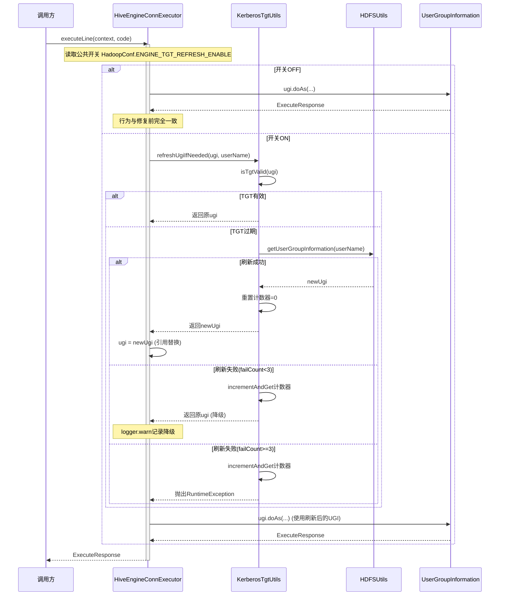
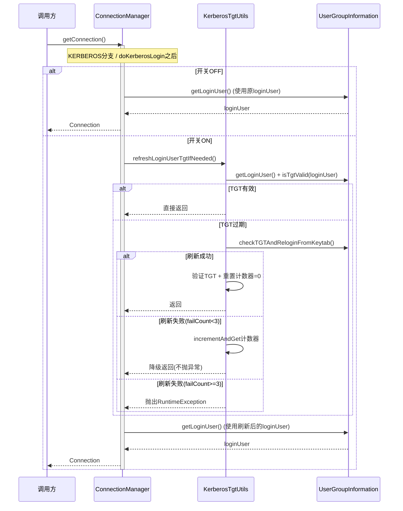
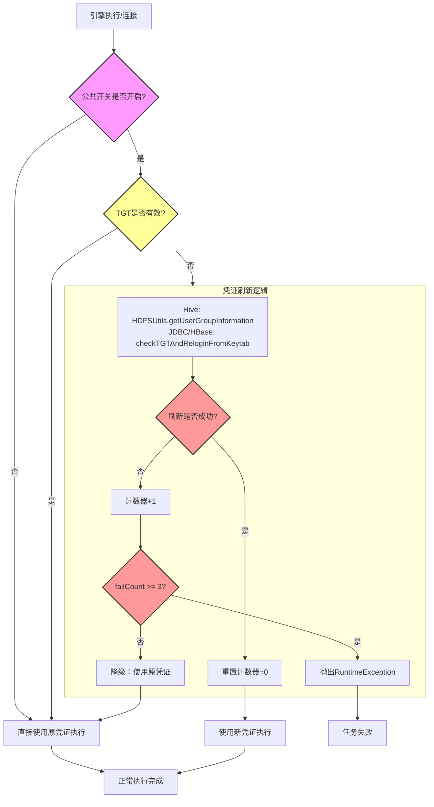
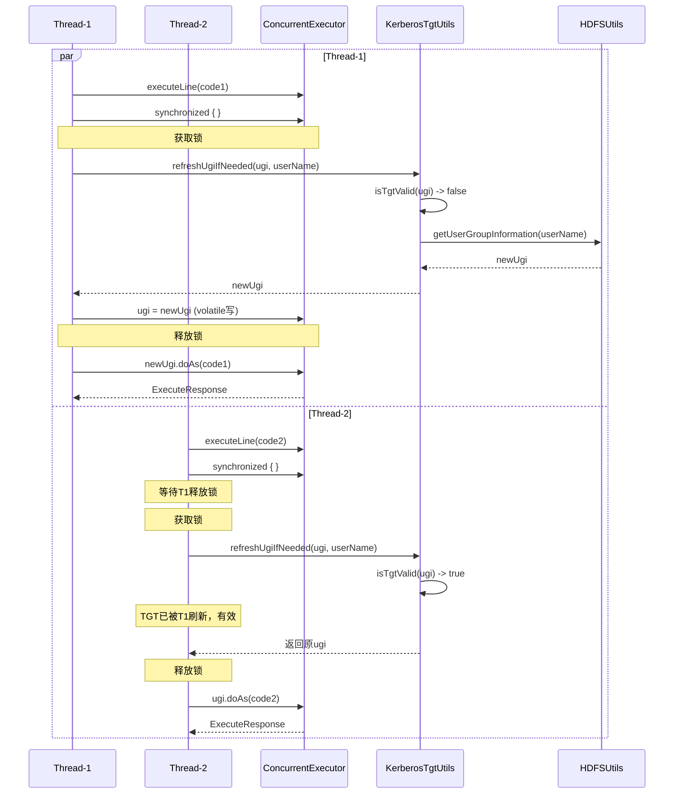

# 引擎复用TGT过期修复 设计文档

**需求类型**: FIX（Bug修复）
**问题等级**: P0-紧急
**文档版本**: v2.0
**创建日期**: 2026-09-01
**更新日期**: 2026-09-02
**需求来源**: DPMS Story #544181
**功能属性**: 后端

---

## 0. 执行摘要

| 维度 | 内容 |
|------|------|
| **问题概述** | Hive/JDBC/HBase三类引擎复用时TGT过期，导致Kerberos认证异常，任务执行失败 |
| **紧急程度** | P0-紧急（生产环境必现） |
| **修复策略** | 公共开关 + 公共工具方法 + 三引擎分别调用：在HadoopConf中新增公共开关，在KerberosTgtUtils中新增两个刷新方法（refreshUgiIfNeeded给Hive用，refreshLoginUserTgtIfNeeded给JDBC/HBase用），三引擎各自在执行/连接前调用对应方法 |
| **关键风险** | 低（开关默认false，前2次失败降级，第3次失败抛RuntimeException） |
| **修复范围** | linkis-hadoop-common（公共模块）+ Hive/JDBC/HBase三个引擎插件 |

**章节导航**:
- Part 1 核心设计: 根因分析 -> 修复方案对比 -> 核心修复流程 -> 影响范围
- Part 2 支撑设计: 测试策略 -> 发布方案 -> 回滚方案 -> 监控方案
- Part 3 参考资料: 完整修复代码 -> 测试代码 -> 回滚脚本

---

## Part 1: 核心设计 (L1层)

### 1.1 根因分析详解

#### 5Why分析结果

| 层级 | 问题 | 答案 |
|:----:|------|------|
| Why 1 | 为什么引擎复用时任务执行失败？ | 因为UGI/loginUser中的TGT已过期，Kerberos认证抛出异常 |
| Why 2 | 为什么TGT会过期？ | 外部keytab刷新频率为1小时一次，TGT有效期有限（通常约10小时），引擎运行超过一天后TGT必然过期 |
| Why 3 | 为什么TGT过期后没有自动刷新？ | Hive EC的UGI对象在`doCreateHiveSession`中创建后永不更新；JDBC/HBase EC使用JVM全局loginUser，没有在连接前检查TGT有效性 |
| Why 4 | 为什么引擎复用时不检查TGT有效性？ | `DefaultEngineNodeManager.reuseEngine`只检查引擎心跳状态，不检查Kerberos凭证有效性 |
| Why 5 | **根本原因是什么？** | **引擎复用流程缺少TGT有效性检查机制，Hive/JDBC/HBase三类引擎均缺少TGT懒刷新能力，在Kerberos+无缓存场景下凭证是"一次性"的，无法应对长时间运行的引擎复用** |

#### 问题代码定位

**问题代码1: Hive UGI创建点（不修改，仅分析）**

```scala
// HiveEngineConnFactory.scala 第112-118行
def doCreateHiveSession(options: util.Map[String, String]): HiveSession = {
  val hiveConf: HiveConf = getHiveConf(options)
  val ugi = HDFSUtils.getUserGroupInformation(Utils.getJvmUser)  // <-- UGI仅创建一次
  val baos = new ByteArrayOutputStream()
  val sessionState: SessionState = getSessionState(hiveConf, ugi, baos)
  HiveSession(sessionState, ugi, hiveConf, baos)  // <-- UGI存入HiveSession，生命周期内不变
}
```

**问题代码2: Hive UGI使用点 - 普通模式**

```scala
// HiveEngineConnExecutor.scala 第222-252行
Utils.tryFinally {
  ugi.doAs(new PrivilegedExceptionAction[ExecuteResponse]() {  // <-- 使用固定UGI，不检查TGT
    override def run(): ExecuteResponse = {
      // ... 执行Hive SQL
    }
  })
} { /* cleanup */ }
```

**问题代码3: Hive UGI使用点 - 并发模式**

```scala
// HiveEngineConcurrentConnExecutor.scala 第183行
ugi.doAs(new PrivilegedExceptionAction[ExecuteResponse]() {  // <-- 使用固定UGI，不检查TGT
  override def run(): ExecuteResponse = {
    // ... 执行Hive SQL
  }
})
```

**问题代码4: JDBC loginUser使用点**

```java
// ConnectionManager.java KERBEROS case
case KERBEROS:
    createKerberosSecureConfiguration(properties, username);  // <-- 使用JVM全局loginUser，不检查TGT
    // 直接创建连接，不检查TGT有效性
    break;
```

**问题代码5: HBase loginUser使用点**

```java
// HBaseConnectionManager.java doKerberosLogin / getConnection
UserGroupInformation loginUser = UserGroupInformation.getLoginUser();  // <-- 使用JVM全局loginUser，不检查TGT
// 直接创建连接，不检查TGT有效性
```

**问题代码6: close()阶段无异常保护**

```scala
// HiveEngineConnExecutor.scala 第509-513行
override def close(): Unit = {
  singleSqlProgressMap.clear()
  Utils.tryAndWarnMsg(sessionState.close())("close session failed")
  super.close()  // <-- TGT过期时可能抛出未捕获异常
}
```

#### 问题链路分析

**Hive 引擎（独立 UGI 对象）**:
```
引擎启动
  +-- HiveEngineConnFactory.doCreateHiveSession
      +-- HDFSUtils.getUserGroupInformation(Utils.getJvmUser)  <-- UGI创建（仅一次）
          +-- UserGroupInformation.loginUserFromKeytabAndReturnUGI  <-- Kerberos登录
              +-- UGI存入HiveSession.ugi  <-- 固定引用

引擎复用（TGT已过期）
  +-- HiveEngineConnExecutor.executeLine
      +-- ugi.doAs(...)  <-- 使用过期TGT
          +-- Kerberos认证失败  <-- 抛出异常
              +-- 任务执行失败
```

**JDBC/HBase 引擎（JVM 全局 loginUser）**:
```
引擎启动
  +-- ConnectionManager / HBaseConnectionManager
      +-- UserGroupInformation.loginUserFromKeytab  <-- 全局loginUser登录（仅一次）

引擎复用（TGT已过期）
  +-- getConnection / doKerberosLogin
      +-- UserGroupInformation.getLoginUser()  <-- 使用过期TGT的全局loginUser
          +-- Kerberos认证失败  <-- 抛出异常
              +-- 连接创建失败 -> 任务执行失败
```

---

### 1.2 修复方案对比

| 方案 | 描述 | 优点 | 缺点 | 风险 | 推荐度 |
|-----|------|------|------|------|-------|
| 临时方案 - 各引擎独立开关+独立修复 | 每个引擎各自配置开关和修复逻辑 | 改动隔离 | 配置分散、代码重复 | 低 | 3/5 |
| 根本方案 - 公共开关+公共工具方法+三引擎分别调用 | 公共开关统一控制，公共方法封装刷新逻辑，三引擎各自调用 | 配置统一、代码复用、维护简单 | 改动公共模块 | 低 | 5/5 |

#### 推荐策略

**采用根本方案**：公共开关 + 公共工具方法 + 三引擎分别调用

- 公共开关 `linkis.engineconn.tgt.refresh.enable` 统一控制三类引擎
- 公共工具方法封装TGT检查和凭证刷新逻辑，避免代码重复
- AtomicInteger计数器实现"前2次降级、第3次抛异常"的重试机制
- 三引擎各自在适当位置调用对应方法

---

### 1.3 修复方案详解

#### 1.3.1 整体架构对比

**修复前**:
```
Hive:    executeLine -> ugi.doAs(...)  [固定UGI，可能已过期]
JDBC:    getConnection -> createKerberosSecureConfiguration  [固定loginUser，可能已过期]
HBase:   getConnection -> doKerberosLogin -> getLoginUser  [固定loginUser，可能已过期]
```

**修复后**:
```
公共模块:
  HadoopConf.ENGINE_TGT_REFRESH_ENABLE  [公共开关]
  KerberosTgtUtils.refreshUgiIfNeeded(ugi, userName)  [Hive用]
  KerberosTgtUtils.refreshLoginUserTgtIfNeeded()  [JDBC/HBase用]
  AtomicInteger 计数器 + MAX_REFRESH_FAILURES=3  [重试与报错机制]

Hive:    executeLine
  +-- [开关ON] KerberosTgtUtils.refreshUgiIfNeeded(ugi, userName)
  |   +-- TGT有效 -> 不刷新
  |   +-- TGT过期 -> HDFSUtils.getUserGroupInformation获取新UGI
  |       +-- 成功 -> 重置计数器，替换ugi引用
  |       +-- 失败 -> 计数+1，前2次降级，第3次抛RuntimeException
  +-- ugi.doAs(...)
  ...
  +-- close()
      +-- super.close() [Utils.tryQuietly包裹]

JDBC:    getConnection (KERBEROS case)
  +-- createKerberosSecureConfiguration
  +-- [开关ON] KerberosTgtUtils.refreshLoginUserTgtIfNeeded()
  |   +-- TGT有效 -> 不刷新
  |   +-- TGT过期 -> checkTGTAndReloginFromKeytab
  |       +-- 成功 -> 重置计数器
  |       +-- 失败 -> 计数+1，前2次降级，第3次抛RuntimeException
  +-- 创建连接

HBase:   getConnection
  +-- doKerberosLogin
  +-- [开关ON + Kerberos] KerberosTgtUtils.refreshLoginUserTgtIfNeeded()
  |   +-- 同JDBC逻辑
  +-- getLoginUser -> 创建连接
```

#### 1.3.2 修改文件清单

| 序号 | 文件路径 | 修改类型 | 修改内容 |
|:----:|---------|:--------:|---------|
| 1 | `HadoopConf.scala` | 修改 | 新增`ENGINE_TGT_REFRESH_ENABLE`公共配置开关 |
| 2 | `KerberosTgtUtils.java` | 修改 | 新增`refreshUgiIfNeeded`和`refreshLoginUserTgtIfNeeded`方法 + AtomicInteger重试计数器 |
| 3 | `HiveEngineConnExecutor.scala` | 修改 | 构造参数`ugi`改为`var`；executeLine增加TGT检查（调用公共方法）；close()兜底 |
| 4 | `HiveEngineConcurrentConnExecutor.scala` | 修改 | 构造参数`ugi`改为`@volatile var`；executeLine增加TGT检查（调用公共方法，含synchronized）；close()兜底 |
| 5 | `HiveEngineConfiguration.scala` | 修改 | 移除独立开关`TGT_REFRESH_ENABLE`（改用公共开关） |
| 6 | `ConnectionManager.java` | 修改 | KERBEROS分支增加TGT检查（调用公共方法） |
| 7 | `JDBCConfiguration.scala` | 修改 | 移除独立开关`JDBC_TGT_REFRESH_ENABLE`（改用公共开关） |
| 8 | `HBaseConnectionManager.java` | 修改 | getConnection增加TGT检查（调用公共方法） |
| 9 | `HBaseConfiguration.scala` | 修改 | 移除独立开关`HBASE_TGT_REFRESH_ENABLE`（改用公共开关） |
| 10 | 三个引擎的`linkis-engineconn.properties` | 修改 | 添加公共开关注释行 |

#### 1.3.3 复用决策表

| 现有资产 | 复用/扩展/新建 | 理由 |
|---------|:------------:|------|
| `KerberosTgtUtils.isTgtValid(ugi)` | 复用 | 已存在的TGT检查工具，无需重新实现 |
| `HDFSUtils.getUserGroupInformation(userName)` | 复用 | 已存在的UGI获取工具，含Kerberos登录逻辑 |
| `UserGroupInformation.checkTGTAndReloginFromKeytab()` | 复用 | Hadoop原生方法，刷新JVM全局loginUser的TGT |
| `Utils.tryCatch` / `Utils.tryQuietly` | 复用 | 项目统一异常保护工具 |
| `CommonVars` | 复用 | 项目统一配置开关声明工具 |
| `HadoopConf` | 扩展 | 在公共配置对象中新增一个开关字段，三引擎共用 |
| `KerberosTgtUtils` | 扩展 | 新增两个刷新方法 + AtomicInteger计数器，封装TGT检查与刷新逻辑 |
| `HiveEngineConnExecutor` | 扩展 | 在现有executeLine方法中调用公共方法，构造参数ugi改为var |
| `HiveEngineConcurrentConnExecutor` | 扩展 | 同上，额外增加volatile+synchronized并发保护 |
| `ConnectionManager` | 扩展 | 在KERBEROS分支中调用公共方法 |
| `HBaseConnectionManager` | 扩展 | 在getConnection中调用公共方法 |
| `HiveEngineConfiguration` / `JDBCConfiguration` / `HBaseConfiguration` | 修改 | 移除各引擎独立开关，统一使用公共开关 |
| `HiveEngineConnFactory` | 不修改 | UGI创建点保持不变 |
| 数据库表/Mapper | 不涉及 | 无数据库变更 |

---

### 1.4 详细设计

#### 1.4.1 HadoopConf - 新增公共配置开关

**修改位置**: `linkis-hadoop-common/src/main/scala/org/apache/linkis/hadoop/common/conf/HadoopConf.scala`

**修改内容**: 在`HadoopConf` object中新增`ENGINE_TGT_REFRESH_ENABLE`配置项

```scala
// ===== 修复代码（AFTER）=====
object HadoopConf {

  // ... 现有配置项保持不变 ...

  /**
   * 引擎TGT懒刷新公共开关。
   * 开启后在引擎执行/连接前检查TGT有效性，过期则刷新凭证。
   * 适用场景：开启Kerberos认证且未开启HDFS缓存的长时间运行引擎。
   * 适用于Hive/JDBC/HBase三类引擎。
   * 默认关闭，需显式开启。
   */
  val ENGINE_TGT_REFRESH_ENABLE =
    CommonVars[java.lang.Boolean]("linkis.engineconn.tgt.refresh.enable", false).getValue

  // ... 现有配置项保持不变 ...
}
```

**设计要点**:
- 使用`CommonVars[java.lang.Boolean]`声明，避免Scala Boolean与Java Boolean的隐式转换问题
- 默认值`false`，遵循功能开关原则
- key命名`linkis.engineconn.tgt.refresh.enable`，符合`linkis.[模块].[功能].[属性]`规范
- 放在公共模块`HadoopConf`中，三引擎共用

---

#### 1.4.2 KerberosTgtUtils - 新增公共工具方法 + 重试计数器

**修改位置**: `linkis-hadoop-common/src/main/java/org/apache/linkis/hadoop/common/utils/KerberosTgtUtils.java`

**新增内容**:

```java
// ===== 新增常量与计数器 =====
private static final int MAX_REFRESH_FAILURES = 3;
private static final AtomicInteger ugiRefreshFailCount = new AtomicInteger(0);
private static final AtomicInteger loginUserRefreshFailCount = new AtomicInteger(0);

// ===== 新增方法1: refreshUgiIfNeeded（Hive用）=====
public static UserGroupInformation refreshUgiIfNeeded(
    UserGroupInformation ugi, String userName) {
  if (!HadoopConf.ENGINE_TGT_REFRESH_ENABLE()) {
    return ugi;  // 开关关闭，直接返回原UGI
  }
  if (isTgtValid(ugi)) {
    return ugi;  // TGT有效，不需要刷新
  }
  // TGT过期，尝试刷新
  try {
    UserGroupInformation newUgi = HDFSUtils.getUserGroupInformation(userName);
    ugiRefreshFailCount.set(0);  // 成功则重置计数器
    logger.info("UGI refreshed successfully via refreshUgiIfNeeded for user: " + userName);
    return newUgi;
  } catch (Exception e) {
    int failCount = ugiRefreshFailCount.incrementAndGet();
    if (failCount >= MAX_REFRESH_FAILURES) {
      throw new RuntimeException(
          "UGI refresh failed " + failCount + " times consecutively, aborting", e);
    }
    logger.warn("UGI refresh failed (" + failCount + "/" + MAX_REFRESH_FAILURES
        + "), fallback to original UGI", e);
    return ugi;  // 前2次降级，返回原UGI
  }
}

// ===== 新增方法2: refreshLoginUserTgtIfNeeded（JDBC/HBase用）=====
public static void refreshLoginUserTgtIfNeeded() {
  if (!HadoopConf.ENGINE_TGT_REFRESH_ENABLE()) {
    return;  // 开关关闭，直接返回
  }
  try {
    UserGroupInformation loginUser = UserGroupInformation.getLoginUser();
    if (isTgtValid(loginUser)) {
      return;  // TGT有效，不需要刷新
    }
    // TGT过期，尝试刷新
    loginUser.checkTGTAndReloginFromKeytab();
    // 验证刷新结果
    UserGroupInformation refreshedUser = UserGroupInformation.getLoginUser();
    if (isTgtValid(refreshedUser)) {
      loginUserRefreshFailCount.set(0);  // 成功则重置计数器
      logger.info("LoginUser TGT refreshed successfully via refreshLoginUserTgtIfNeeded");
    } else {
      throw new RuntimeException("TGT still invalid after checkTGTAndReloginFromKeytab");
    }
  } catch (Exception e) {
    int failCount = loginUserRefreshFailCount.incrementAndGet();
    if (failCount >= MAX_REFRESH_FAILURES) {
      throw new RuntimeException(
          "LoginUser TGT refresh failed " + failCount + " times consecutively, aborting", e);
    }
    logger.warn("LoginUser TGT refresh failed (" + failCount + "/" + MAX_REFRESH_FAILURES
        + "), fallback to original loginUser", e);
    // 前2次降级，不抛异常
  }
}
```

**设计要点**:
- 两个方法分别针对两种场景：独立UGI对象（Hive）和JVM全局loginUser（JDBC/HBase）
- AtomicInteger计数器线程安全，两套计数器独立计数
- `MAX_REFRESH_FAILURES = 3`：前2次降级（warn日志 + 走原路径），第3次抛RuntimeException
- 成功刷新后立即重置计数器为0
- 使用项目logger，不使用System.out

---

#### 1.4.3 HiveEngineConnExecutor - executeLine TGT检查 + UGI刷新

**修改位置**: `linkis-engineconn-plugins/hive/src/main/scala/org/apache/linkis/engineplugin/hive/executor/HiveEngineConnExecutor.scala`

**修改点1: 构造参数ugi改为var**

```scala
// ===== 问题代码（BEFORE）=====
class HiveEngineConnExecutor(
    id: Int,
    sessionState: SessionState,
    ugi: UserGroupInformation,  // <-- val，不可变
    hiveConf: HiveConf,
    baos: ByteArrayOutputStream = null
) extends ComputationExecutor with ResourceFetchExecutor {
  // ...
}

// ===== 修复代码（AFTER）=====
class HiveEngineConnExecutor(
    id: Int,
    sessionState: SessionState,
    private var ugi: UserGroupInformation,  // <-- 改为var，允许懒刷新替换
    hiveConf: HiveConf,
    baos: ByteArrayOutputStream = null
) extends ComputationExecutor with ResourceFetchExecutor {
  // ...
}
```

**修改点2: executeLine中增加TGT检查和UGI刷新**

在`ugi.doAs`调用前（第221行附近），增加TGT检查逻辑：

```scala
// ===== 修复代码（AFTER）=====
val proc = CommandProcessorFactory.get(tokens, hiveConf)
this.proc = proc
LOG.debug("ugi is " + ugi.getUserName)

// === TGT懒刷新逻辑（新增，调用公共方法）===
if (HadoopConf.ENGINE_TGT_REFRESH_ENABLE) {
  val refreshedUgi = KerberosTgtUtils.refreshUgiIfNeeded(ugi, Utils.getJvmUser)
  if (refreshedUgi != ugi) {
    ugi = refreshedUgi
  }
}
// === TGT懒刷新逻辑结束 ===

Utils.tryFinally {
  ugi.doAs(new PrivilegedExceptionAction[ExecuteResponse]() {
    // ... 原有逻辑不变 ...
  })
} { /* 原有cleanup逻辑不变 */ }
```

**修改点3: close()方法兜底**

```scala
// ===== 问题代码（BEFORE）=====
override def close(): Unit = {
  singleSqlProgressMap.clear()
  Utils.tryAndWarnMsg(sessionState.close())("close session failed")
  super.close()
}

// ===== 修复代码（AFTER）=====
override def close(): Unit = {
  singleSqlProgressMap.clear()
  Utils.tryAndWarnMsg(sessionState.close())("close session failed")
  Utils.tryQuietly {
    super.close()
  }
}
```

**新增import**:

```scala
import org.apache.linkis.hadoop.common.conf.HadoopConf
import org.apache.linkis.hadoop.common.utils.KerberosTgtUtils
```

---

#### 1.4.4 HiveEngineConcurrentConnExecutor - executeLine TGT检查 + UGI刷新(volatile+synchronized)

**修改位置**: `linkis-engineconn-plugins/hive/src/main/scala/org/apache/linkis/engineplugin/hive/executor/HiveEngineConcurrentConnExecutor.scala`

**修改点1: 构造参数ugi改为@volatile var**

```scala
// ===== 问题代码（BEFORE）=====
class HiveEngineConcurrentConnExecutor(
    id: Int,
    sessionState: SessionState,
    ugi: UserGroupInformation,  // <-- val，不可变
    hiveConf: HiveConf,
    baos: ByteArrayOutputStream = null
) extends ConcurrentComputationExecutor with ResourceFetchExecutor {
  // ...
}

// ===== 修复代码（AFTER）=====
class HiveEngineConcurrentConnExecutor(
    id: Int,
    sessionState: SessionState,
    @volatile private var ugi: UserGroupInformation,  // <-- @volatile var，保证多线程可见性
    hiveConf: HiveConf,
    baos: ByteArrayOutputStream = null
) extends ConcurrentComputationExecutor with ResourceFetchExecutor {
  // ...
}
```

**修改点2: executeLine中增加TGT检查和UGI刷新（含synchronized）**

在`ugi.doAs`调用前（第182行附近），增加TGT检查逻辑：

```scala
// ===== 修复代码（AFTER）=====
val proc = CommandProcessorFactory.get(tokens, hiveConf)
LOG.debug("ugi is " + ugi.getUserName)

// === TGT懒刷新逻辑（新增，含同步锁）===
if (HadoopConf.ENGINE_TGT_REFRESH_ENABLE) {
  synchronized {
    val refreshedUgi = KerberosTgtUtils.refreshUgiIfNeeded(ugi, Utils.getJvmUser)
    if (refreshedUgi != ugi) {
      ugi = refreshedUgi
    }
  }
}
// === TGT懒刷新逻辑结束 ===

ugi.doAs(new PrivilegedExceptionAction[ExecuteResponse]() {
  // ... 原有逻辑不变 ...
})
```

**修改点3: close()方法兜底**

```scala
// ===== 修复代码（AFTER）=====
override def close(): Unit = {
  killAll()
  if (backgroundOperationPool != null) {
    backgroundOperationPool.shutdown()
    try backgroundOperationPool.awaitTermination(10, TimeUnit.SECONDS)
    catch {
      case e: InterruptedException =>
        LOG.warn("...")
    }
    backgroundOperationPool = null
  }
  Utils.tryQuietly {
    super.close()
  }
}
```

**新增import**:

```scala
import org.apache.linkis.hadoop.common.conf.HadoopConf
import org.apache.linkis.hadoop.common.utils.KerberosTgtUtils
```

---

#### 1.4.5 ConnectionManager (JDBC) - KERBEROS分支TGT检查

**修改位置**: `linkis-engineconn-plugins/jdbc/src/main/java/org/apache/linkis/engineplugin/jdbc/ConnectionManager.java`

**修改内容**: 在KERBEROS case的`createKerberosSecureConfiguration`之后增加TGT检查

```java
// ===== 问题代码（BEFORE）=====
case KERBEROS:
    createKerberosSecureConfiguration(properties, username);
    break;

// ===== 修复代码（AFTER）=====
case KERBEROS:
    createKerberosSecureConfiguration(properties, username);
    if (HadoopConf.ENGINE_TGT_REFRESH_ENABLE()) {
      KerberosTgtUtils.refreshLoginUserTgtIfNeeded();
    }
    break;
```

**新增import**:

```java
import org.apache.linkis.hadoop.common.conf.HadoopConf;
import org.apache.linkis.hadoop.common.utils.KerberosTgtUtils;
```

---

#### 1.4.6 HBaseConnectionManager (HBase) - getConnection TGT检查

**修改位置**: `linkis-engineconn-plugins/hbase/src/main/java/org/apache/linkis/engineplugin/hbase/HBaseConnectionManager.java`

**修改内容**: 在`doKerberosLogin`之后、`getLoginUser`之前增加TGT检查

```java
// ===== 问题代码（BEFORE）=====
// doKerberosLogin(configuration);
// UserGroupInformation loginUser = UserGroupInformation.getLoginUser();

// ===== 修复代码（AFTER）=====
doKerberosLogin(configuration);
if (isKerberosAuthType(configuration) && HadoopConf.ENGINE_TGT_REFRESH_ENABLE()) {
  KerberosTgtUtils.refreshLoginUserTgtIfNeeded();
}
UserGroupInformation loginUser = UserGroupInformation.getLoginUser();
```

**新增import**:

```java
import org.apache.linkis.hadoop.common.conf.HadoopConf;
import org.apache.linkis.hadoop.common.utils.KerberosTgtUtils;
```

---

#### 1.4.7 重试与报错机制详解

**设计**: 使用 AtomicInteger 计数器记录连续失败次数

**两套独立计数器**:

| 计数器 | 适用引擎 | 刷新方式 | 对应方法 |
|--------|---------|---------|---------|
| `ugiRefreshFailCount` | Hive | `HDFSUtils.getUserGroupInformation` | `refreshUgiIfNeeded` |
| `loginUserRefreshFailCount` | JDBC/HBase | `checkTGTAndReloginFromKeytab` | `refreshLoginUserTgtIfNeeded` |

**行为流程**:

```
刷新尝试
  +-- 成功
  |   +-- 计数器重置为0
  |   +-- logger.info 记录成功
  |   +-- 返回新凭证
  +-- 失败
      +-- 计数器 incrementAndGet
      +-- failCount < 3?
      |   +-- 是: logger.warn 记录降级，返回原凭证（降级执行）
      |   +-- 否: 抛出 RuntimeException（不再降级）
```

**设计理由**:
- 前2次降级：避免偶发网络抖动或KDC短暂不可用导致任务直接失败
- 第3次抛异常：避免无限静默降级掩盖根本性问题（如keytab配置错误、KDC长期不可用）
- 计数器重置：一旦刷新成功，计数器立即归零，后续失败重新从0计数

---

#### 1.4.8 UGI刷新策略（Hive引擎，方案B详解）

**选择方案**: 方案B - 重新调用`HDFSUtils.getUserGroupInformation`获取新UGI对象

**方案对比**:

| 维度 | 方案A（修改原UGI的TGT） | 方案B（获取新UGI对象） |
|------|----------------------|----------------------|
| 实现方式 | 通过反射重新login到现有UGI的Subject | 调用`HDFSUtils.getUserGroupInformation`获取全新UGI |
| 并发安全 | 需要修改共享UGI内部状态，并发风险高 | 替换引用，原UGI不受影响 |
| 代码侵入 | 需要访问UGI私有字段 | 调用已有公开方法，无侵入 |
| 回滚能力 | 修改后难以回滚 | 引用替换，原UGI仍在（GC前） |
| 一致性 | 与HiveEngineConnFactory创建方式一致 | 与HiveEngineConnFactory创建方式完全一致 |

**并发安全设计（HiveEngineConcurrentConnExecutor）**:

| 机制 | 作用 | 实现方式 |
|------|------|---------|
| `@volatile` | 保证多线程可见性 | UGI引用的写入对其他线程立即可见 |
| `synchronized` | 保证原子性 | TGT检查+UGI替换作为临界区，同一时刻只有一个线程能执行 |

---

### 1.5 修复流程时序图

#### 1.5.1 Hive引擎 executeLine调用时序（开关ON）



#### 1.5.2 JDBC/HBase引擎 getConnection调用时序（开关ON）



#### 1.5.3 关键节点说明表

| 节点 | 处理逻辑 | 输入/输出 | 异常处理 |
|-----|---------|----------|---------|
| 1. 读取公共开关 | 读取`HadoopConf.ENGINE_TGT_REFRESH_ENABLE` | 输入: 无<br>输出: Boolean | 开关读取失败时默认false（CommonVars保证） |
| 2a. Hive TGT检查 | 调用`KerberosTgtUtils.refreshUgiIfNeeded(ugi, userName)` | 输入: UGI对象+用户名<br>输出: UGI对象(原或新) | 内部处理：前2次失败降级返回原UGI，第3次抛RuntimeException |
| 2b. JDBC/HBase TGT检查 | 调用`KerberosTgtUtils.refreshLoginUserTgtIfNeeded()` | 输入: 无<br>输出: 无(修改全局loginUser) | 内部处理：前2次失败降级不抛异常，第3次抛RuntimeException |
| 3. UGI引用替换(Hive) | 将ugi引用替换为新UGI对象 | 输入: 新UGI<br>输出: 无 | 并发模式下用synchronized保护 |
| 4. 执行/连接 | 使用(可能已刷新的)凭证执行doAs或创建连接 | 输入: code/connection params<br>输出: ExecuteResponse/Connection | 原有异常处理逻辑不变 |
| 5. close兜底(Hive) | `super.close()`用`Utils.tryQuietly`包裹 | 输入: 无<br>输出: 无 | 静默吞掉Kerberos相关异常 |

#### 1.5.4 技术难点说明表

| 难点 | 问题描述 | 解决方案 | 决策理由 |
|-----|---------|---------|---------|
| 公共开关 vs 独立开关 | 三引擎各自配置开关还是共用一个 | 公共开关放在HadoopConf | 配置简洁，三引擎行为一致，运维只需管理一个开关 |
| UGI刷新 vs loginUser刷新 | Hive使用独立UGI，JDBC/HBase使用全局loginUser，刷新方式不同 | 两套方法：refreshUgiIfNeeded + refreshLoginUserTgtIfNeeded | 针对不同场景提供正确方法，公共方法封装差异 |
| 重试与报错机制 | 无限降级会掩盖问题，每次报错太严格 | AtomicInteger计数器，前2次降级，第3次抛异常 | 平衡容错与问题发现 |
| UGI不可变(Hive) | Scala构造参数默认为val，无法替换引用 | 将`ugi`参数改为`var` | 最小改动，仅改变可变性 |
| 并发安全(Hive) | 并发模式下多线程同时执行executeLine，UGI替换需要原子性 | `@volatile` + `synchronized` | 保证可见性+原子性 |
| TGT检查开销 | 每次执行都检查TGT可能影响性能 | `isTgtValid`仅检查过期时间，不涉及网络IO | 单次检查<1ms，可忽略 |
| 降级安全 | 凭证刷新失败时不能影响任务执行(前2次) | 方法内部tryCatch，前2次返回原凭证 | 遵循项目异常降级原则 |

#### 1.5.5 边界与约束说明

- **前置条件**:
  - 开关`linkis.engineconn.tgt.refresh.enable`已声明且值为`true`
  - 引擎已通过Kerberos认证启动（UGI/loginUser已存在）
- **后置保证**:
  - 开关ON时：TGT过期的引擎复用前会自动刷新凭证
  - 开关OFF时：行为与修复前完全一致
  - 前2次刷新失败时：降级使用原凭证，不抛出异常
  - 第3次刷新失败时：抛出RuntimeException，任务失败（预期行为）
- **副作用说明**:
  - 开关ON时每次执行增加一次TGT检查（开销<1ms）
  - TGT过期时增加一次凭证刷新（开销<500ms），仅触发一次
  - 日志中增加TGT刷新相关info/warn记录
- **回滚约束**:
  - 设置`linkis.engineconn.tgt.refresh.enable=false`即可回滚
  - 回滚后引擎需重启以恢复原始凭证引用（如果之前已刷新过）

---

### 1.6 影响范围分析

| 维度 | 影响等级 | 说明 |
|------|:--------:|------|
| 功能影响 | 轻微 | 在Hive/JDBC/HBase引擎插件内部增加TGT检查逻辑，在公共模块HadoopConf和KerberosTgtUtils中新增配置和方法 |
| 接口影响 | 无 | 不修改任何公开接口签名 |
| 数据模型影响 | 无 | 不涉及数据库表结构变更 |
| 上下游影响 | 无 | 不影响上下游系统，不涉及第三方服务变更 |
| 性能影响 | 极小 | 开关ON时每次执行增加<1ms的TGT检查；开关OFF时无额外开销 |
| 安全影响 | 无 | 凭证刷新使用与原创建相同的Kerberos凭证，不涉及权限变更 |

---

## Part 2: 支撑设计 (L2层)

### 2.1 测试验证策略

#### 2.1.1 单元测试场景

| 场景ID | 测试场景 | 前置条件 | 预期结果 | 验证点 |
|:------:|---------|---------|---------|--------|
| UT-01 | 开关OFF + Hive executeLine | 开关=false | 行为与修复前完全一致 | 不触发TGT检查，直接使用原UGI |
| UT-02 | 开关ON + Hive TGT有效 | TGT未过期 | 正常执行SQL，不触发UGI刷新 | isTgtValid返回true，不调用getUserGroupInformation |
| UT-03 | 开关ON + Hive TGT过期 | TGT已过期 | 自动刷新UGI后正常执行SQL | refreshUgiIfNeeded返回新UGI，ugi引用被替换 |
| UT-04 | 开关ON + Hive UGI刷新失败(第1次) | TGT过期 + HDFSUtils抛异常 | 降级使用原UGI，不抛出异常 | 计数器=1，logger.warn记录 |
| UT-05 | 开关ON + Hive UGI刷新失败(第3次) | 连续3次刷新失败 | 抛出RuntimeException | 计数器=3，抛出异常 |
| UT-06 | 开关ON + Hive刷新成功后计数器重置 | 先失败2次后成功 | 计数器重置为0 | ugiRefreshFailCount=0 |
| UT-07 | close() + TGT过期(Hive) | TGT已过期 | close不抛出未捕获异常 | super.close()被tryQuietly包裹 |
| UT-08 | 并发模式 + 多线程同时触发TGT过期 | 并发模式 + TGT过期 | UGI刷新线程安全 | synchronized保证 |
| UT-09 | 开关ON + JDBC TGT过期 | TGT已过期 | 自动刷新loginUser后连接正常 | refreshLoginUserTgtIfNeeded被调用 |
| UT-10 | 开关ON + JDBC刷新失败(第3次) | 连续3次刷新失败 | 抛出RuntimeException | loginUserRefreshFailCount=3 |
| UT-11 | 开关ON + HBase TGT过期 | TGT已过期 | 自动刷新loginUser后连接正常 | refreshLoginUserTgtIfNeeded被调用 |
| UT-12 | 开关ON + HBase刷新失败(第3次) | 连续3次刷新失败 | 抛出RuntimeException | loginUserRefreshFailCount=3 |
| UT-13 | 开关OFF + JDBC/HBase | 开关=false | 行为与修复前完全一致 | 不触发TGT检查 |

#### 2.1.2 集成测试场景

| 场景ID | 测试场景 | 前置条件 | 预期结果 |
|:------:|---------|---------|---------|
| IT-01 | Kerberos + 无缓存 + Hive引擎运行超过TGT有效期 | Kerberos认证 + HDFS缓存关闭 | 引擎复用时自动刷新UGI，SQL正常执行 |
| IT-02 | Kerberos + 无缓存 + JDBC引擎运行超过TGT有效期 | Kerberos认证 + HDFS缓存关闭 | 引擎复用时自动刷新loginUser，连接正常 |
| IT-03 | Kerberos + 无缓存 + HBase引擎运行超过TGT有效期 | Kerberos认证 + HDFS缓存关闭 | 引擎复用时自动刷新loginUser，连接正常 |
| IT-04 | Kerberos + 有缓存 | Kerberos认证 + HDFS缓存开启 | 功能不受影响（有缓存场景TGT由HDFS层管理） |
| IT-05 | 非Kerberos场景 | Simple认证 | 功能不受影响（isTgtValid对非Kerberos返回true） |
| IT-06 | 并发模式 + 多线程同时执行SQL | 并发模式 + Kerberos | UGI刷新线程安全，无竞态条件 |
| IT-07 | 连续3次失败报错(Hive) | 模拟KDC不可用 | 第3次抛RuntimeException，任务失败 |

#### 2.1.3 回归测试范围

| 范围 | 测试内容 |
|------|---------|
| 普通Hive/JDBC/HBase SQL执行 | SELECT / DDL / DML 正常执行 |
| 引擎首次启动 | 首次executeLine/getConnection正常执行（TGT必然有效） |
| 引擎复用（TGT未过期） | 复用执行正常 |
| Hive引擎并发模式 | 并发executeLine正常执行 |
| JDBC引擎各种数据库连接 | MySQL/PostgreSQL/Oracle等连接正常 |
| HBase引擎连接 | HBase表读写正常 |
| 引擎关闭 | close()正常关闭，不抛出异常 |

#### 2.1.4 性能测试

| 指标 | 基准值 | 验收标准 |
|------|--------|---------|
| TGT检查耗时 | < 1ms | 单次`KerberosTgtUtils.isTgtValid`耗时 < 1ms |
| UGI刷新耗时(Hive) | < 500ms | 单次`HDFSUtils.getUserGroupInformation`耗时 < 500ms |
| loginUser刷新耗时(JDBC/HBase) | < 500ms | 单次`checkTGTAndReloginFromKeytab`耗时 < 500ms |
| 开关OFF开销 | 0ms | 开关关闭时无额外性能开销 |

---

### 2.2 发布策略

| 维度 | 方案 |
|------|------|
| 发布类型 | 灰度发布 |
| 灰度步骤 | 1. BDAP-DEV测试环境部署验证<br>2. SIT/UAT环境验证长时间运行场景（Hive/JDBC/HBase）<br>3. 生产环境灰度金监局环境<br>4. 手动设置`linkis.engineconn.tgt.refresh.enable=true`开启修复 |
| 发布窗口 | 非业务高峰期 |
| 部署要求 | 测试环境开3个bdap环境（DEV/SIT/UAT），生产开bdap+bdap灰度 |

---

### 2.3 回滚方案

| 维度 | 方案 |
|------|------|
| 回滚触发条件 | 开启修复后出现SQL执行异常率上升或其他回归问题 |
| 回滚步骤 | 1. 设置`linkis.engineconn.tgt.refresh.enable=false`<br>2. 重启引擎<br>3. 行为回退到修复前状态 |
| 回滚时间 | 配置修改 + 引擎重启，约5分钟 |
| 回滚验证 | 引擎复用行为恢复原状，无TGT检查逻辑介入 |

---

### 2.4 监控方案

| 监控指标 | 采集方式 | 告警阈值 |
|---------|---------|---------|
| Hive/JDBC/HBase引擎复用成功率 | jobhistory任务状态统计 | 成功率 < 95% 告警 |
| TGT刷新次数 | 日志中"refreshed successfully"出现次数 | 非预期 |
| TGT刷新失败次数(前2次) | 日志中"fallback to original"出现次数 | > 0 告警 |
| TGT连续3次失败 | 日志中"aborting"出现次数 | > 0 严重告警 |
| SQL执行错误率 | jobhistory错误任务统计 | 错误率 > 5% 告警 |

---

## Part 3: 参考资料 (L3层)

<details>
<summary>3.1 完整修复代码 - HadoopConf.scala（新增公共开关）</summary>

```scala
/*
 * Licensed to the Apache Software Foundation (ASF) under one or more
 * contributor license agreements.  See the NOTICE file distributed with
 * this work for additional information regarding copyright ownership.
 * The ASF licenses this file to You under the Apache License, Version 2.0
 * (the "License"); you may not use this file except in compliance with
 * the License.  You may obtain a copy of the License at
 *
 *    http://www.apache.org/licenses/LICENSE-2.0
 *
 * Unless required by applicable law or agreed to in writing, software
 * distributed under the License is distributed on an "AS IS" BASIS,
 * WITHOUT WARRANTIES OR CONDITIONS OF ANY KIND, either express or implied.
 * See the License for the specific language governing permissions and
 * limitations under the License.
 */

package org.apache.linkis.hadoop.common.conf

import org.apache.linkis.common.conf.CommonVars

object HadoopConf {

  // ... 现有配置项保持不变 ...

  /**
   * 引擎TGT懒刷新公共开关。
   * 开启后在引擎执行/连接前检查TGT有效性，过期则刷新凭证。
   * 适用场景：开启Kerberos认证且未开启HDFS缓存的长时间运行引擎。
   * 适用于Hive/JDBC/HBase三类引擎。
   * 默认关闭，需显式开启。
   */
  val ENGINE_TGT_REFRESH_ENABLE =
    CommonVars[java.lang.Boolean]("linkis.engineconn.tgt.refresh.enable", false).getValue

  // ... 现有配置项保持不变 ...
}
```

</details>

<details>
<summary>3.2 完整修复代码 - KerberosTgtUtils.java（新增公共方法 + 重试计数器）</summary>

```java
/*
 * Licensed to the Apache Software Foundation (ASF) under one or more
 * contributor license agreements.  See the NOTICE file distributed with
 * this work for additional information regarding copyright ownership.
 * The ASF licenses this file to You under the Apache License, Version 2.0
 * (the "License"); you may not use this file except in compliance with
 * the License.  You may obtain a copy of the License at
 *
 *    http://www.apache.org/licenses/LICENSE-2.0
 *
 * Unless required by applicable law or agreed to in writing, software
 * distributed under the License is distributed on an "AS IS" BASIS,
 * WITHOUT WARRANTIES OR CONDITIONS OF ANY KIND, either express or implied.
 * See the License for the specific language governing permissions and
 * limitations under the License.
 */

package org.apache.linkis.hadoop.common.utils;

import org.apache.linkis.hadoop.common.conf.HadoopConf;

import org.apache.hadoop.security.UserGroupInformation;

import org.slf4j.Logger;
import org.slf4j.LoggerFactory;

import java.util.concurrent.atomic.AtomicInteger;

public class KerberosTgtUtils {

  private static final Logger logger = LoggerFactory.getLogger(KerberosTgtUtils.class);

  // ... 现有 isTgtValid 方法保持不变 ...

  // === 新增：重试计数器 ===
  private static final int MAX_REFRESH_FAILURES = 3;
  private static final AtomicInteger ugiRefreshFailCount = new AtomicInteger(0);
  private static final AtomicInteger loginUserRefreshFailCount = new AtomicInteger(0);

  /**
   * 刷新UGI（如果TGT过期）。适用于Hive引擎（独立UGI对象）。
   *
   * @param ugi     当前UGI对象
   * @param userName 用户名
   * @return 刷新后的UGI对象（如果TGT有效则返回原UGI）
   * @throws RuntimeException 连续3次刷新失败时抛出
   */
  public static UserGroupInformation refreshUgiIfNeeded(
      UserGroupInformation ugi, String userName) {
    if (!HadoopConf.ENGINE_TGT_REFRESH_ENABLE()) {
      return ugi;
    }
    if (isTgtValid(ugi)) {
      return ugi;
    }
    try {
      logger.info("TGT expired, refreshing UGI for user: " + userName);
      UserGroupInformation newUgi = HDFSUtils.getUserGroupInformation(userName);
      ugiRefreshFailCount.set(0);
      logger.info("UGI refreshed successfully for user: " + userName);
      return newUgi;
    } catch (Exception e) {
      int failCount = ugiRefreshFailCount.incrementAndGet();
      if (failCount >= MAX_REFRESH_FAILURES) {
        throw new RuntimeException(
            "UGI refresh failed " + failCount + " times consecutively, aborting", e);
      }
      logger.warn("UGI refresh failed (" + failCount + "/" + MAX_REFRESH_FAILURES
          + "), fallback to original UGI", e);
      return ugi;
    }
  }

  /**
   * 刷新JVM全局loginUser的TGT（如果过期）。适用于JDBC/HBase引擎。
   *
   * @throws RuntimeException 连续3次刷新失败时抛出
   */
  public static void refreshLoginUserTgtIfNeeded() {
    if (!HadoopConf.ENGINE_TGT_REFRESH_ENABLE()) {
      return;
    }
    try {
      UserGroupInformation loginUser = UserGroupInformation.getLoginUser();
      if (isTgtValid(loginUser)) {
        return;
      }
      logger.info("LoginUser TGT expired, refreshing via checkTGTAndReloginFromKeytab");
      loginUser.checkTGTAndReloginFromKeytab();
      UserGroupInformation refreshedUser = UserGroupInformation.getLoginUser();
      if (isTgtValid(refreshedUser)) {
        loginUserRefreshFailCount.set(0);
        logger.info("LoginUser TGT refreshed successfully");
      } else {
        throw new RuntimeException("TGT still invalid after checkTGTAndReloginFromKeytab");
      }
    } catch (Exception e) {
      int failCount = loginUserRefreshFailCount.incrementAndGet();
      if (failCount >= MAX_REFRESH_FAILURES) {
        throw new RuntimeException(
            "LoginUser TGT refresh failed " + failCount + " times consecutively, aborting", e);
      }
      logger.warn("LoginUser TGT refresh failed (" + failCount + "/" + MAX_REFRESH_FAILURES
          + "), fallback to original loginUser", e);
    }
  }
}
```

</details>

<details>
<summary>3.3 完整修复代码 - HiveEngineConnExecutor.scala（关键修改片段）</summary>

```scala
// === 新增import ===
import org.apache.linkis.hadoop.common.conf.HadoopConf
import org.apache.linkis.hadoop.common.utils.KerberosTgtUtils

// === 构造参数修改 ===
class HiveEngineConnExecutor(
    id: Int,
    sessionState: SessionState,
    private var ugi: UserGroupInformation,  // 改为var
    hiveConf: HiveConf,
    baos: ByteArrayOutputStream = null
) extends ComputationExecutor
    with ResourceFetchExecutor {

  // ... 现有字段和方法不变 ...

  // === executeLine中的修改（在ugi.doAs前插入） ===
  override def executeLine(
      engineExecutorContext: EngineExecutionContext,
      code: String
  ): ExecuteResponse = {
    // ... 现有前置逻辑不变 ...

    val proc = CommandProcessorFactory.get(tokens, hiveConf)
    this.proc = proc
    LOG.debug("ugi is " + ugi.getUserName)

    // === TGT懒刷新逻辑（新增，调用公共方法） ===
    if (HadoopConf.ENGINE_TGT_REFRESH_ENABLE) {
      val refreshedUgi = KerberosTgtUtils.refreshUgiIfNeeded(ugi, Utils.getJvmUser)
      if (refreshedUgi != ugi) {
        ugi = refreshedUgi
      }
    }
    // === TGT懒刷新逻辑结束 ===

    Utils.tryFinally {
      ugi.doAs(new PrivilegedExceptionAction[ExecuteResponse]() {
        override def run(): ExecuteResponse = {
          // ... 原有执行逻辑不变 ...
        }
      })
    } {
      // ... 原有cleanup逻辑不变 ...
    }
  }

  // === close()方法修改 ===
  override def close(): Unit = {
    singleSqlProgressMap.clear()
    Utils.tryAndWarnMsg(sessionState.close())("close session failed")
    Utils.tryQuietly {
      super.close()
    }
  }

  // ... 现有其他方法不变 ...
}
```

</details>

<details>
<summary>3.4 完整修复代码 - HiveEngineConcurrentConnExecutor.scala（关键修改片段）</summary>

```scala
// === 新增import ===
import org.apache.linkis.hadoop.common.conf.HadoopConf
import org.apache.linkis.hadoop.common.utils.KerberosTgtUtils

// === 构造参数修改 ===
class HiveEngineConcurrentConnExecutor(
    id: Int,
    sessionState: SessionState,
    @volatile private var ugi: UserGroupInformation,  // 改为@volatile var
    hiveConf: HiveConf,
    baos: ByteArrayOutputStream = null
) extends ConcurrentComputationExecutor
    with ResourceFetchExecutor {

  // ... 现有字段和方法不变 ...

  // === executeLine中的修改（在ugi.doAs前插入，含同步锁） ===
  override def executeLine(
      engineExecutorContext: EngineExecutionContext,
      code: String
  ): ExecuteResponse = {
    // ... 现有前置逻辑不变 ...

    val operation = new Callable[ExecuteResponse] {
      override def call(): ExecuteResponse = {
        SessionState.setCurrentSessionState(sessionState)
        sessionState.setLastCommand(code)

        val proc = CommandProcessorFactory.get(tokens, hiveConf)
        LOG.debug("ugi is " + ugi.getUserName)

        // === TGT懒刷新逻辑（新增，含同步锁） ===
        if (HadoopConf.ENGINE_TGT_REFRESH_ENABLE) {
          synchronized {
            val refreshedUgi = KerberosTgtUtils.refreshUgiIfNeeded(ugi, Utils.getJvmUser)
            if (refreshedUgi != ugi) {
              ugi = refreshedUgi
            }
          }
        }
        // === TGT懒刷新逻辑结束 ===

        ugi.doAs(new PrivilegedExceptionAction[ExecuteResponse]() {
          override def run(): ExecuteResponse = {
            // ... 原有执行逻辑不变 ...
          }
        })
      }
    }

    val future = backgroundOperationPool.submit(operation)
    future.get()
  }

  // === close()方法修改 ===
  override def close(): Unit = {
    killAll()
    if (backgroundOperationPool != null) {
      backgroundOperationPool.shutdown()
      try backgroundOperationPool.awaitTermination(10, TimeUnit.SECONDS)
      catch {
        case e: InterruptedException =>
          LOG.warn(
            "HIVE_SERVER2_ASYNC_EXEC_SHUTDOWN_TIMEOUT = " + 10 + " seconds has been exceeded. RUNNING background operations will be shut down",
            e
          )
      }
      backgroundOperationPool = null
    }
    Utils.tryQuietly {
      super.close()
    }
  }

  // ... 现有其他方法不变 ...
}
```

</details>

<details>
<summary>3.5 完整修复代码 - ConnectionManager.java（JDBC，关键修改片段）</summary>

```java
// === 新增import ===
import org.apache.linkis.hadoop.common.conf.HadoopConf;
import org.apache.linkis.hadoop.common.utils.KerberosTgtUtils;

// === KERBEROS分支修改 ===
switch (authType) {
  case KERBEROS:
      createKerberosSecureConfiguration(properties, username);
      // === TGT懒刷新逻辑（新增） ===
      if (HadoopConf.ENGINE_TGT_REFRESH_ENABLE()) {
        KerberosTgtUtils.refreshLoginUserTgtIfNeeded();
      }
      // === TGT懒刷新逻辑结束 ===
      break;
  case SIMPLE:
      // ... 原有逻辑不变 ...
  default:
      // ... 原有逻辑不变 ...
}
```

</details>

<details>
<summary>3.6 完整修复代码 - HBaseConnectionManager.java（HBase，关键修改片段）</summary>

```java
// === 新增import ===
import org.apache.linkis.hadoop.common.conf.HadoopConf;
import org.apache.linkis.hadoop.common.utils.KerberosTgtUtils;

// === getConnection中修改 ===
public Connection getConnection(Configuration configuration) {
    // ... 前置逻辑不变 ...

    doKerberosLogin(configuration);

    // === TGT懒刷新逻辑（新增） ===
    if (isKerberosAuthType(configuration) && HadoopConf.ENGINE_TGT_REFRESH_ENABLE()) {
      KerberosTgtUtils.refreshLoginUserTgtIfNeeded();
    }
    // === TGT懒刷新逻辑结束 ===

    UserGroupInformation loginUser = UserGroupInformation.getLoginUser();
    // ... 后续连接创建逻辑不变 ...
}
```

</details>

<details>
<summary>3.7 配置文件变更 - linkis-engineconn.properties（三个引擎）</summary>

```properties
# === 新增配置项（Hive/JDBC/HBase三个引擎的linkis-engineconn.properties均添加） ===

# 引擎TGT懒刷新公共开关（默认关闭）
# 开启Kerberos认证且未开启HDFS缓存时建议开启
# 适用于Hive/JDBC/HBase三类引擎
# 开启后在引擎执行/连接前检查TGT有效性，过期则刷新凭证
# linkis.engineconn.tgt.refresh.enable=false
```

</details>

<details>
<summary>3.8 TGT检查与凭证刷新流程图（Mermaid）</summary>



</details>

<details>
<summary>3.9 并发模式时序图 - 多线程UGI刷新（Hive）</summary>



</details>

---

## 4. 配置设计

### 4.1 新增配置项

| 配置Key | 类型 | 默认值 | 说明 |
|---------|------|--------|------|
| `linkis.engineconn.tgt.refresh.enable` | Boolean | `false` | 引擎TGT懒刷新公共开关（Hive/JDBC/HBase共用）。开启后在引擎执行/连接前检查TGT有效性，过期则刷新凭证 |

### 4.2 配置位置

| 位置 | 文件 | 说明 |
|------|------|------|
| 模块配置类 | `HadoopConf.scala`（`linkis-hadoop-common`公共模块） | 使用`CommonVars`声明开关 |
| 部署配置文件 | 三个引擎的`linkis-engineconn.properties` | 添加注释行（即使关闭也写出，便于运维感知） |

### 4.3 使用说明

```properties
# 引擎TGT懒刷新公共开关（默认关闭）
# 开启Kerberos认证且未开启HDFS缓存时建议开启
# 适用于Hive/JDBC/HBase三类引擎
# linkis.engineconn.tgt.refresh.enable=false
```

开启方式（需重启引擎生效）:

```properties
linkis.engineconn.tgt.refresh.enable=true
```

### 4.4 配置架构对比

| 维度 | v1.0（仅Hive） | v2.0（三引擎公共） |
|------|---------------|-------------------|
| 开关数量 | 1个（Hive独立） | 1个（公共） |
| 配置Key | `linkis.engineconn.hive.tgt.refresh.enable` | `linkis.engineconn.tgt.refresh.enable` |
| 配置位置 | `HiveEngineConfiguration.scala` | `HadoopConf.scala`（公共模块） |
| 控制范围 | 仅Hive | Hive + JDBC + HBase |
| 运维成本 | 每引擎独立配置 | 统一配置，一次控制三引擎 |

---

## 5. 设计决策记录 (ADR)

### ADR-01: 为什么选择公共开关而非各引擎独立开关

| 维度 | 公共开关（选中） | 独立开关 |
|------|-------------|---------|
| 配置管理 | 一个开关控制三引擎，运维简单 | 三个开关各自配置，运维复杂 |
| 代码复用 | 公共方法+公共开关，消除重复 | 每引擎各自实现，代码重复 |
| 一致性 | 三引擎行为统一 | 可能出现部分引擎开启部分关闭 |
| 扩展性 | 未来新增引擎只需调用公共方法 | 需新增独立开关和逻辑 |

### ADR-02: 为什么选择在executeLine/getConnection前懒刷新而非定时刷新

| 维度 | 懒刷新（选中） | 定时刷新 |
|------|-------------|---------|
| 改动范围 | 仅executeLine/getConnection方法 | 需新增定时线程池+调度逻辑 |
| 可靠性 | 确保每次执行前凭证有效 | 刷新窗口内可能仍使用过期凭证 |
| 性能 | 仅在需要时检查 | 持续后台开销 |
| 复杂度 | 低 | 高（线程管理+生命周期+异常处理） |

### ADR-03: 为什么选择方案B（新UGI对象）而非方案A（修改原UGI）- Hive引擎

| 维度 | 方案B（选中） | 方案A |
|------|-------------|------|
| 并发安全 | 引用替换，原UGI不受影响 | 需修改共享对象内部状态 |
| 代码侵入 | 调用已有公开方法 | 需反射访问UGI私有字段 |
| 一致性 | 与HiveEngineConnFactory创建方式一致 | 不同路径，可能产生不一致 |

### ADR-04: 为什么采用3次失败报错机制

| 维度 | 3次失败报错（选中） | 无限降级 | 每次报错 |
|------|-------------|---------|---------|
| 容错性 | 前2次容忍偶发故障 | 无限容忍，掩盖问题 | 零容忍，过于严格 |
| 问题发现 | 第3次暴露根本问题 | 可能永远不暴露 | 偶发抖动就失败 |
| 平衡性 | 平衡容错与问题发现 | 偏向容错 | 偏向严格 |

### ADR-05: 为什么使用getValue而非getHotValue

| 维度 | getValue（选中） | getHotValue |
|------|-------------|------------|
| 适用场景 | 开关联动通常需要重启服务 | 运维需要不重启动态调参 |
| 性能 | 首次访问后使用JVM快照 | 每次读热加载缓存 |
| 决策理由 | TGT刷新开关不需要运行时动态切换，getValue性能更好 | 开关变更频率低，重启可接受 |

---

## 6. 质量检查清单

### 执行摘要检查
- [x] 在1页内完成（约500字）
- [x] 包含紧急程度说明
- [x] 包含修复策略选择

### L1核心层检查
- [x] 有根因分析（5Why）
- [x] 有方案对比（独立开关 vs 公共开关）
- [x] 时序图有关键节点说明表
- [x] 时序图有技术难点说明表
- [x] 代码对比为片段形式（非完整实现）

### L2支撑层检查
- [x] 测试场景为表格形式
- [x] 有回滚方案摘要
- [x] 避免了完整代码（在L3层折叠展示）

### L3参考层检查
- [x] 完整修复代码使用折叠块
- [x] 回滚方案使用折叠块
- [x] 折叠块标题清晰

### 整体检查
- [x] 提供临时方案和根本方案
- [x] 测试方案完整（覆盖三引擎 + 3次失败场景）
- [x] 发布策略明确
- [x] 回滚方案可执行
- [x] 重试与报错机制设计完整
